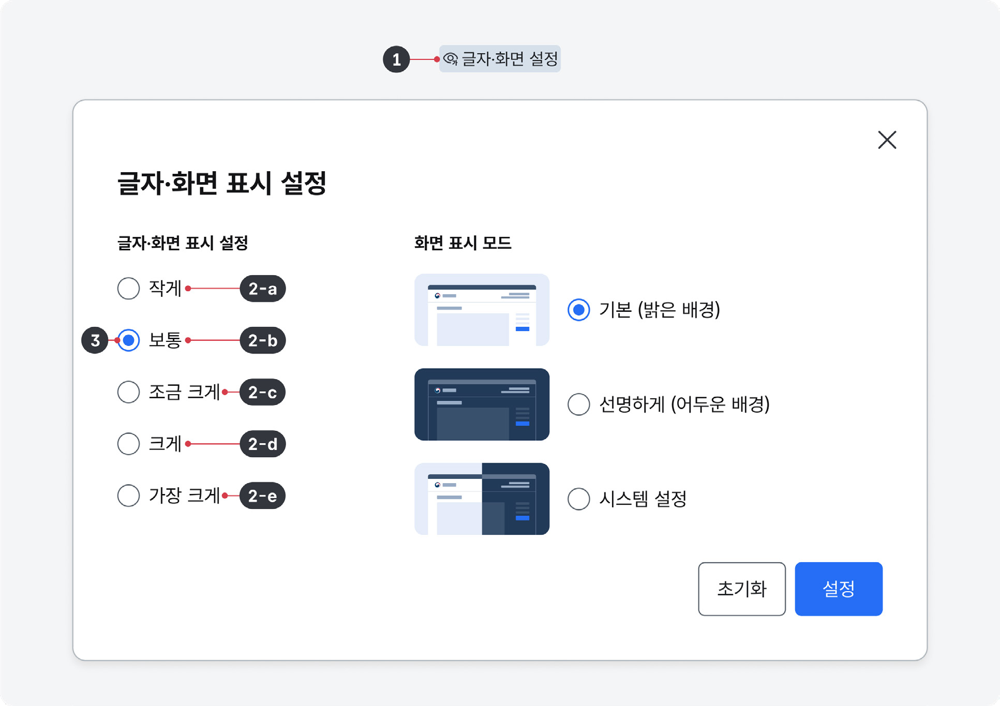
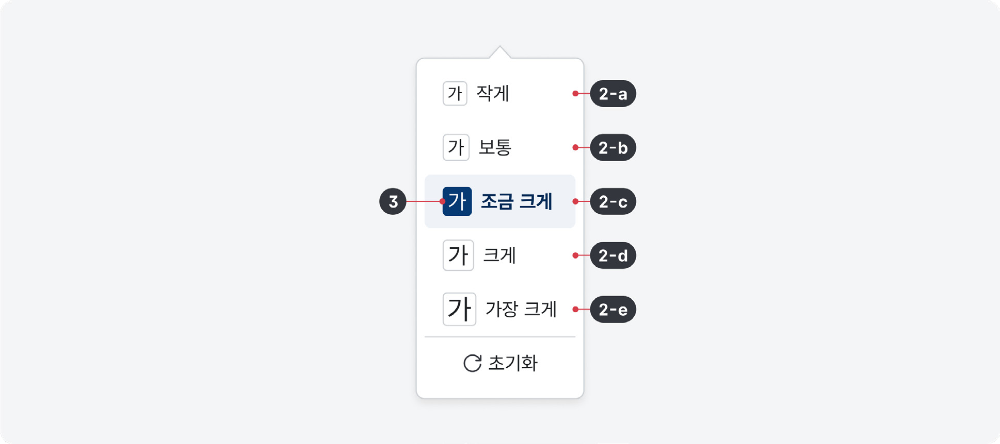
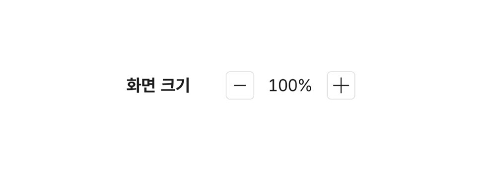
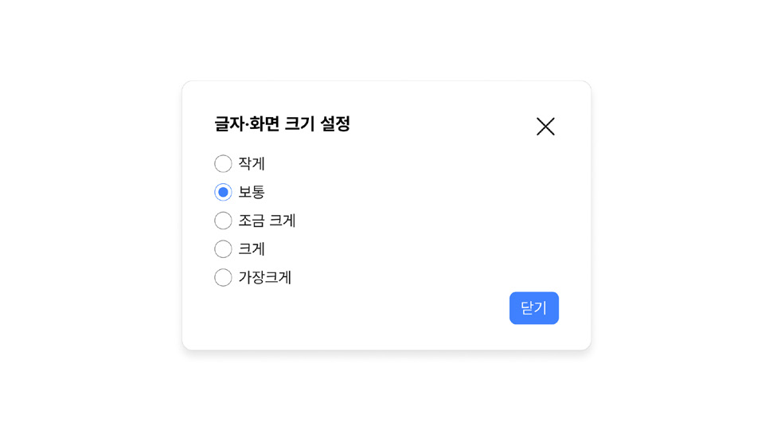
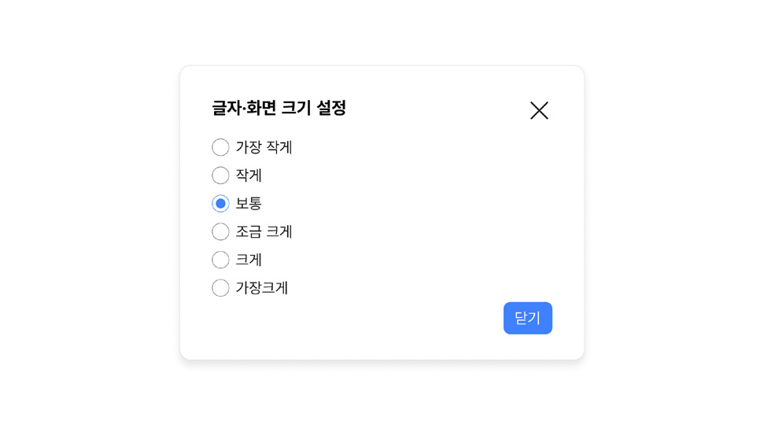

화면 크기 조정은 텍스트를 포함하여 화면에 표시되는 정보를 확대하거나 축소하는 데 사용되는 요소이다.

사용자에 따라 읽을 수 있는 텍스트의 크기, 조작할 수 있는 요소의 크기는 다르다. 디바이스나 사용자 에이전트가 지원하는 여러 가지 설정 기능을 활용하면 사용자가 선호하는 방식으로 콘텐츠의 표시 방식을 수정할 수 있다. 그러나 화면 크기 조정 기능을 필요로 하는 사용자는 관련 기능을 찾아 설정하는 데 어려움을 겪을 가능성이 높으므로 서비스 자체적으로 화면 크기 조정 기능을 제공하고 접근하기 쉽게 만드는 것이 중요하다.

## 구조

- 1 아이콘과 레이블: 화면 크기 조정 옵션 목록을 실행하는 데 사용하는 버튼의 이름
- 2 옵션: 사용자가 선택할 수 있는 화면 크기 조정 옵션 값의 목록

- a. 작게: 90% 축소
- b. 보통: 100%, 기본 크기
- c. 조금 크게: 110% 확대
- d. 크게: 130% 확대
- e. 가장 크게: 150% 확대

- 3 선택값: 사용자가 옵션 목록에서 선택한 값을 보여줌

## 사용성 가이드라인

- 01 옵션 레이블을 명확한 내용으로 제공한다.
- 02 옵션을 5개 이내로 제공한다.
- 03 반응형 레이아웃 사용을 고려한다.
### 01. 옵션 레이블을 명확한 내용으로 제공한다.

옵션에 텍스트 레이블 없이 글자 크기만을 보여주는 아이콘만 제공되거나 확대 배율만 표시될 경우 사용자에 따라 이해가 어려울 수 있으므로 설명적인 레이블을 함께 제공해야 한다.

[모범 사례]

[피해야 할 사례]

### 02. 옵션을 5개 이내로 제공한다.

서비스 특성에 따라 확대/축소 옵션값을 추가하거나 제거할 수 있다. 옵션의 개수가 많아질 수록 인지적 부담이 증가하므로 옵션 개수는 5개 이내로 제공하는 것이 바람직하다.

[모범 사례]

[피해야 할 사례]

### 03. 반응형 레이아웃 사용을 고려한다.

사용자 에이전트의 확대 기능을 사용하여 화면을 400%까지 확대했을 때, 1920 x 1080 해상도의 모니터를 기준으로 뷰포트 너비가 480px로 줄어들어 모바일 레이아웃으로 전환된다.

DPR(Device Pixel Ratio)이 2인 고해상도 모니터일 경우, 200%로 확대되었을 때 뷰포트 너비가 480px로 줄어든다.

따라서 화면을 확대했을 때 화면에 콘텐츠를 문제 없이 표시하기 위해서는 반응형 레이아웃을 사용하는 것이 용이하다.
### 플랫폼에 대한 고려 사항

모바일 애플리케이션에서는 별도 설정 화면에서 화면 크기 조정 기능을 제공할 수 있다.

모바일 애플리케이션에서는 ‘화면 크기 조정’ 컴포넌트를 사용하는 대신 사용자에게 익숙한 방식의 설정 화면에서 동등한 기능을 사용할 수 있도록 제공한다.
## 접근성 가이드라인

### 01. 화면 크기를 조정했을 때 콘텐츠가 가려지거나 기능이 손실되지 않도록 한다.

'화면 크기 조정' 컴포넌트의 제공 목적은 사용자가 문제없이 읽을 수 있는 배율의 콘텐츠를 제공하는 것이므로 기본 크기에서 제공되는 콘텐츠, 기능은 조정된 배율의 화면에서도 문제없이 접근할 수 있어야 한다.

조정된 배율의 화면에서 모든 콘텐츠와 기능을 기본 배율과 동일한 방식으로 사용할 수 있도록 해야 하는 것은 아니다. 모바일 레이아웃에서 메인 메뉴가 햄버거 메뉴 형식으로 전환되는 것처럼 콘텐츠와 기능에 대한 접근 방식은 달라질 수 있으나, 내용이 변형되어서는 안 된다.

- WCAG 2.1 Resize Text (AA)
- WCAG 2.1 Reflow (AA)

### 02. 화면을 확대했을 때 화면 스크롤은 단일 방향으로 유지/ 생성되도록 한다.

화면을 확대하여 뷰포트 영역이 좁아졌을 때, 요소의 배열/배치가 조정되지 않아 뷰포트 영역 밖으로 배치되어 스크롤이 생성되면 콘텐츠를 읽을 때 더 많은 노력이 필요하다.

단, 이미지, 멀티미디어, 표와 같이 기본적으로 양방향으로 배치되는 특성을 가진 콘텐츠와 모바일 레이아웃에서는 세로, 가로 스크롤이 동시에 사용될 수 있다.

- WCAG 2.1 Reflow (AA)
## 상호작용 가이드라인

### 목록 확장 및 축소

### 탐색

| 구분 | 내용 |
|---|---|
| Click | 컨테이너를 Click 했을 때, 옵션 목록이 확장되거나 축소된다. 옵션 목록이 확장된 상태에서 레이블, 컨테이너, 옵션 목록이 아닌 영역을 Click 하면 옵션 목록은 축소되어야 한다. |
| Enter, Space | 컨테이너에 초점이 있는 경우, 옵션 목록이 확장되거나 축소된다. |
| Esc | 옵션 목록을 축소하고 컨테이너로 초점이 이동해야 한다. |

| 구분 | 내용 |
|---|---|
| Tab, Shift + Tab | Tab, Shift + Tab 키를 눌렀을 때 접근할 수 있어야 한다. |
| Scroll | 옵션 목록에 스크롤이 생성된 경우 목록이 상/하로 이동한다. |
### 옵션 선택

| 구분 | 내용 |
|---|---|
| Click | 옵션 목록에서 특정 옵션을 Click 하면 해당 옵션으로 선택값이 변경된다. |
| Enter | 옵션에 초점이 있는 경우, 해당 옵션값이 선택된 후 목록이 축소된다. |
| 방향키 ↑, ↓ | 컨테이너에 초점이 있고 옵션 목록이 축소된 경우, 이전/다음 옵션으로 선택값이 변경된다. |
