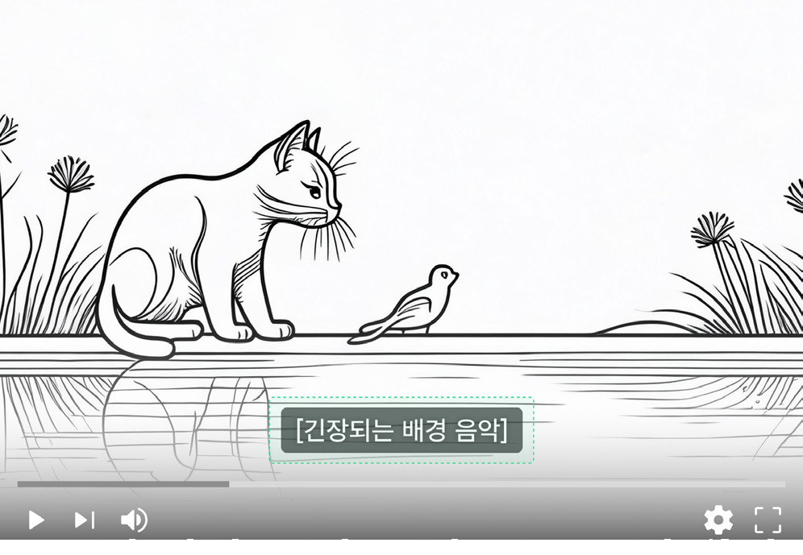
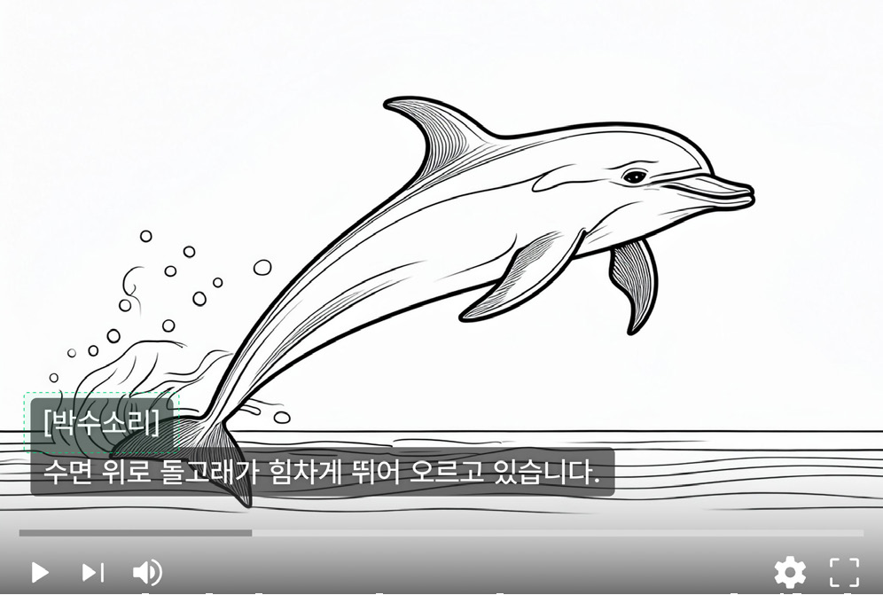

### 접근 가능한 미디어

미디어 콘텐츠에 설명이 필요한 경우에 사용하는 컴포넌트이다. 정지된 이미지에 설명을 제공할 때에는 숨김 콘텐츠를, 오디오/비디오/멀티미디어 콘텐츠에 설명을 제공할 때는 접근 가능한 미디어 컴포넌트를 사용한다.

## 유형

### 콘텐츠

오디오 콘텐츠

청각적 정보만으로 구성된 미디어 콘텐츠이다. 만약 비디오가 포함되었다고 하더라도 해당 비디오가 단순 커버 이미지인 경우, 오디오 콘텐츠로 간주한다. 캡션 또는 단순 원고(Simple transcripts)를 대체 정보로 제공해야 한다.

비디오 콘텐츠

소리 없이 화면만으로 구성된 미디어 콘텐츠이다. 만약 오디오가 포함되었다고 하더라도 단순 배경음인 경우, 비디오 콘텐츠로 간주한다. 화면 해설 또는 설명적 원고를 대체 정보로 제공해야 한다.

멀티미디어 콘텐츠

오디오, 비디오를 모두 포함한 미디어 콘텐츠이다. 콘텐츠의 복잡성, 중요도에 따라 여러 가지 대체 정보를 복합적으로 제공해야 한다.
### 대체 정보

캡션(Captions)

대화, 내레이션, 음향 효과와 같이 콘텐츠에 포함된 의미 있는 청각적 정보를 텍스트로 표시한 것으로, 정보의 출현 시점과 동기화하여 제공한다. 캡션은 청각 장애인, 난청인을 위한 대체 정보이며, 주변 환경이 소란스럽거나 일시적으로 소리를 사용할 수 없는 환경에서 유용하게 활용할 수 있다.

등장인물의 음성, 화면에 표시된 외국어 텍스트를 번역하여 표시하는 자막(Subtitles)과는 다르게 캡션은 누가 말하고 있는지(등장인물이 2명 이상인 경우), 어떤 효과음이 재생되고 있는지(효과음에 중요한 의미가 있는 경우)에 대한 정보를 포함해야 한다.

화면 해설(Description)

화면 해설은 시각 장애인, 시력이 낮은 사용자에게 필요한 대체 정보이다. 비디오 또는 멀티미디어 콘텐츠의 시각적 정보에 대한 정보를 제공하는 것으로 텍스트, 오디오, 비디오 형태를 사용할 수 있다. 비디오 해설은 해설이 필요한 미디어에 음성 설명을 포함하여 제작한 별도의 비디오 파일이다. 오디오 해설, 텍스트 해설은 모든 사용자가 동일한 비디오 콘텐츠를 사용한다. 오디오 해설은 사용자 선택에 따라 비디오의 기본 오디오 트랙과 해설용 오디오 트랙 재생이 전환된다. 텍스트 해설은 해설이 필요한 시간을 명시하여 별개의 텍스트 파일로 제공된다.

설명적 원고(Descriptive transcripts)

설명적 원고는 시각적 정보와 더불어 청각적 정보에 대한 상세한 설명을 하나의 원고로 제공하므로 시각 장애인과 청각 장애인 모두 사용할 수 있는 대체 정보다.

수어(Sign language)

수어는 수어 표준에 따라 콘텐츠에 포함된 청각 정보를 설명하는 대체 콘텐츠이다. 청각 장애인 사용자 중 일부는 수어가 모국어이며 텍스트로 작성된 콘텐츠 이해에 어려움을 겪는다. 모든 사용자가 반드시 확인해야 하는 중요한 정보가 멀티미디어 형식으로 제공된다면, 수어를 대체 콘텐츠로 제공하는 방안을 고려해야 한다.
## 사용성 가이드라인

- 01 미디어 콘텐츠를 제작하기 전에 대체 정보 제공에 대한 계획을 수립한다.
- 02 가능한 다양한 유형의 대체 정보를 제공한다.
- 03 대체 정보는 미디어에 포함된 모든 정보를 설명해야 한다.
- 04 정보를 전달하기 위한 목적의 시각적 요소를 삽입할 때 명도 대비에 유의한다.
- 05 자막은 주변 요소에 가려지거나 흐리게 표시되어서는 안 된다.
- 06 자막은 오디오와 동기화하여 제공한다.
- 07 콘텐츠를 업데이트할 때 대체 정보도 업데이트한다.
### 01. 미디어 콘텐츠를 제작하기 전에 대체 정보 제공에 대한 계획을 수립한다.

대체 정보를 제작하는 데 시간과 비용이 투입되기 때문에 콘텐츠를 제작하는 단계에서 대체 정보 제공 방식과 제작 방식을 함께 계획하는 것이 좋다. 대체 정보를 자체적으로 제작해야 한다면, 미디어 콘텐츠 제작 과정에서 사용한 녹화용 대본, 대사집 등의 자료를 활용하여 대체 정보를 제작하는 데 소요되는 시간을 줄일 수 있다.
### 02. 가능한 다양한 유형의 대체 정보를 제공한다.

콘텐츠 유형별로 제공되어야 하는 대체 정보가 다르며, 대체 정보의 유형별로 사용할 수 있는 사용자가 다르다. 여러 방식을 사용하기 어렵다면 가능한 많은 사용자가 사용할 수 있는 설명적 원고를 제공한다.
### 03. 대체 정보는 미디어에 포함된 모든 정보를 설명해야 한다.

미디어 콘텐츠의 대체 정보는 콘텐츠가 전달하는 정보를 동등한 수준으로 전달할 수 있도록 제작해야 한다. 예를 들어, 화면에 표시된 정보의 위치나 배열 정보가 중요하다면 시각에 대한 대체 정보에 포함해야 한다. 장면에는 표시되지 않았지만 청중이 박수를 치고 있음을 알려주는 오디오가 있다면 이를 청각 대체 정보에 포함해야 한다.

- [모범 사례 1]

- [모범 사례 2]

### 04. 정보를 전달하기 위한 목적의 시각적 요소를 삽입할 때 명도 대비에 유의한다.

이미지화된 텍스트는 사용자가 직접 텍스트 색상을 조정할 수 없기 때문에 비디오, 멀티미디어 콘텐츠를 제작할 때 명도 대비 기준을 준수하는 것이 특히 중요하다. 장식 용도의 요소, 오디오로 설명이 제공되고 있는 정보를 제외한 시각적 정보는 인접한 배경과 가능한 4.5:1 이상의 명도 대비를 갖도록 표현한다.
### 05. 자막은 주변 요소에 가려지거나 흐리게 표시되어서는 안 된다.

자막이 가려지면 사용자들은 중요한 정보를 놓칠 수 있다. 자막을 화면의 중요한 시각적 요소와 겹치지 않도록 배치하고, 필요한 경우 자막의 위치를 조정한다. 또한 배경과의 충분한 명도 대비 확보를 위해 자막 텍스트에 윤곽선을 표시하거나 반투명한 검은색 배경을 추가하는 것이 좋다. 가능한 경우, 사용자가 자막의 크기, 색상, 위치를 조정할 수 있는 옵션을 제공하면 대체 정보가 필요한 사용자의 편의성을 높일 수 있다.

- [모범 사례 1]

- [모범 사례 2]

[피해야 할 사례]

### 06. 자막은 오디오와 동기화하여 제공한다.

오디오가 제공되는 시점에 정확하게 정보를 전달할 수 있으며, 시청각 정보가 일치하므로 콘텐츠에 대한 사용자의 이해를 높일 수 있다.

### 07. 콘텐츠를 업데이트할 때 대체 정보도 업데이트한다.

미디어 콘텐츠가 업데이트될 때마다 관련 대체 정보도 함께 검토 및 수정하여 최신 상태를 유지해야 한다.
