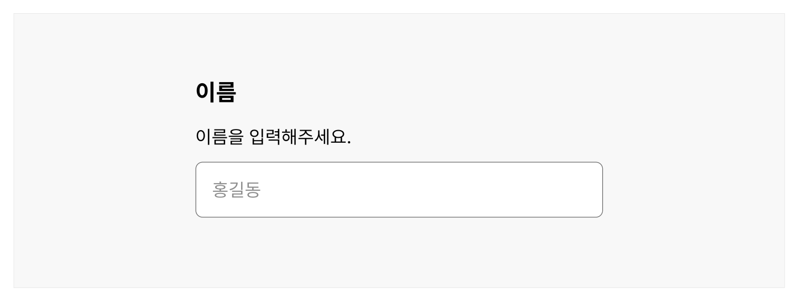
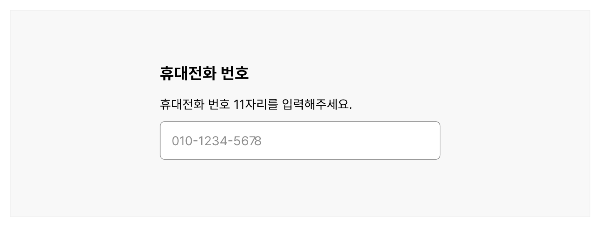
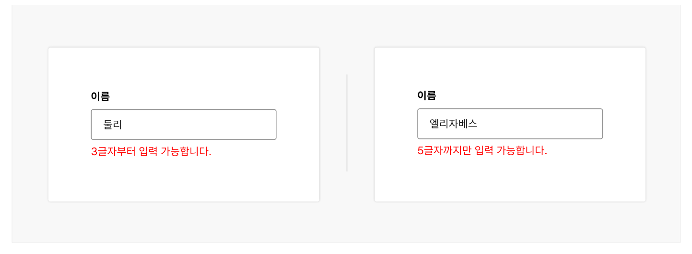
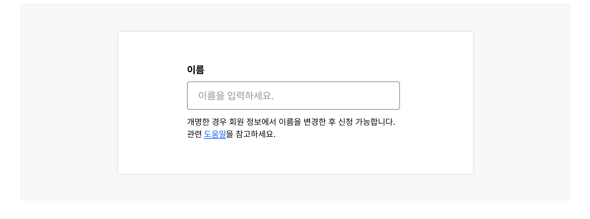
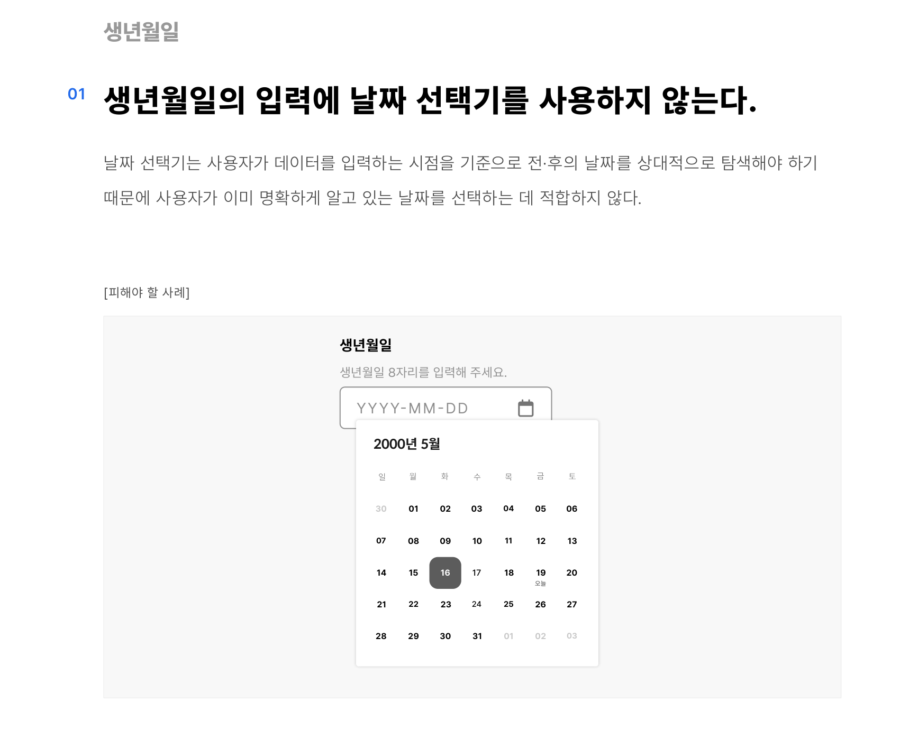
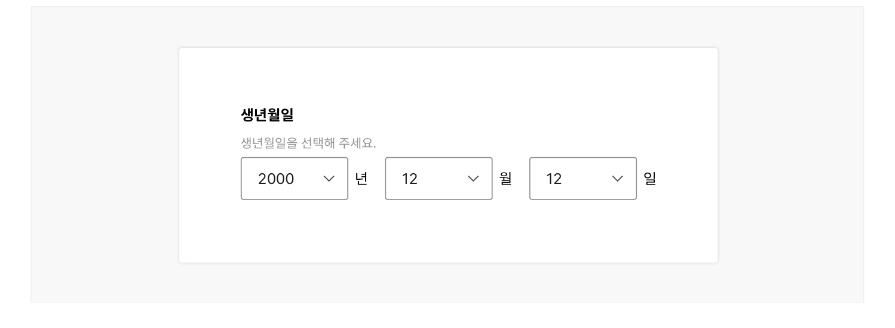
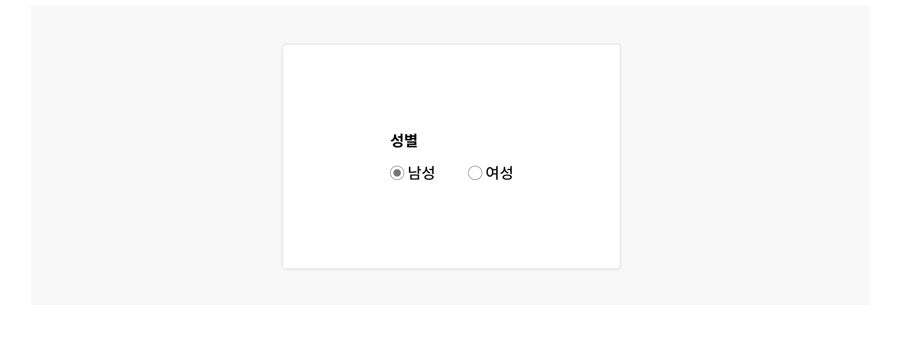
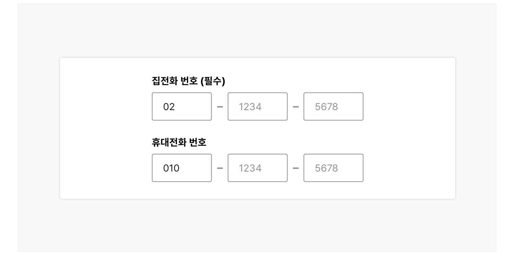
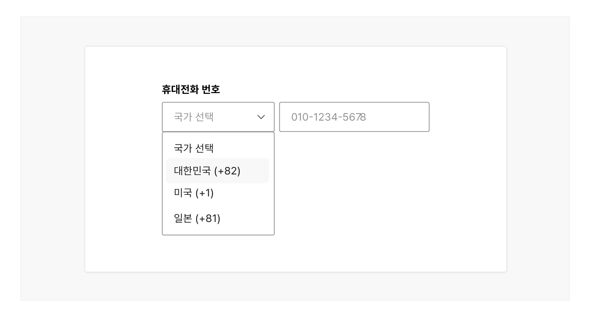

### 개인 식별 정보 입력

개인 식별 정보는 사용자 본인을 포함하여 특정한 개인의 신원을 밝히거나 개인/단체에 대한 기본 정보 확인에 사용되는 모든 정보를 의미한다. 사용자에게 개인 식별 정보의 입력을 요청하기 전에 해당 정보를 반드시 수집해야 하는지 다시 한 번 점검하고 사용자에게 입력이 필요한 이유를 명확하게 설명하는 것이 좋다.

## 유형

이름



**시각 자료 텍스트 보완**

```text
이름
이름을 입력해주세요.
홍길동
```
생년월일


### 전화번호



**표/목록 텍스트 보완**

```text
원본 PDF의 UI 배치·상태·다이어그램을 보존한 시각 자료입니다.
```
## 사용성 가이드라인

### 공통

- 01 개인 식별 정보의 수집이 필요한지 확인한다.
- 02 입력이 필요한 데이터의 용도를 명확하게 설명한다.
- 03 개인 식별 정보 입력 필드에 복사와 붙여넣기를 허용한다.
- 04 기본값을 설정하지 않는다.

### 이름

- 01 입력할 수 있는 모든 문자의 입력과 표시를 지원한다.
- 02 이름 입력 필드에 입력 가능한 글자 수를 적절하게 구성한다.
- 03 이름 입력에 단일 텍스트 입력 필드를 사용한다.
- 04 개명한 사용자가 문제 없이 이름을 입력할 수 있는지 확인한다.

### 생년월일

- 01 생년월일의 입력에 날짜 선택기를 사용하지 않는다.
- 02 연도, 일의 입력에 셀렉트를 사용하지 않는다.
- 03 날짜 입력 형식을 정확하게 안내한다.
### 성별

- 01 특정 성별을 기본값으로 지정하지 않는다.
- 02 '선택 안 함' 옵션을 제공한다.

### 전화번호

- 01 활용 용도에 적합한 유형의 전화번호 입력을 요청한다.
- 02 전화번호 입력 필드에 명확한 레이블을 제공한다.
- 03 여러 가지 입력 형식에 유연한 입력 필드를 제공한다.
- 04 국가 코드 입력에 콤보박스를 사용한다.
- 05 여러 개의 전화번호 입력 요청 시, 각 번호를 구분할 수 있는 레이블을 제공한다.
- 06 여러 개의 전화번호 입력 요청 시, 주로 사용하는 번호를 지정할 수 있는 옵션을 제공한다.
### 공통

### 01. 개인 식별 정보의 수집이 필요한지 확인한다.

사용자에게 개인 식별 정보의 입력을 요청하기 전에 서비스 이용을 위해 필요한 정보인지 다시 한 번 확인해야 한다.

### 02. 입력이 필요한 데이터의 용도를 명확하게 설명한다.

입력한 데이터가 어떻게 활용될 것이고, 어떤 편의성을 제공할 수 있는지를 사용자에게 명확하게 안내해야 한다.

### 03. 개인 식별 정보 입력 필드에 복사와 붙여넣기를 허용한다.

데이터 입력에 어려움을 느끼거나 시간이 많이 걸리는 사용자를 고려하여 모든 개인 식별 정보 입력 필드에는 복사와 붙여넣기를 제한하지 않아야 한다.

### 04. 기본값을 설정하지 않는다.

플레이스홀더를 사용하는 경우에는 실제 입력과 쉽게 구분할 수 있도록 한다.
### 이름

### 01. 사용자가 입력할 수 있는 모든 문자의 입력과 표시를 지원한다.

사용자의 이름이 다양한 언어로 작성될 수 있음을 고려하여 기호, 숫자, 공백을 포함한 모든 문자를 입력 가능하도록 허용하고 화면에 적절히 표시될 수 있도록 해야 한다. 만약 본인인증 과정 등 문서에 표시된 이름의 문자 형식이 지정되어 있고 해당 형식에 따라 정확하게 입력되어야 하는 과업이라면 제약 사항에 대해 사용자에게 명확하게 설명하고, 적절한 경우 대안을 제시해야 한다.
### 02. 이름 입력 필드에 입력 가능한 글자 수를 적절하게 구성한다.

이름 입력 필드는 모든 사용자의 이름을 수용할 수 있는 정도의 글자 수 입력을 허용하고 최대 길이에 맞추어 입력 필드의 너비를 제공한다. 이때, 가장 짧은 이름의 글자 수 역시 고려되어야 한다. 한글 이름을 기준으로 하였을 때 유효성 검사에서 최소 3글자 이상의 입력을 요청하지 않도록 유의한다.

[피해야 할 사례]



**사례 텍스트 보완**

```text
이름
엘리자베스
둘리
5글자까지만 입력 가능합니다.
3글자부터 입력 가능합니다.
```
### 03. 이름 입력에 단일 텍스트 입력 필드를 사용한다.

모든 사람의 이름이 일반적인 성, 이름 형식에 부합하지 않을 수 있으므로 여러 개의 이름 입력 필드는 신중하게 사용해야 한다.
### 04. 개명한 사용자가 문제 없이 이름을 입력할 수 있는지 확인한다.

개명한 사용자의 이름 입력에 제약이 있는 경우, 이름 입력 문제를 해결하는 데 참고할 수 있는 방안을 이름 입력 필드 주변에 제공해야 한다.

[모범 사례]



**사례 텍스트 보완**

```text
이름
이름을 입력하세요.
개명한 경우 회원 정보에서 이름을 변경한 후 신청 가능합니다.
관련 도움말을 참고하세요.
```

### 생년월일

### 생년월일의 입력에 날짜 선택기를 사용하지 않는다.

날짜 선택기는 사용자가 데이터를 입력하는 시점을 기준으로 전·후의 날짜를 상대적으로 탐색해야 하기 때문에 사용자가 이미 명확하게 알고 있는 날짜를 선택하는 데 적합하지 않다.

[피해야 할 사례]

도식 라벨: 2000년 5월

### 연도, 일의 입력에 셀렉트를 사용하지 않는다.

연도와 일 정보를 셀렉트로 제공하게 되면 옵션 수가 지나치게 많아져 오히려 입력이 어려워질 수 있다. 날짜 입력 서식 컴포넌트 중 다중 입력 필드나 단일 입력 필드를 사용하는 것이 좋다.

[피해야 할 사례]



**사례 텍스트 보완**

```text
생년월일
생년월일을 선택해 주세요.
2000
년
월
일
```

### 날짜 입력 형식을 정확하게 안내한다.

날짜 입력 서식 컴포넌트를 참조하여 해당 가이드라인에 따라 입력 형식을 안내한다.
### 성별

### 특정 성별을 기본값으로 지정하지 않는다.

입력폼이 로딩되었을 때 특정 성별 옵션이 기본으로 선택되어 있지 않도록 유의한다.

[피해야 할 사례]



**사례 텍스트 보완**

```text
성별
남성
여성
```

### '선택 안 함' 옵션을 제공한다.

성별이 개인의 신원을 정확하게 하는 데 필요한 정보가 아니라면 성별 정보를 필수 입력 항목에서 제외하거나 사용자가 응답하지 않을 옵션을 제공하는 것이 바람직하다.

[모범 사례]


**사례 텍스트 보완**

```text
성별
남성
여성
선택 안 함
```
### 전화번호

### 01. 활용 용도에 적합한 유형의 전화번호 입력을 요청한다.

모든 사용자가 모든 유형의 전화번호를 보유하고 있지 않으므로 인증이나 메시지 발신이 필요하지 않는 한 특정 유형의 전화번호의 입력만 허용하는 것은 바람직하지 않다.

[피해야 할 사례]



**사례 텍스트 보완**

```text
집전화 번호 (필수)
1234
5678
휴대전화 번호
```
### 02. 전화번호 입력 필드에 명확한 레이블을 제공한다.

입력해야 하는 전화번호의 유형이 무엇인지 정확하게 인지할 수 있도록 '휴대 전화번호', '지역 번호'와 같이 명확한 레이블을 제공한다. 전화번호의 유형 구분이 불필요한 경우에는 '전화번호'라는 레이블을 사용한다.

[모범 사례]



**사례 텍스트 보완**

```text
휴대전화 번호
국가 선택
01012345678
대한민국 (+82)
미국 (+1)
일본 (+81)
```
### 03. 여러 가지 입력 형식에 유연한 입력 필드를 제공한다.

공백, 하이픈, 대시 등 일반적으로 전화번호의 입력 형식으로 사용되는 다양한 형식의 입력을 허용하여 사용자가 익숙한 방식으로 전화번호를 입력할 수 있도록 한다.

하이픈을 반드시 포함해야 하는 등 특정 형식에 맞추어 입력이 필요한 경우, 도움말 텍스트로 입력 형식의 제한에 대해 명확하게 설명해야 한다. 사용자의 편의성을 위해 자동으로 형식을 수정할 수 있다.

### 04. 국가 코드 입력에 콤보박스를 사용한다.

국가 코드를 기억하지 못하는 사용자의 입력을 돕기 위해 국가명과 국가 코드가 명시된 목록을 콤보박스의 옵션으로 제공한다.
### 05. 여러 개의 전화번호 입력 요청 시, 각 번호를 구분할 수 있는 레이블을 제공한다.

사용자에게 여러 개의 전화번호를 입력할 것을 요청하는 경우, 전화번호 입력 필드 레이블이나 필드셋의 제목으로 각 번호를 명확하게 구분할 수 있는 레이블을 제공하여 사용자가 혼동을 느끼지 않도록 해야 한다. 예) '지역 번호', '휴대 전화번호', '사무실 전화번호'

### 06. 여러 개의 전화번호 입력 요청 시, 주로 사용하는 번호를 지정할 수 있는 옵션을 제공한다.

사용자가 입력한 번호를 연락 수단으로 사용하고자 하는 경우, 사용자가 어떤 수단을 통해 연락을 받을 것인지, 주로 사용하는 번호가 무엇인지를 선택할 수 있는 옵션을 제공하여 연락을 놓치지 않도록 해야 한다.


## 접근성 가이드라인

### 01. 입력 필드에 자동 완성 속성을 설정한다.

정보 입력에 필요한 사용자의 인지적, 신체적 노력을 최소화할 수 있도록 사용자 에이전트가 사용자가 기존에 입력한 정보를 활용할 수 있는 기술을 제공해야 한다. 웹사이트에서는 HTML 표준인 autocomplete 속성을 사용하여 입력 필드의 목적에 맞는 자동완성 정보를 사용자 에이전트에 전달할 수 있다.

- WCAG 2.1 Identify Input Purpose (AA)
