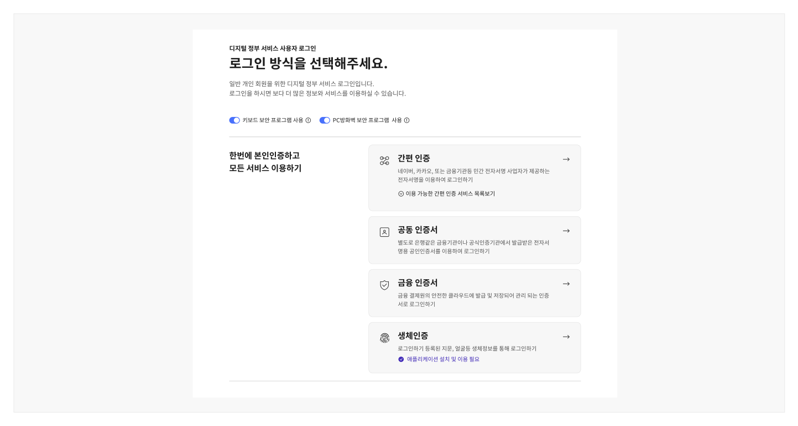
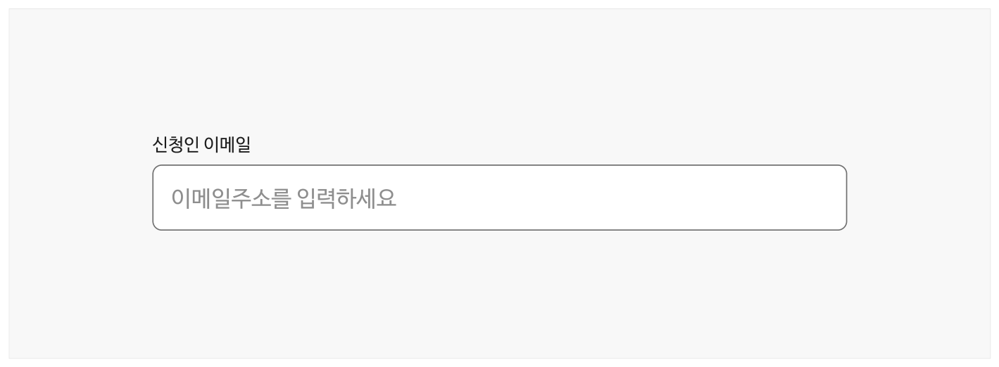

도움 패턴은 사용자에게 서비스를 이용하는 동안 사용자 인터페이스의 작동 방식과 사용 방법, 진행 중인 과업 플로(Flow) 등과 관련된 도움 정보를 제공하는 데 사용되는 다양한 유형의 컴포넌트 조합이다. 사용자의 능숙도와 이용 맥락에 적합한 도움 컴포넌트를 설계하여 제공함으로써 사용자는 보다 쉽고 빠르게 서비스를 이해하고 이용할 수 있게 된다.

## 유형

### 고정형 도움말

고정형 도움말은 사용자가 도움 콘텐츠를 읽고 활용하는 데 노력이 거의 들지 않는다. 사용자가 요청하지 않더라도 사용자 인터페이스, 콘텐츠 주변에 항상 표시되어 있다.

고정형 도움말은 대개 모든 사용자가 반드시 확인해야 하는 정보를 전달한다. 때문에 서비스를 처음 이용하거나 능숙도가 낮은 사용자를 돕기보다, 이용 빈도가 높은 사용자가 문제없이 서비스를 이용하는 것을 돕거나 일반적으로 사용자에게 익숙한 기능/화면을 구현하는 경우에 사용하기 적합한 수준의 도움말이다.
안내 영역



**시각 자료 텍스트 보완**

```text
섹션 헤딩 및 설명
```


**시각 자료 텍스트 보완**

```text
원본 PDF의 UI 배치·상태·다이어그램을 보존한 시각 자료입니다.
```
레이블


인라인 텍스트



**시각 자료 텍스트 보완**

```text
인라인 텍스트
플레이스홀더
```


**시각 자료 텍스트 보완**

```text
원본 PDF의 UI 배치·상태·다이어그램을 보존한 시각 자료입니다.
```
### 사용자 요청에 의한 도움말

사용자 요청에 의한 도움말은 사용자의 현재 작업과 관련된 상황적이고 시기적절한 도움말을 제공한다. 사용자가 특정 화면, 특정 섹션, 특정 요소에 대한 도움말 확인을 위해 도움말 표시 버튼을 클릭하였을 때 화면 이동 없이 요소 주변에 도움말이 제공되어, 사용자가 핵심적인 정보의 개념을 쉽게 이해하고 서비스의 이용 방향을 설정할 수 있도록 돕는다.

사용자 요청에 의한 도움말은 사용자가 문제를 겪기 전에 상황을 예방하는 데 도움을 주며 이를 통해 사용자가 서비스와 사용자 인터페이스에 익숙해지도록 한다. 서비스의 신규 사용자, 초보 사용자, 복잡한 서비스, 새로운 기능/정보를 도입한 화면에 사용하기 적합한 수준의 도움말이다.

툴팁


맥락적 도움말


도움 패널


코치마크


따라하기 패널

### 반응형 도움말

반응형 도움말은 사용자의 맥락을 벗어난 별도 화면에서 제공되는 정보, 문서 등의 도움말 리소스이다. 사용자는 문제를 겪는 상황에서 이를 해결하기 위해 반응형 도움말을 탐색한다.

예를 들어, 자주 묻는 질문, 도움말 메뉴 등은 반응형 도움말에 속한다.
## 사용성 가이드라인

### 공통

- 01 과업의 난이도와 복잡성을 고려하여 사용자에게 적절한 도움을 제공한다.
- 02 도움말 콘텐츠는 명확하고 간결한 내용으로 작성한다.
- 03 도움말 콘텐츠는 포괄적이고 유연한 내용으로 작성한다.
- 04 사용자 요청에 의한 도움말 콘텐츠는 반응형 방식으로도 사용할 수 있도록 한다.
- 05 동일한 페이지 제목, 버튼 이름을 지칭하기 위한 텍스트는 모든 서비스에서 동일하게 사용한다.
- 06 관련 화면/리소스 링크는 새 탭에서 화면이 연결되도록 제공한다.

### 안내 영역

- 01 안내 영역은 본문을 이해하고 이용하는 데 포괄적으로 이해가 필요한 정보를 전달하는 데 사용한다.
- 02 안내 영역은 본문 상단에 배치한다.
- 03 한 화면에 여러 개의 안내 영역을 사용하지 않는다.

### 플레이스홀더

01 플레이스홀더를 레이블이나 도움말의 대체 수단으로 사용하지 않는다.

### 인라인 텍스트

01 사용자가 작업을 완료하는 데 필요한 중요한 정보는 인라인 텍스트로 제공한다.
### 툴팁

01 컨트롤 요소에 대한 레이블과 같이 간단한 추가 정보를 제공하는 데 툴팁을 사용한다.

### 맥락적 도움말

01 컴포넌트의 상태나 관련된 상세 정보를 제공하는 데 맥락적 도움말을 사용한다.

### 도움 패널

01 도움말 콘텐츠의 양이 많거나 복잡한 과업에 도움 패널을 사용한다.

### 코치마크와 따라하기 패널

01 작업을 완료하는 방법에 대한 단계별 안내가 필요한 복잡한 과업에 코치마크와 따라하기 패널을 사용한다.
### 공통

### 01. 과업의 난이도와 복잡성을 고려하여 사용자에게 적절한 도움을 제공한다.

사용자가 문제에 직면하기 전에 필요한 도움을 받을 수 있도록 고정형 도움말과 사용자 요청에 의한 도움말을 적절하게 사용한다. 복잡도가 낮은 화면, 대부분의 사용자에게 익숙한 화면에는 고정형 도움말을 제공하고 반대로 복잡도가 높거나 사용자에게 새로운 기능/화면에는 사용자 요청에 의한 도움말을 사용하는 것이 좋다.

### 02. 도움말 콘텐츠는 명확하고 간결한 내용으로 작성한다.

고정형 도움말, 사용자 요청에 의한 도움말은 오류와 사용자의 문제 상황을 사전 예방하는 데 중요하지만 동시에 사용자가 완수하고자 하는 작업에 집중하는 것을 방해한다. 사용자가 도움 패턴을 통해 실질적인 도움을 받을 수 있도록 관련성 높고 유용한 정보를 사용자 관점에서 콘텐츠를 작성하여 적시에 제공해야 한다.

### 03. 도움말 콘텐츠는 포괄적이고 유연한 내용으로 작성한다.

특정 이용 환경, 이용 조건에서만 참고할 수 있는 내용으로 제공하지 않아야 한다. 가능한 한 다양한 사용자가 문제 없이 이용 가능한 도움말을 제공하여 도움 패턴을 통해 사용자가 실질적인 도움을 받을 수 있도록 해야 한다.
### 04. 사용자 요청에 의한 도움말 콘텐츠는 반응형 방식으로도 사용할 수 있도록 한다.

복잡한 기능/화면의 경우, 사용자는 도움이 필요한 맥락에 있지 않더라도 상황적·맥락적으로 제공받은 도움 콘텐츠를 다시 확인하고 싶을 수 있다. 따라서 사용자 요청에 의한 도움말 콘텐츠를 반응형 도움말로 동일하게 제공하여 필요에 따라 사용자가 접근할 수 있도록 해야 한다.

### 05. 동일한 페이지 제목, 버튼 이름을 지칭하기 위한 텍스트는 모든 서비스에서 동일하게 사용한다.

도움 콘텐츠에 관련 화면이나 리소스 링크를 포함하는 경우, 동일한 목적지/기능에 대해서는 일관성 있는 텍스트 표현을 사용하여 모든 사용자가 학습 없이 효율적으로 콘텐츠를 탐색할 수 있도록 해야 한다.

### 06. 관련 화면/리소스 링크는 새 탭에서 화면이 연결되도록 제공한다.

관련 화면/리소스는 사용자가 현재 탐색 중인 화면, 수행 중인 과업의 맥락 이해에 도움을 제공하기 위한 부가적인 정보이다. 따라서 관련 화면/리소스 링크를 실행하였을 때 탐색 중인 화면이 전환되어 사용자가 맥락을 잃어버리지 않도록 새 탭으로 링크를 실행해야 한다.
### 안내 영역

### 01. 안내 영역은 본문을 이해하고 이용하는 데 포괄적으로 이해가 필요한 정보를 전달하는 데 사용한다.

본문 콘텐츠와 전반적으로 관련 있는 도움말은 안내 영역에 배치하여 중요한 정보를 인지한 상태에서 본문에 접근할 수 있도록 한다. 안내 영역에 포함할 수 있는 정보의 예시는 다음과 같다.

- 취소/수정 가능 여부
- 전자서명/본인인증 절차의 포함 여부
- 제출할 증빙서류
- 기타 안내 사항

### 02. 안내 영역은 본문 상단에 배치한다.

안내 영역을 본문 하단에 배치하면 사용자는 정보가 필요한 순간에 도움말에 접근할 수 없다.

### 03. 한 화면에 여러 개의 안내 영역을 사용하지 않는다.

여러 개의 안내 영역을 사용하게 되면 사용자가 중요한 정보에 집중하기 어렵고 안내 영역 내부의 설명을 무시할 수 있다. 안내 영역에는 중요한 정보만 포함하여 간결하게 구성하고 필요한 경우 디스클로저 컴포넌트를 활용하여 정보를 제공한다. 이때, 디스클로저는 접힌 상태로 표시되어야 하며 사용자가 반드시 확인해야 할 중요한 정보를 담지 않아야 한다.
### 플레이스홀더

플레이스홀더를 레이블이나 도움말의 대체 수단으로 사용하지 않는다.

플레이스홀더는 사용자가 값을 입력하기 시작하는 순간 사라지기 때문에 플레이스홀더 텍스트가 인라인 텍스트와 완전히 동일하거나 추가적으로 전달되는 정보가 없어야 한다. 플레이스홀더는 다음과 같이 어떤 값을 입력해야 하는지에 대한 힌트나 예시를 제공하기 위한 목적으로 사용하기 적합하다. 그러나 이 경우에도 플레이스홀더 텍스트가 인라인 텍스트로 제공되어야 한다.

- 날짜, 숫자의 입력 형식을 안내함
- 입력 가능한 텍스트의 자릿수를 표시함
### 인라인 텍스트

사용자가 작업을 완료하는 데 필요한 중요한 정보는 인라인 텍스트로 제공한다.

사용자 요청에 의한 도움말은 사용자에 따라 발견이 어려울 수 있으므로 반드시 확인해야 하는 중요한 정보는 도움이 필요한 요소에 인접한 위치에 인라인 텍스트로 제공하는 것이 적합하다.
### 툴팁

컨트롤 요소에 대한 레이블과 같이 간단한 추가 정보를 제공하는 데 툴팁을 사용한다.

인라인 텍스트에 비해 중요도가 낮고 도움 정보가 1~2단어로 구성되어 있거나 한 문장으로 간결한 경우에는 툴팁을 사용한다. 예를 들어, 텍스트 레이블 없는 아이콘 단독 컨트롤 요소에 레이블을 표시하고자 하는 경우에는 툴팁을 사용한다.
### 맥락적 도움말

컴포넌트의 상태나 관련된 상세 정보를 제공하는 데 맥락적 도움말을 사용한다.

컴포넌트나 레이블 옆에 배치되어 해당 요소에 관한 부가적인 정보나 사용자가 알았을 때 도움이 되는 정보 또는 사용자의 과업을 적극적으로 돕기 위한 정보 제공에 맥락적 도움말을 사용한다.
### 도움 패널

도움말 콘텐츠의 양이 많거나 복잡한 과업에 도움 패널을 사용한다.

도움 패널은 본문 콘텐츠의 섹션이나 일부 요소에 대한 도움말이 많은 양의 텍스트나 관련 리소스로 구성되어 있어 개별 화면 수준의 도움말을 제공해야 하는 경우에 사용한다. 도움 패널에 주로 제공되는 정보의 예시는 다음과 같다.

- 과업 수행의 결과
- 입력 필드의 구성과 각 입력 필드에 정보 입력이 필요한 이유
- 선택적 입력 사항에 대한 입력을 결정하는 데 참고할 수 있는 정보
- 입력 필드에 값을 입력하는 방법
- 서비스에 대한 정의, 복잡한 용어 설명
### 코치마크와 따라하기 패널

작업을 완료하는 방법에 대한 단계별 안내가 필요한 복잡한 과업에 코치마크와 따라하기 패널을 사용한다.

사용자의 이용 빈도가 매우 낮고 여러 단계의 입력으로 구성된 과업에 코치마크와 따라하기 패널을 사용하면 사용자는 보다 쉽게 과업 목표를 달성할 수 있다.
