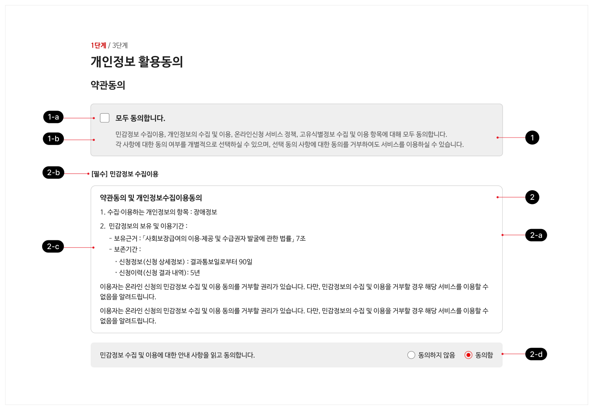

동의는 웹사이트의 이용 조건 및 절차 등을 명시한 내용을 읽고 동의 여부나 안내 사항의 확인 여부를 확인하는 데 사용되는 패턴이다. 대개 동의가 필요한 약관은 일반적으로 잘 사용되지 않는 용어로 작성되며 양이 매우 방대하므로 사용자의 이해를 도울 수 있도록 요소들을 알기 쉽게 구조화해야 한다.

## 구조

- 1 일괄 동의 옵션

- a. 체크박스: 동의 목록의 전체 항목의 동의 옵션 선택 상태를 토글하는 데 사용됨
- b. 설명: 동의하는 항목 전체에 대한 정보와 선택 동의 항목에 대한 설명이 제공됨

- 2 목록

- a. 컨테이너: 항목을 다른 항목과 구분하는 시각적 구분자
- b. 제목: 동의 목록의 각 항목 제목으로 본문에 제공되고 있는 콘텐츠의 제목에 해당하는 텍스트
- c. 본문: 약관 등에 대한 상세 설명
- d. 동의 옵션: 항목에 대한 동의 여부를 선택하기 위한 라디오 버튼 또는 체크박스


**시각 자료 텍스트 보완**

```text
1-a
1-b
2-b
2-a
2-c
2-d
```
## 사용성 가이드라인

- 01 동의하지 않음 옵션을 제공한다.
- 02 동의함/동의하지 않음 옵션은 구분하기 쉽게 표현한다.
- 03 필수 항목과 선택 항목 정보를 제공하고 명확하게 구분될 수 있도록 표현한다.
### 01. 동의하지 않음 옵션을 제공한다.

대안을 선택할 수 있는 기회를 제공받은 것으로 인해, 사용자는 약관에 동의하는 행동이 더욱 의미 있다고 느끼게 된다.

### 02. 동의함/동의하지 않음 옵션은 구분하기 쉽게 표현한다.

선택 옵션이 다른 요소들과 잘 구분되지 않으면, 사용자는 동의 여부 선택 옵션을 인지하지 못해, 선택 과정 없이 다음 단계로 넘어가려는 시도를 하게 되고 결국 오류가 발생할 수 있다.

### 03. 필수 항목과 선택 항목 정보를 제공하고 명확하게 구분될 수 있도록 표현한다.

사용자가 동의하지 않아도 서비스를 이용하는 데 문제가 없는 선택적 동의 항목과 필수 동의 항목은 명확하게 구분되어야 한다. 동의 항목의 제목에 '필수' ,'선택' 텍스트를 표시하고 필수 항목은 동의 항목 목록의 상단에 그루핑하여 배치한다.


## 접근성 가이드라인

### 01. 키보드를 이용하여 약관 내용을 확인할 수 있도록 제공한다.

약관 내용 영역에 생성된 스크롤은 키보드를 이용하여 조작할 수 있도록 제공하여, 키보드 사용자가 스크롤 하단에 숨겨진 내용을 확인할 수 있어야 한다.

- KWCAG 2.2 키보드 사용 보장
- WCAG 2.1 Keyboard (A)
- WCAG 2.1 No Keyboard Trap (A)

### 02. 약관 내용을 적절하게 구조화하여 제공한다.

웹 문서에서 약관 내용을 제목, 문단 등으로 적절히 구조화하여 제공하면 보조 기기 사용자가 콘텐츠를 탐색하고 이해하기 쉬워진다.

- KWCAG 2.2 제목 제공
- WCAG 2.1 Info and Relationships (A)

### 03. 동의함/동의하지 않음 옵션에 설명을 제공한다.

동의함, 동의하지 않음 라디오 버튼 양식의 레이블은 양식 오른쪽에 배치한다. 동의 항목이 여러 개 제공되는 상황을 고려하여 스크린 리더 사용자가 각 라디오 버튼이 어떤 항목에 대한 동의 옵션인지 명확하게 확인할 수 있도록 aria-describedby 속성을 이용하여 상응하는 동의 항목의 제목과 연결한다.

- KWCAG 2.2 레이블 제공
- WCAG 2.1 Info and Relationships (A)
- WCAG 2.1 Labels or Instructions (A)
## 상호작용 가이드라인

### 목록 탐색

### 동의 옵션 선택

### 일괄 선택

개별 선택 항목 중 단 하나라도 '동의 안 함' 옵션이 선택되어 있다면 일괄 선택 체크박스는 선택 해제 상태가 유지되어야 한다.

| 구분 | 설명 |
|---|---|
| Tab | 목록 내 다음 인터페이스 요소로 키보드 초점이 이동하고 초점을 받은 요소에 키보드 포커스링이 표시된다. |
| Shift + Tab | 목록 내 이전 인터페이스 요소로 키보드 초점이 이동하고 초점을 받은 요소에 키보드 포커스링이 표시된다. |

| 구분 | 설명 |
|---|---|
| Click | 일괄 선택 체크박스를 Click 하여 값이 선택되면 모든 동의 옵션의 '동의함' 값이 선택된다. 체크박스를 Click 하여 값의 선택이 해제되면서 모든 동의 옵션의 '동의 안 함' 값이 선택된다. 초점은 체크박스에 유지되어야 한다. |
| Space | 일괄 선택 체크박스가 초점을 가진 상태에서 Space 키에 대한 Keyup 이벤트가 발생하면 체크박스가 선택 상태로 전환되면서 모든 동의 옵션의 '동의함' 값이 선택된다. 이 상태에서 다시 체크박스에 동일한 이벤트가 발생하면 값의 선택이 해제되면서 모든 동의 옵션의 '동의 안 함' 값이 선택된다. 초점은 체크박스에 유지되어야 한다. |
### 개별 선택

라디오 버튼과 체크박스 컴포넌트의 가이드라인을 따른다.
