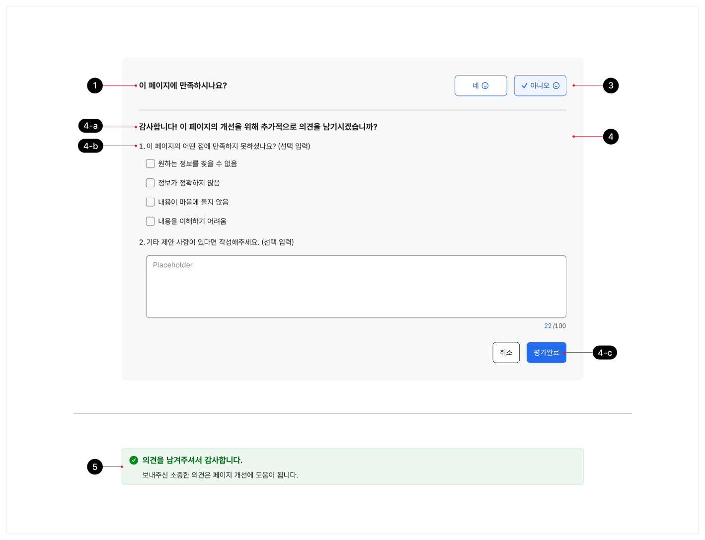

사용자 피드백은 사용자로부터 특정 화면/기능 이용 경험에 대한 평가 의견, 불편 사항, 제안 사항을 수집하는 데 사용되는 패턴이다. 서비스 이용 맥락에서 직접적으로 사용자의 의견을 수집할 수 있는 수단이므로 서비스 운영에 매우 중요한 요소이나, 사용자가 의견을 남기는 것이 의무 사항이 아니므로 사용자의 과업을 방해하지 않으면서 의견을 남기도록 유도하는 것이 중요하다.

## 용례

### 사용하기 적합한 경우

화면별 사용자의 이용 의견을 상시적으로 확인하고자 하는 경우

새로운 기능이나 정보에 대한 의견을 확인하고자 하는 경우

### 사용하기 적합하지 않은 경우

서비스 전체에 대한 종합적인 사용자 의견을 수렴하고자 하는 경우

다수의 질문으로 구성되어 있고 단계가 필요한 입력폼으로 구성되기 때문에 별도의 화면을 구성하여 의견을 수렴하는 것이 적절하다.
## 구조

- 1 제목: 사용자에게 의견을 구할 대상을 설명하는 질문 형식의 간결한 텍스트
- 2 설명(선택): 제목에 대해 부가적으로 설명이 필요한 경우에 사용하는 선택적 텍스트
- 3 평가

a. 감정 표현: 만족, 불만족 형식으로 사용자의 감정 정보를 수집함 b. 별점: 1~5점의 점수 체계를 통해 사용자의 피드백을 정량적으로 수집함

- 4 맞춤 영역(선택)

- a. 제목: 사용자에게 추가적으로 확인하고자 하는 내용에 대한 간단한 설명
- b. 질문: 1~3개의 추가적인 질문으로 라디오 버튼, 체크박스, 텍스트 입력 필드와 같은 컴포넌트로 구성됨
- c. 액션 버튼: 부가적인 질문에 대해 응답하지 않기로 선택하거나, 응답 후 최종적으로 피드백을 제출하는 데 사용되는 버튼 그룹

- 5 완료 메시지: 피드백 제출이 완료되었음을 사용자에게 알려주는 메시지


**시각 자료 텍스트 보완**

```text
4-a
4-b
4-c
```
## 사용성 가이드라인

- 01 사용자 피드백은 화면 하단 또는 본문의 사이드 영역에 배치한다.
- 02 사용자 피드백을 시의적으로 사용하는 경우 사용자의 작업이 완료된 후에 유도 메시지를 제공한다.
- 03 사용자 피드백은 폐쇄형 질문으로 시작한다.
- 04 평가의 선택지를 최소화한다.
- 05 맞춤 영역의 질문을 간결하게 구성한다.
- 06 맞춤 영역의 질문에 대한 응답 방식을 유연하게 구성한다.
### 01. 사용자 피드백은 화면 하단 또는 본문의 사이드 영역에 배치한다.

사용자가 방해 없이 페이지 본문의 정보와 기능을 이용한 후에 피드백을 남길 수 있도록 화면 하단에 배치한다. 만약 본문의 너비가 충분하고 화면의 복잡도가 높지 않다면 사용자의 평가를 유도하기 위해 사이드 영역에 배치할 수 있다.

### 02. 사용자 피드백을 시의적으로 사용하는 경우 사용자의 작업이 완료된 후에 유도 메시지를 제공한다.

새로운 기능이나 정보에 대한 의견을 확인하고자 하는 경우, 웹 페이지가 로딩되자마자 사용자 피드백 요소가 강조되어 표현되면 사용자에게 방해가 된다. 서비스를 이용하지 않은 상태에서 피드백을 제공할 수는 없으므로 의견을 받고자 하는 사용자가 정보/기능의 이용을 완료한 후에 사용자 피드백 요소가 출현해야 한다.

### 03. 사용자 피드백은 폐쇄형 질문으로 시작한다.

사용자가 쉽고 빠르게 사용자 피드백 요소에 접근할 수 있도록 선택 가능한 값이 1개로 정해져 있는 폐쇄형 질문을 기본 평가 질문으로 제공해야 한다. 사용자가 직접 의견을 작성하도록 하는 개방형 질문이 평가의 시작 질문으로 제공되면 사용자는 피드백을 남기는 데 많은 노력이 필요하다고 판단하여 의견 남기기를 시도하지 않을 수 있다.
### 04. 평가의 선택지를 최소화한다.

평가의 선택지 개수가 늘어날수록 사용자가 응답을 선택하는 데 걸리는 시간과 함께 의도하지 않은 응답을 선택하는 실수 역시 증가한다. 가능한 한 2가지 선택지로 간결하게 구성된 감정 평가 방식을 사용하고, 별점을 사용하는 경우에는 선택지가 5개를 초과하지 않도록 한다.

### 05. 맞춤 영역의 질문을 간결하게 구성한다.

맞춤 영역에 제공되는 추가적인 질문은 최대 3개만 사용한다. 심도 깊은 평가나 의견이 필요한 경우 별도 화면이나 채널을 활용해야 한다.

### 06. 맞춤 영역의 질문에 대한 응답 방식을 유연하게 구성한다.

사용자가 서비스 운영자에게 전달하고자 하는 의견을 표현하는 데 적합한 질문과 응답 방식을 사용한다. 개방형 질문은 폐쇄형 질문에서 미처 표현하지 못한 사용자의 의견을 수집하는 데 효과적이다. 그러나 개방형 질문으로 인해 사용자가 부담을 느낄 수 있으므로 개방형 질문을 사용하는 경우 가장 마지막 질문으로 사용하는 것이 좋다.


### 플랫폼에 대한 고려 사항

화면 너비가 충분하지 않은 경우, 어사이드에 배치된 사용자 피드백은 화면 하단에 배치한다.

사용자가 방해 없이 본문의 정보와 기능을 이용한 후에 피드백을 남길 수 있도록 사용자 피드백을 버튼으로 축약하여 플로팅 시키지 않고 화면 하단에 배치한다.


## 접근성 가이드라인

### 01. 각 입력 필드와 입력폼에 이름을 제공한다.

스크린 리더에서 사용자 피드백의 질문을 구성하고 있는 각각의 입력 요소의 용도를 이해할 수 있도록 접근 가능한 이름을 제공해야 한다.

- KWCAG 2.2 레이블 제공
- WCAG 2.1 Info and Relationships (A)
- WCAG 2.1 Name, Role, Value (A)

### 02. 맞춤 영역, 완료 메시지에 live-region을 적용한다.

스크린 리더 사용자는 맞춤 영역의 출현이나 피드백 메시지로의 전환 상태를 인지하지 못할 수 있으므로 aria-live="polite" 속성을 사용자 피드백 구획에 제공한다.

- WCAG 2.1 Name, Role, Value (A)
- WCAG 2.1 Status Messages (AA)
## 상호작용 가이드라인

### 평가 선택

### 맞춤 영역의 요소 탐색

| 구분 | 설명 |
|---|---|
| Click | 감정 표현이나 별점 버튼을 Click 하였을 때, 맞춤 영역이 사용되는 경우 사용자 피드백 컨테이너 높이가 확장되면서 하단으로 맞춤 영역이 표시된다. 맞춤 영역이 없는 경우 평가가 제출되면서 헤딩과 설명은 사라지고 그 자리가 완료 메시지로 대체된다. |
| Enter, Space | 감정 표현이나 별점 버튼이 초점을 가진 상태에서 Enter 또는 Space 키에 대해 Keyup 이벤트가 발생하였을 때, 맞춤 영역이 사용되는 경우 사용자 피드백 컨테이너 높이가 확장되면서 하단으로 맞춤 영역이 표시된다. 맞춤 영역이 없는 경우 평가가 제출되면서 헤딩과 설명은 사라지고 그 자리가 완료 메시지로 대체된다. 초점은 사용자가 선택한 평가 버튼에 유지된다. |

| 구분 | 설명 |
|---|---|
| Tab, Shift + Tab | 맞춤 영역 내부에 입력 서식 요소, 액션 버튼에 키보드 초점이 순차적으로 접근한다. |
### 최종 응답 제출

| 구분 | 설명 |
|---|---|
| Click | 맞춤 영역이 존재하는 경우, 취소 또는 평가 완료 버튼을 Click 하면 평가 입력폼이 제출 완료되면서 완료 메시지가 제공된다. |
| Enter, Space | 맞춤 영역이 존재하는 경우, 취소 또는 평가 완료 버튼이 초점을 가진 상태에서 Enter 또는 Space 키에 대해 Keyup 이벤트가 발생하였을 때 평가 입력폼이 제출 완료되면서 완료 메시지가 제공된다. |
