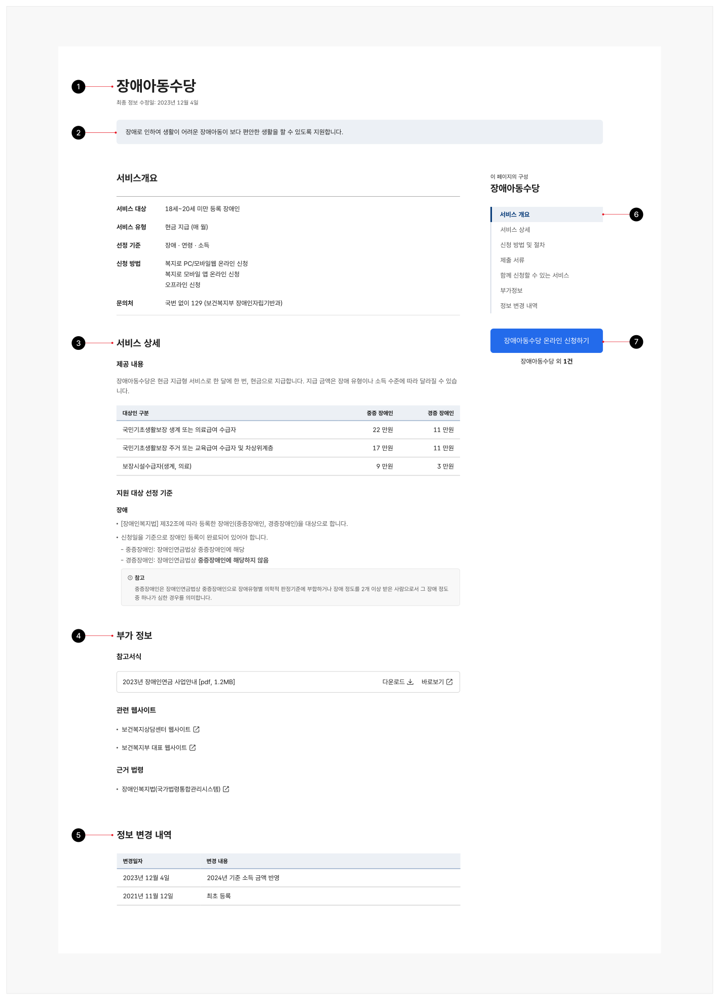
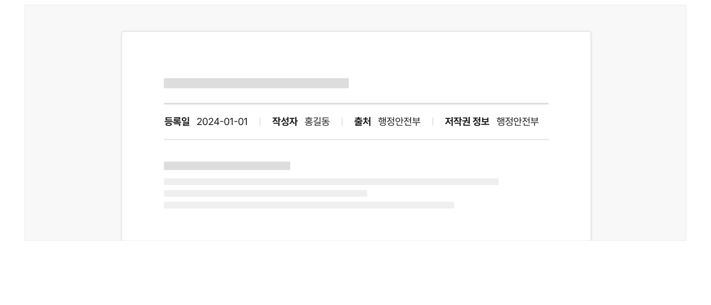
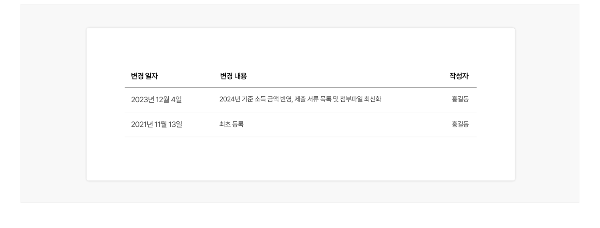
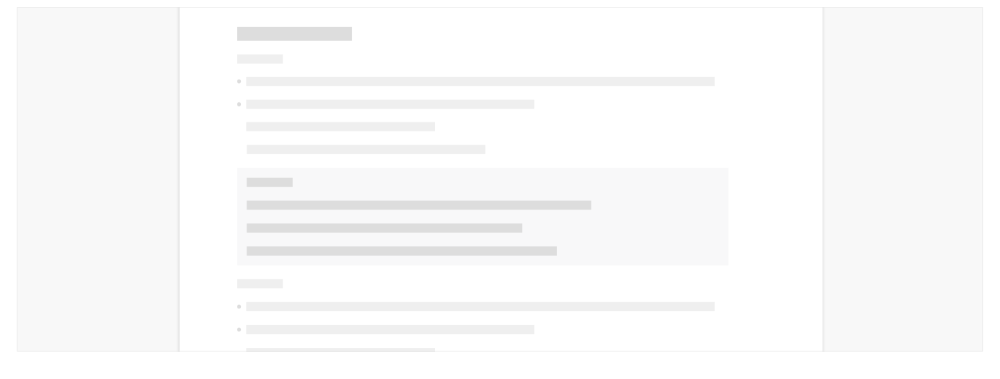
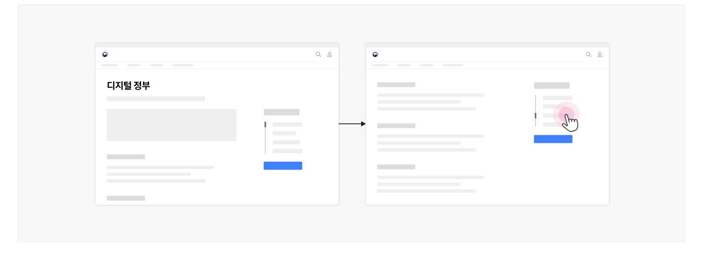
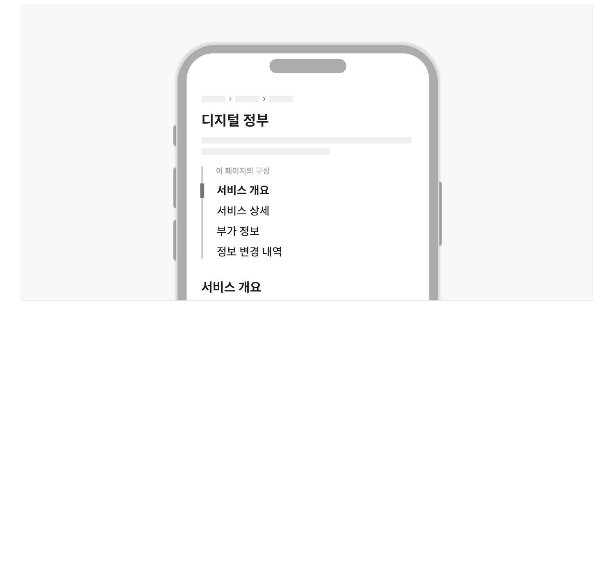

상세 정보는 특정한 주제에 관한 정보를 제공하는 패턴으로, 효과적인 정보 전달을 위해 텍스트 이외에 다양한 시각적 요소들이 활용된다. 사용자들은 콘텐츠 목록에서 콘텐츠 제목이나 요약 정보를 포함한 링크를 통해 상세 정보에 접근하기 때문에, 사용자가 예상하는 정보를 명확하고 간결하게 전달할 수 있어야 한다.

## 유형

### 단일 화면

모든 상세 정보를 하나의 화면에 제공하고 주요 단락 사이를 콘텐츠 내 탐색을 활용하여 이동한다. 불가피하게 탭을 사용해야 하는 상황을 제외하고 상세 정보는 기본적으로 단일 화면 레이아웃으로 제공되는 것이 바람직하다.

### 탭

단일 화면에서 콘텐츠를 소구하기에 콘텐츠 내용이 지나치게 복잡하거나 콘텐츠 섹션 간 성격이 달라 사용자가 섹션의 내용을 비교해가며 파악하지 않아도 될 때 사용하기 적합한 레이아웃이다.
## 구조

- 1 제목: 본문 전체에 대한 제목
- 2 요약 정보: 본문의 주요 내용을 요약하여 설명하는 2~3줄의 텍스트
- 3 상세 정보: 상세 정보를 전달하기 위한 콘텐츠 섹션으로 구성된 본문
- 4 부가 정보: 본문에 대한 이해를 돕기 위해 제공되는 콘텐츠 섹션으로 구성됨
- 5 콘텐츠 변경 이력: 정보의 업로드일, 변경일, 변경된 내용에 대한 로그 기록
- 6 콘텐츠 내 탐색: 본문의 콘텐츠 섹션의 구조를 파악하고 원하는 섹션으로 이동할 수 있도록 도와주는 탐색 수단
- 7 액션 버튼: 정보와 관련된 기능을 실행하는 버튼 또는 관련 페이지로 이동할 수 있는 링크


## 사용성 가이드라인

- 01 콘텐츠의 작성자, 출처, 저작권을 표시한다.
- 02 정보 등록, 변경 일자와 변경 내역을 제공한다.
- 03 제목은 다른 요소들과 구분되도록 표현한다.
- 04 콘텐츠 요소들 사이의 계층구조를 명확하게 구분한다.
- 05 문단과 문장은 최대한 간단명료하게 구성한다.
- 06 핵심 주제는 첫 문단, 첫 문장에 포함시킨다.
- 07 인포그래픽, 사진, 동영상 등의 콘텐츠를 적절하게 활용한다.
- 08 외부 서비스로 이동하거나 새 창을 실행하는 액션 버튼에 명확한 시각적 단서를 제공한다.
- 09 화면 너비가 충분한 경우 콘텐츠 내 탐색을 표시하고 본문 우측의 일관된 위치에 고정하여 제공한다.
### 01. 콘텐츠의 작성자, 출처, 저작권을 표시한다.

모든 상세 콘텐츠에 작성자, 출처, 저작권 정보를 표시하여 사용자가 신뢰를 가지고 정보를 이용할 수 있도록 해야 한다.

[모범 사례]



**사례 텍스트 보완**

```text
등록일
20240101
작성자 홍길동
출처 행정안전부
저작권 정보 행정안전부
```
### 02. 정보 등록, 변경 일자와 변경 내역을 제공한다.

정보가 업로드된 최초 날짜부터 시작하여 모든 변경 내역의 반영 일자와 변경 내역을 헤딩 근처와 본문 마지막에 제공해야 한다. 이를 통해 디지털 정부서비스가 지속적으로 관리되고 있음을 사용자가 인지할 수 있다.

[모범 사례]



**사례 텍스트 보완**

```text
변경 일자
변경 내용
작성자
2024년 기준 소득 금액 반영, 제출 서류 목록 및 첨부파일 최신화
홍길동
2023년 12월 4일
최초 등록
2021년 11월 13일
```
### 03. 제목은 다른 요소들과 구분되도록 표현한다.

제목은 웹사이트에서의 현재 사용자 위치를 알려주고, 본문을 읽기 전에 간략한 내용을 파악할 수 있게 도와준다. 따라서 각 콘텐츠의 제목은 다른 요소와 명확하게 구분되어 표현되어야 한다.
### 04. 콘텐츠 요소들 사이의 계층구조를 명확하게 구분한다.

요소들 간 계층구조를 명확하게 구분하면, 사용자는 중요한 정보를 더욱 빠르게 처리할 수 있다.

[모범 사례]



**사례 텍스트 보완**

```text
피해야 할 사례
```
[피해야 할 사례]


**사례 텍스트 보완**

```text
원본 PDF의 UI 배치·상태·다이어그램을 보존한 시각 자료입니다.
```
### 05. 문단과 문장은 최대한 간단명료하게 구성한다.

사용자의 이해를 촉진할 수 있도록, 문단을 구성하는 문장, 문장을 구성하는 단어를 가능한 한 간단명료하게 사용해야 한다.

### 06. 핵심 주제는 첫 문단, 첫 문장에 포함시킨다.

핵심 주제를 문단이나 문장의 첫 부분에 배치하면 다음에 어떤 내용이 나올 것인지를 충분히 예측할 수 있으므로 내용을 조직화하고 이해하기 쉽다.

### 07. 인포그래픽, 사진, 동영상 등의 콘텐츠를 적절하게 활용한다.

시각적 정보를 활용하면 텍스트에만 의존하는 것보다 말하고자 하는 바를 효과적으로 전달할 수 있으며 사용자의 흥미를 유발한다.

### 08. 외부 서비스로 이동하거나 새 창을 실행하는 액션 버튼에 명확한 시각적 단서를 제공한다.

새 창 열림 아이콘을 표시하여 사용자가 원하지 않는 상황에서 현재의 이용 맥락을 벗어나지 않도록 한다.
### 09. 화면 너비가 충분한 경우 콘텐츠 내 탐색을 표시하고 본문 우측의 일관된 위치에 고정하여 제공한다.

콘텐츠의 목차로 작동하여 사용자가 화면 구조를 훑어볼 수 있으며, 콘텐츠 내 탐색에서 특정 항목을 클릭하면 연결된 섹션으로 스크롤 되므로 원하는 콘텐츠로 빠르게 이동할 수 있다.

[모범 사례]



**사례 텍스트 보완**

```text
디지털 정부
```


### 플랫폼에 대한 고려 사항

### 모바일에서 콘텐츠 내 탐색은 제목과 본문 사이에 배치한다.

화면 너비가 충분하지 않을 때, 콘텐츠 내 탐색은 특정 위치에 고정하지 않고 제목과 본문 사이에 배치한다. 본문의 구조가 복잡하여 콘텐츠 내 탐색의 길이가 길어질 경우, 디스클로저와 같은 확장 가능한 섹션으로 콘텐츠 내 탐색을 제공할 수 있다.

[모범 사례]



**사례 텍스트 보완**

```text
디지털 정부
이 페이지의 구성
서비스 개요
서비스 상세
부가 정보
정보 변경 내역
```
## 접근성 가이드라인

### 01. 텍스트 콘텐츠와 배경 간 명도 대비를 4.5:1 이상으로 제공한다.

텍스트 콘텐츠와 배경 사이의 명도 대비를 4.5:1 이상으로 제공하여 저시력 사용자가 어려움 없이 콘텐츠를 이해할 수 있도록 해야 한다. 화면을 확대할 수 있는 경우 명도 대비를 3:1까지 낮출 수 있다.

- KWCAG 2.2 텍스트 콘텐츠의 명도 대비
- WCAG 2.1 Cotrast (Minimum) (AA)

### 02. 텍스트 이외의 콘텐츠에 대체 수단을 제공한다.

보조 기술 사용자 등의 접근성 사용자가 이미지, 음성, 동영상 등 텍스트 이외의 콘텐츠 정보를 이해할 수 있도록 대체 수단을 제공해야 한다.

- KWCAG 2.2 적절한 대체 텍스트 제공
- KWCAG 2.2 자막 제공
- WCAG 2.1 Non-text Content (A)
- WCAG 2.1 Audio-only and Video-only (Prerecorded) (A)
- WCAG 2.1 Captions (Prerecorded) (A)
- WCAG 2.1 Audio Description or Media Alternative (Prerecorded) (A)
- WCAG 2.1 Captions (Live) (AA)
- WCAG 2.1 Audio Description (Prerecorded) (AA)
### 03. 멀티미디어 콘텐츠 플레이어는 키보드로 조작할 수 있도록 제공한다.

멀티미디어 콘텐츠의 플레이어에서 사용할 수 있는 재생/정지, 음량 조절, 시간 조절 등의 모든 기능은 키보드를 이용하여 조작할 수 있어야 한다.

- KWCAG 2.2 키보드 사용 보장
- WCAG 2.1 Keyboard (A)

### 04. 멀티미디어 콘텐츠가 자동으로 재생되지 않도록 제공한다.

음성 정보가 포함된 멀티미디어 콘텐츠가 자동으로 재생되면, 모든 웹 문서 정보를 소리를 통해 전달 받는 보조 기술 사용자의 웹 페이지 탐색에 방해가 될 수 있다. 그러므로 사용자가 재생 동작을 수행하기 전에 멀티미디어 콘텐츠가 자동으로 재생되지 않도록 해야 한다.

- KWCAG 2.2 정지 기능 제공
- KWCAG 2.2 자동 재생 금지
- WCAG 2.1 Pause, Stop, Hide (A)
- WCAG 2.1 Audio Control (A)
### 05. 가능한 한 이미지 텍스트를 사용하지 않는다.

텍스트 정보를 이미지 형식으로 제공하게 되면 사용자가 해상도 손실 없이 텍스트를 확대/축소할 수 없으며 명도 대비, 자간 등의 표현을 상황에 맞게 조정할 수 없게 된다.

저시력 사용자, 읽기 장애가 있는 사용자가 텍스트 정보의 표현 방식을 변경하여 콘텐츠를 인지할 수 있도록 심미적인 효과 또는 특정한 텍스트 표현이 필수적인 경우를 제외하고 이미지 텍스트를 사용하지 않아야 한다.

- WCAG 2.1 Images of Text (AA)

### 06. 시각적으로 표현된 콘텐츠의 구조, 수준을 프로그램적으로 동일하게 제공한다.

본문을 구성하는 제목, 목록, 표 등 구조화된 정보는 &lt;h2&gt;~&lt;h6&gt;, &lt;ul&gt;, &lt;ol&gt;, &lt;li&gt;, &lt;table&gt;, &lt;strong&gt; 등 해당 정보를 의미하는 요소로 제공하여 스크린 리더에서도 정보를 동등하게 인지할 수 있어야 한다.

- KWCAG 2.2 제목 제공
- WCAG 2.1 Info and Relationships (A)
