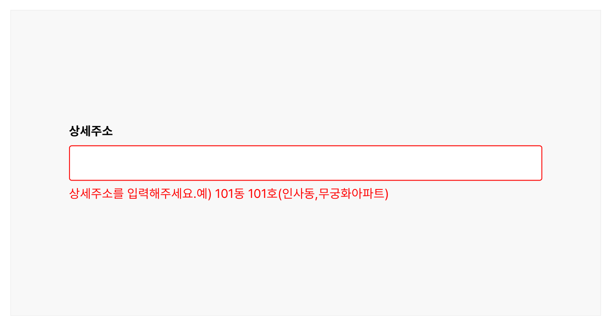
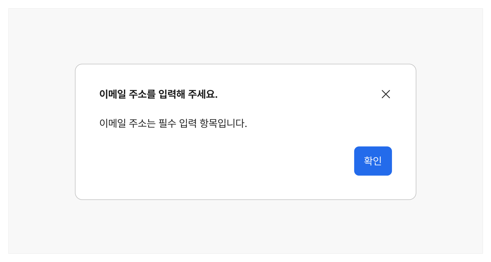

오류는 사용자가 요청한 작업을 시스템이 완료하지 못하는 문제가 발생했을 때 제공된다. 발생 가능한 문제를 사전에 안내하는 경고와는 달리, 오류는 이미 발생한 문제에 관한 정보를 사용자에게 알려준다. 오류정보는 단순히 사용자에게 문제가 발생했음을 알려주는 데 그치지 않고 본래 수행하고자 했던 행동을 완수할 수 있게 유도해야 한다. 오류정보를 제공하기 위해 별도의 모달을 사용하거나 오류가 발생한 지점에 직접 메시지를 전달할 수 있다.

## 유형

인라인 메시지



**시각 자료 텍스트 보완**

```text
오류는 사용자가 요청한 작업을 시스템이 완료하지 못하는 문제가 발생했을 때 제공된다. 발생 가능한 문제를 사전에 안내하는 경고와는 달리, 오류는 이미 발생한 문제에 관한 정보를 사용자에게 알려준다. 오류정보는 단순히 사용자에게 문제가 발생했음을 알려주는 데 그치지 않고 본래 수행하고자 했던 행동을 완수할 수 있게 유도해야 한다. 오류정보를 제공하기 위해 별도의 모달을 사용하거나 오류가 발생한 지점에 직접 메시지를 전달할 수 있다.
유형
인라인 메시지
```
### 모달



**시각 자료 텍스트 보완**

```text
원본 PDF의 UI 배치·상태·다이어그램을 보존한 시각 자료입니다.
```
## 사용성 가이드라인

- 01 빠르게 인지할 수 있도록 표현한다.
- 02 발생한 오류 및 문제를 분명하게 설명한다.
- 03 오류를 수정할 수 있는 방법을 제공한다.
- 04 정중한 문체를 사용한다.
### 01. 빠르게 인지할 수 있도록 표현한다.

오류 메시지의 크기, 색상, 위치 등은 사용자가 빠르게 오류 발생 정보를 인지할 수 있게 표현해야 한다.

### 02. 발생한 오류 및 문제를 분명하게 설명한다.

사용자가 어떤 종류의 오류가 어떤 지점에서 발생했는지 명확히 이해할 수 있어야 오류를 수정할 수 있다.

### 03. 오류를 수정할 수 있는 방법을 제공한다.

오류의 내용이 복잡한 경우, 문제를 수정할 수 있는 방법을 함께 제공하면 효과적으로 오류를 수정할 수 있다.

### 04. 정중한 문체를 사용한다.

오류 메시지는 사용자에게 부정적인 상황을 알려주는 정보이므로, 정중한 문체를 사용하여 사용자를 안심시켜야 한다.


## 접근성 가이드라인

### 오류가 발생한 요소로 초점이 자동으로 이동되도록 제공한다.

모달을 이용하여 오류 메시지가 제공되는 경우, 창이 닫힌 후 초점을 오류가 발생한 입력 필드로 이동 시키면 보조 기술 사용자는 부가적인 탐색 과정 없이 오류를 빠르게 수정할 수 있다.

- KWCAG 2.2 오류 정정
- WCAG 2.1 Error Identification (A)

### 사용자의 입력 값이 유지되도록 한다.

오류 발생을 안내한 후에도 사용자가 입력한 값이나 조작한 내용을 유지하여, 사용자가 무엇이 잘못되었는지 확인하고 값을 수정할 수 있도록 해야 한다.

- KWCAG 2.2 오류 정정
- WCAG 2.1 Error Identification (A)
