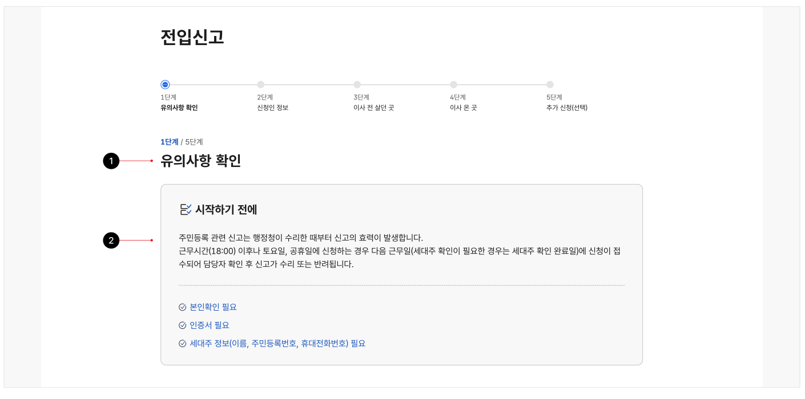
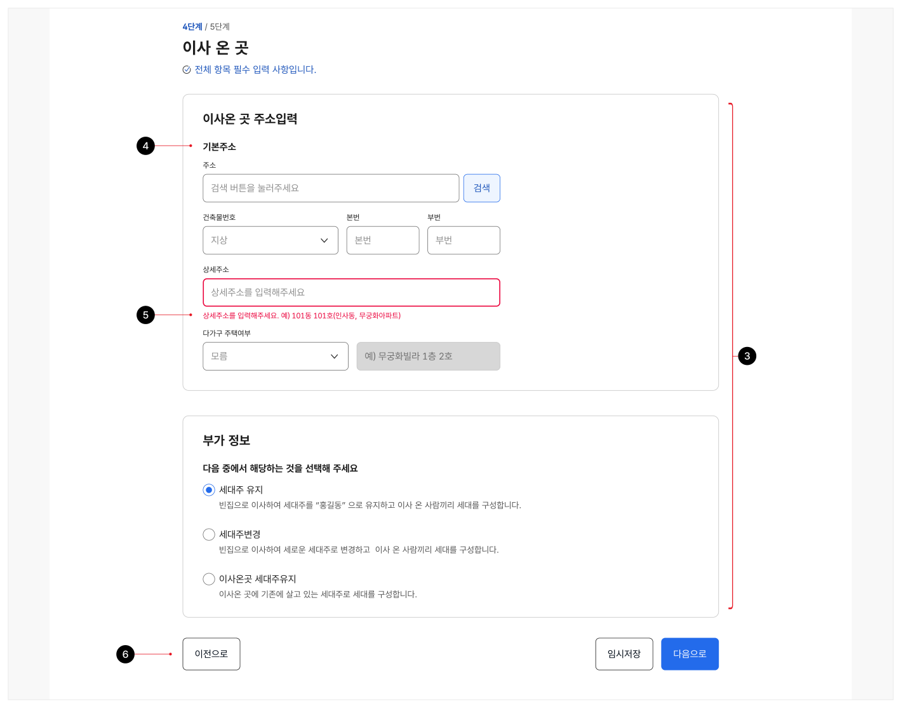
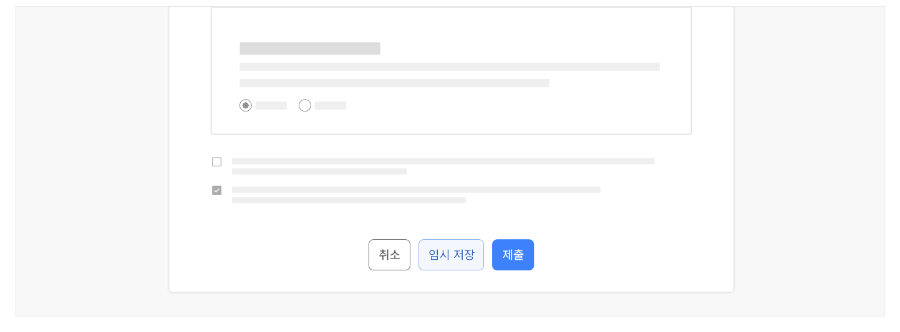
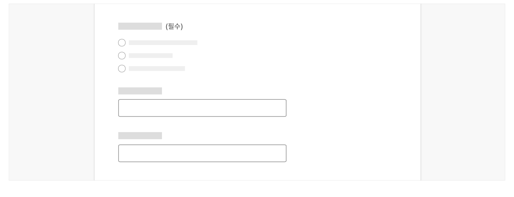
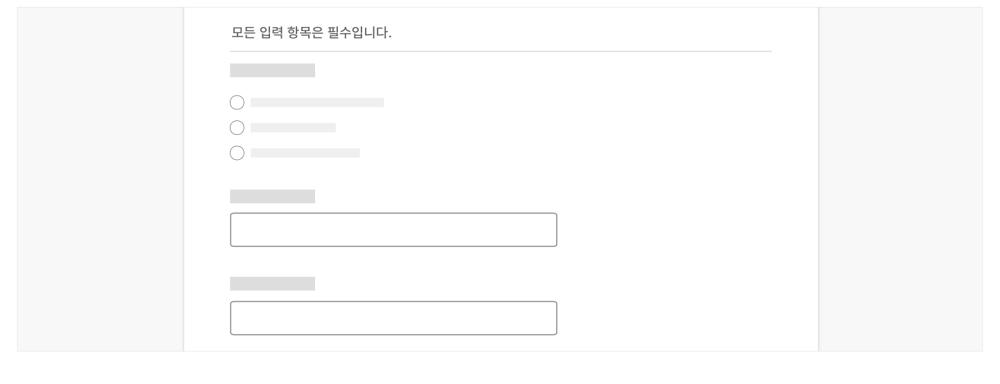
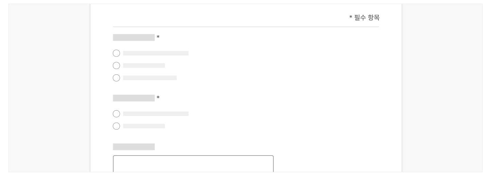
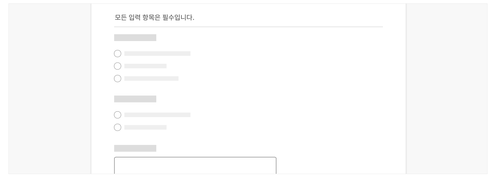
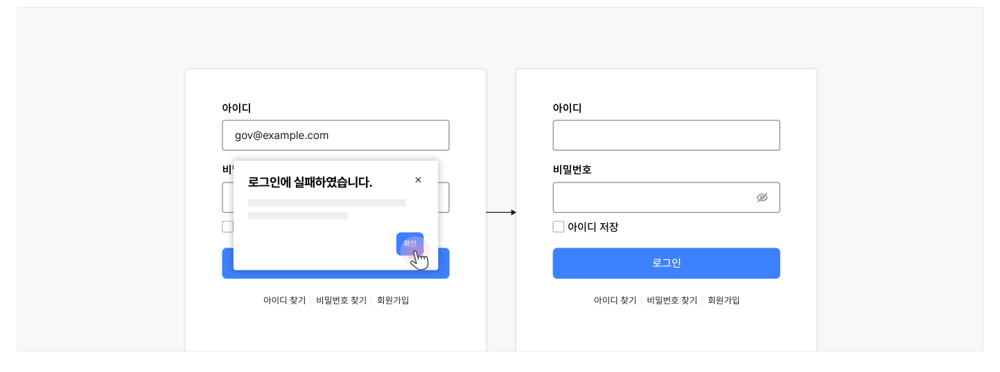

입력폼은 사용자가 데이터를 입력하여 서버로 전송하는 데 사용하는 콘텐츠 섹션으로 하나 이상의 입력 컨트롤로 구성된다.

## 구조

- 1 제목: 입력폼의 목적에 대한 설명
- 2 설명(선택): 입력폼의 목적에 대한 부가적인 설명이나 사용자가 데이터를 입력할 때 유의해야 하는 사항 등 총체적인 안내를 제공하는 문장
- 3 콘텐츠: 데이터 입력을 위한 컴포넌트의 모음
- 4 필드셋(선택): 서로 관련된 여러 데이터 입력 컴포넌트를 의미적으로 그룹화하는 요소
- 5 오류 메시지: 사용자의 데이터 입력에 오류가 발생했을 때 제공되는 피드백 메시지
- 6 액션 버튼: 입력폼의 데이터를 서버로 전송하거나 입력값 또는 입력 프로세스를 중단하기 위한 액션 버튼 그룹




**시각 자료 텍스트 보완**

```text
원본 PDF의 UI 배치·상태·다이어그램을 보존한 시각 자료입니다.
```
## 유형

### 단일 화면에서의 데이터 입력

가장 기본적인 입력폼의 유형으로 1개 이상의 폼 콘텐츠로 구성된다. 점진적 공개법(Progressive disclosure)을 활용하면 별도의 단계 이동 없이 한 화면 내에서도 데이터 입력 과정의 복잡성을 줄일 수 있다.

### 모달을 활용한 데이터 입력

매우 중요한 데이터이면서 빈번하게 입력/수정하지 않는 데이터는 모달 컴포넌트를 입력폼의 컨테이너로 활용함으로써 사용자가 데이터 입력에 집중하고 실수하지 않도록 도와줄 수 있다. 모달에서 데이터를 입력받는 경우 콘텐츠의 수, 즉 입력 관련 컴포넌트의 수를 5개 이내로 구성하는 것이 바람직하다.

### 단계별 데이터 입력

입력해야 할 데이터가 복잡하거나 이로 인해 데이터의 중간 저장이 필요한 경우, 여러 화면에 입력폼을 단계별로 나누어 제공할 수 있다. 이때, 실질적인 데이터 입력은 명확한 단계로 구성되어야 하고 각 단계 내 콘텐츠는 논리적, 선형적 관계가 존재해야 한다. 또한 별도의 컴포넌트를 활용하여 단계의 완수/진행률을 표시해야 한다. 과업에 숙달된 사용자의 경우 데이터를 단계별로 입력하게 되면 효율적으로 데이터를 입력하기 어렵다. 그러므로 단계별 데이터 입력을 사용하기 전에 논리적인 구조에 따라 콘텐츠 섹션을 구분하고 적절하게 강조된 정확한 헤딩 사용, 콘텐츠 간결화를 먼저 시도해야 한다. 간단한 질문부터 점차 어려운 질문으로 사용자를 점진적으로 안내하며, 질문을 의미 있는 작은 덩어리로 나눈다.
## 사용성 가이드라인

- 01 콘텐츠는 가능한 한 하나의 열에 수직으로 정렬한다
- 02 입력폼과 입력폼, 콘텐츠와 콘텐츠 사이에 충분한 간격을 제공한다.
- 03 액션 버튼은 일관된 위치에 배치하고 정렬한다.
- 04 비활성화 상태의 입력폼 제출 버튼 사용을 고려한다.
- 05 입력 필드 주변에 레이블과 설명을 제공한다.
- 06 입력값의 단위를 표시한다.
- 07 필수 입력 항목과 선택 입력 항목을 명확하게 구분한다.
- 08 필수 또는 선택 입력 항목은 일관성 있는 방식으로 구분한다.
- 09 사용자로부터 최소한의 데이터만 입력받는다.
- 10 사용자가 자주 입력하는 데이터에 자동 완성 기능을 제공하는 방안을 고려한다.
- 11 사용자가 잘못 입력/선택한 값을 자동으로 삭제하지 않는다.
### 01. 콘텐츠는 가능한 한 하나의 열에 수직으로 정렬한다.

입력폼의 콘텐츠를 여러 열 그리드에 배치하는 경우 사용자가 콘텐츠 간 관계를 오인하기 쉬우므로 단일 열에 수직으로 정렬하는 것이 권장된다. 그러나 입력받을 데이터가 많고 입력폼 컨테이너의 너비가 충분하다면 여러 개의 열에 콘텐츠를 배치할 수 있다. 더불어 다음과 같이 하나의 정보를 입력하기 위해 여러 개의 컴포넌트가 필요하거나 의미적으로 관련된 컴포넌트인 경우 하나의 열에 여러 컴포넌트를 수평으로 배치하는 것이 적절하다.

- 성, 이름
- 전화번호
- 신용카드 번호
- 우편번호, 주소
- 시작 일자, 종료 일자

### 02. 입력폼과 입력폼, 콘텐츠와 콘텐츠 사이에 충분한 간격을 제공한다.

데이터 입력을 위한 컴포넌트 또는 여러 개의 입력폼이 서로 너무 가까이 배치되면 사용자가 혼동할 수 있다.
### 03. 액션 버튼은 일관된 위치에 배치하고 정렬한다.

액션 버튼은 입력폼의 오른쪽 하단 가장자리에 배치하는 것을 권장한다. 입력폼을 제출하는 버튼이 가장 오른쪽에 배치되어야 하며, 다음 순위 버튼이 순차적으로 제출 버튼의 왼쪽으로 배치된다. 입력폼과 관련하여 3개 이상의 동작이 필요한 경우, 3차 동작 버튼은 입력폼의 왼쪽 하단 가장자리에 배치하여 보다 명확하게 구분할 수 있다.

액션 버튼을 입력폼의 왼쪽 하단 가장자리에 배치할 경우, 중요도에 따른 버튼의 배치 순서는 오른쪽 정렬의 반대이다. 이때, 입력폼 제출 버튼은 모든 버튼 중 가장 왼쪽에 배치되어야 한다.

[모범 사례]

[피해야 할 사례]



**사례 텍스트 보완**

```text
취소
제출
```
### 04. 비활성화 상태의 입력폼 제출 버튼 사용을 고려한다.

입력폼의 모든 필수 입력 항목에 데이터가 입력되기 전까지 입력폼 제출 버튼을 비활성화하면 버튼을 누르기 전에 입력폼 제출 요건이 갖추어지지 않았음을 사용자가 직관적으로 인지할 수 있다. 사용자가 입력폼을 제출할 때는 중복 제출을 방지하기 위해 제출 버튼을 비활성화한다. 입력폼 처리에 시간이 걸릴 경우 피드백 메시지 및 표식자(예 - 스피너)를 사용하여 처리 중임을 안내하는 것이 바람직하다.

- [모범 사례 1]

- [모범 사례 2]
### 05. 입력 필드 주변에 레이블과 설명을 제공한다.

입력 필드의 용도와 관련 도움말을 쉽게 활용할 수 있도록 근접한 위치에 정보를 제공한다.

### 06. 입력값의 단위를 표시한다.

레이블과 별개로 '개', '부수' 등의 데이터 입력 단위를 표시하여 사용자의 입력 오류를 줄인다.
### 07. 필수 입력 항목과 선택 입력 항목을 명확하게 구분한다.

입력폼 콘텐츠에서 필수 입력과 선택 입력 항목은 명확하게 구분해야 한다. 입력 항목을 명확하게 구분하되 사용자의 데이터 입력 과업을 방해하지 않도록 항목을 시각적으로 구분하는 데서 발생하는 시각적 노이즈와 혼동을 최소화하는 것이 중요하다. 입력 항목을 구분하는 방식을 선택할 때에는 전체 입력 항목 대비 필수 입력 항목 수, 선택 입력 항목 수를 고려해야 한다. 대부분의 항목이 필수인 경우 선택 입력 항목만 표시하고, 대부분의 필드가 선택 사항인 경우 필수 필드 레이블만 표시한다.

- [모범 사례 1]



**사례 텍스트 보완**

```text
(선택)
```
- [모범 사례 2]


**사례 텍스트 보완**

```text
(필수)
```
### [모범 사례 3]



**사례 텍스트 보완**

```text
모든 입력 항목은 필수입니다.
```
### 08. 필수 또는 선택 입력 항목은 일관성 있는 방식으로 구분한다.

입력 항목을 구분하기 위해 사용된 패턴은 동일한 유형의 입력폼 또는 전체 웹사이트에서 일관되어야 한다. 입력 항목을 구분하는 데 다음과 같은 방식을 활용할 수 있다.

- 필수 또는 선택 입력 항목 레이블에 텍스트로 '필수', '선택' 표시
- 필수 입력 항목을 별표를 사용하여 표시
- 모든 콘텐츠가 필수 입력인 경우 입력폼 상단 설명에 안내 텍스트를 제공

- [모범 사례 1]



**사례 텍스트 보완**

```text
(선택)
```
- [모범 사례 2]


**사례 텍스트 보완**

```text
필수 항목
```
### [모범 사례 3]



**사례 텍스트 보완**

```text
모든 입력 항목은 필수입니다.
```
### 09. 사용자로부터 최소한의 데이터만 입력받는다.

반드시 필요한 정보만을 사용자가 입력하도록 콘텐츠를 간결화하고 입력 항목을 신중하게 도출해야 한다.

### 10. 사용자가 자주 입력하는 데이터에 자동 완성 기능을 제공하는 방안을 고려한다.

정보 입력에 필요한 사용자의 인지적, 신체적 노력을 최소화할 수 있도록 사용자가 기존에 입력한 데이터를 최대한 활용하는 것이 바람직하다. 사용자가 서비스에 로그인한 상태라면 회원 정보에 저장된 데이터를 자동으로 호출하는 방안을 활용할 수 있다. 활용 가능한 개인화 정보가 없더라도 직전에 입력한 정보를 그대로 사용하는 옵션을 제공하거나 사용자 에이전트(웹 브라우저)에서 저장 및 관리하고 있는 사용자의 기존 입력 데이터 정보가 자동으로 입력될 수 있도록 autocomplete 속성을 활용할 수 있다.
### 11. 사용자가 잘못 입력/선택한 값을 자동으로 삭제하지 않는다.

사용자가 어떤 값을 잘못 입력했는지 문제를 확인하고 필요한 내용을 수정할 수 있도록, 입력값을 자동으로 삭제하지 않는다.

[모범 사례]



**사례 텍스트 보완**

```text
피해야 할 사례
```
[피해야 할 사례]


**사례 텍스트 보완**

```text
아이디
gov@example.com
비밀번호
로그인에 실패하였습니다.
●●●●●●●●●●
아이디 저장
확인
로그인
아이디 찾기
비밀번호 찾기
회원가입
```


### 플랫폼에 대한 고려 사항

### 모바일을 염두에 두고 디자인해야 한다.

터치스크린 환경과 대역폭이 제한된 환경에서 양식을 제공할 수 있는 방법을 고려한다.
## 접근성 가이드라인

### 01. 각 입력 필드와 입력폼에 이름을 제공한다.

스크린 리더에서 입력폼 콘텐츠를 인지할 수 있도록 각각의 입력 요소에 접근 가능한 이름을 제공해야 한다.

- KWCAG 2.2 레이블 제공
- WCAG 2.1 Info and Relationships (A)
- WCAG 2.1 Name, Role, Value (A)

### 02. 입력폼 각 섹션에 제목을 제공한다.

스크린 리더 사용자가 입력폼 섹션의 구조와 각 섹션에서 입력해야 하는 정보가 무엇인지를 명확하게 인지하고, 필요한 입력폼 섹션 단위로 건너뛸 수 있도록 &lt;h2&gt;~&lt;h6&gt; 태그를 사용하여 제목을 제공해야 한다.

- KWCAG 2.2 제목 제공
- WCAG 2.1 Info and Relationships (A)
- WCAG 2.1 Labels or Instructions (A)
### 03. 어떤 항목에서 오류가 발생했는지에 관한 정확한 정보를 오류 메시지로 알려주어야 한다.

오류가 발생한 경우, 사용자에게 어떤 항목에서 오류가 발생했는지에 관한 정확한 정보를 오류 메시지로 알려주어야 한다. 서버 측 검증인 경우, 사용자가 오류 메시지 창에서 확인 버튼을 누른 후에 초점을 오류 항목으로 이동시켜 빠르게 오류를 수정할 수 있도록 해야 한다.

- KWCAG 2.2 오류 정정
- WCAG 2.1 Error Identification (A)
- WCAG 2.1 Status Messages (AA)

### 04. 사용자가 입력 필드의 초점을 자유롭게 이동시킬 수 있도록 제공한다.

사용자가 원하는 입력 필드로 초점을 자유롭게 이동시킬 수 있어야 한다. 편의성을 위해 값의 입력이 완료되었을 때 초점을 자동으로 다음 입력 필드로 이동시키는 경우에도 이전 항목으로 돌아갈 수 있도록 해야 한다.

- KWCAG 2.2 초점 이동과 표시
- WCAG 2.1 Focus Order (A)

접근성 가이드라인

### 05. 필수 입력 항목 정보는 보조 기술이 확인할 수 있는 형태로 제공한다.

필수 입력 항목 정보를 이미지 형식으로 표시한 경우, 이미지에 대한 대체 텍스트를 제공하여 보조 기술 사용자가 의미를 이해할 수 있도록 해야 한다.

- KWCAG 2.2 적절한 대체 텍스트 제공
- WCAG 2.1 Non-text Content (A)
- WCAG 2.1 Labels or Instructions (A)

### 06. 단계가 있는 입력폼에서 반복적으로 입력해야 하는 정보를 자동 입력하거나 동일하게 입력할 수 있는 수단을 제공한다.

사용자가 이전 단계에서 이미 입력했던 정보를 다시 입력해야 한다면 이전 단계의 입력 정보를 자동으로 입력하거나, 이전 입력 정보를 그대로 사용하도록 선택하는 버튼을 사용자에게 제공한다. 이를 통해, 입력폼을 이해하고 정보를 입력하는 데 어려움을 겪는 사용자가 보다 효과적으로 필요한 정보를 입력할 수 있으며 모든 사용자가 입력 횟수를 단축시킬 수 있다.

- KWCAG 2.2 반복 입력 정보
## 상호작용 가이드라인

입력폼에서는 사용자가 필수 항목을 입력하였는지, 데이터가 정해진 양식과 규칙에 적합한지를 확인하여 적합하지 않은 입력에 대해 사용자에게 피드백을 제공해야 한다. 이와 같은 유효성 검증과 피드백 제공에는 클라이언트 측 검증(Client-side validation)과 서버 측 검증(Server-side validation) 방식을 사용할 수 있다.

클라이언트 측 검증은 입력폼의 데이터를 서버에 전송하기 전에 브라우저에서 실시간으로 사용자의 입력을 확인하고 오류가 발생한 항목에 인라인으로 메시지를 제공한다. 이러한 특성으로 인해 클라이언트 측 검증은 사용자가 직관적으로 문제를 인지하고 바로 수정할 수 있도록 도와주어 더 좋은 사용자 경험을 제공할 수 있으며, 사용자가 데이터를 수정하는 과정에서 반복적으로 입력폼을 제출할 때 발생할 수 있는 서버의 부하를 줄여주므로 사용이 권장된다.

그러나 클라이언트 측 검증은 쉽게 지나칠 수 있으며 입력된 데이터의 보안 측면을 확인하는 것이 아니므로 서버 측 검증이 반드시 함께 사용되어야 한다. 서버 측 검증 결과에 기반하여 사용자에게 피드백 메시지를 제공하는 경우에도 메시지는 오류가 발생한 항목에 인라인으로 제공하는 것이 바람직하다.
### 클라이언트 측 검증

### 서버 측 검증

| 구분 | 설명 |
|---|---|
| Keyup | 다른 사용자의 데이터와 중복될 수 없는 아이디, 보안을 위해 작성 규칙이 정해진 비밀번호 등 사용자가 텍스트 데이터를 입력하는 동안 실시간으로 데이터의 적합성을 확인하여 수정해야 할 필요가 있는 경우, 사용자가 데이터를 타이핑하는 동안 값을 검증하는 것이 적절하다. |
| Focusout | 날짜와 같이 전체 값이 입력되기 전까지 적합성을 판단하기 어려운 경우, Keyup 이벤트마다 검증을 수행하게 되면 사용자에게 오히려 방해가 될 수 있다. 사용자가 모든 값을 입력한 후, 다음 항목을 탐색하기 시작했을 때 메시지를 제공해야 한다. |

| 구분 | 설명 |
|---|---|
| Click | 사용자가 입력폼 제출을 Click 했을 때, 오류가 발생한 가장 첫 번째 항목으로 Focus 이벤트가 발생해야 한다. |
| Enter | 사용자가 입력폼 제출 버튼에 초점이 있을 때 Enter 키를 누를 경우, 오류가 발생한 가장 첫 번째 항목으로 Focus 이벤트가 발생해야 한다. |
