필터링·정렬은 데이터 집합에서 사용자가 원하는 속성과 범주에 속하는 데이터 항목을 선별적으로 표시하거나 특정 속성/범주를 기준으로 조직화하는 방법이다. 필터링·정렬을 이용하면 데이터 목록에서 탐색할 범위를 좁힐 수 있기 때문에 검색 결과 등 목록을 탐색하여 원하는 정보를 찾는 시간을 줄일 수 있다.

## 유형

### 필터링 방식

### 텍스트 필터(Text)

검색과 유사하게 데이터 집합에서 특정 단어를 포함하고 있는 정보를 조회하는 데 사용되는 가장 기본적인 필터링 방식이다.

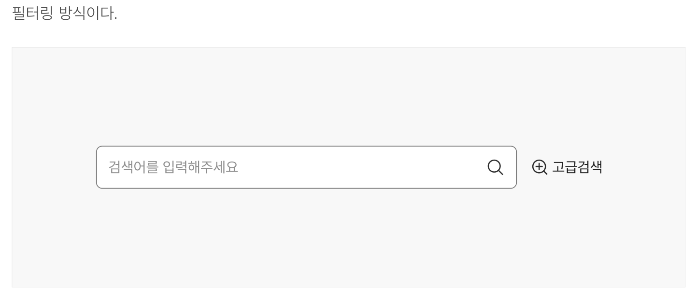

**시각 자료 텍스트 보완**

```text
원본 PDF의 UI 배치·상태·다이어그램을 보존한 시각 자료입니다.
```
### 스코프 필터(Scope)

스코프 필터는 텍스트 필터의 좌측 또는 우측에 배치되어 사용자가 입력한 텍스트 키워드로 검색할 정보 유형의 범위를 제한하는 데 사용된다. 사용자는 셀렉트의 옵션 목록에서 검색하고자 하는 정보의 범주를 선택할 수 있다.

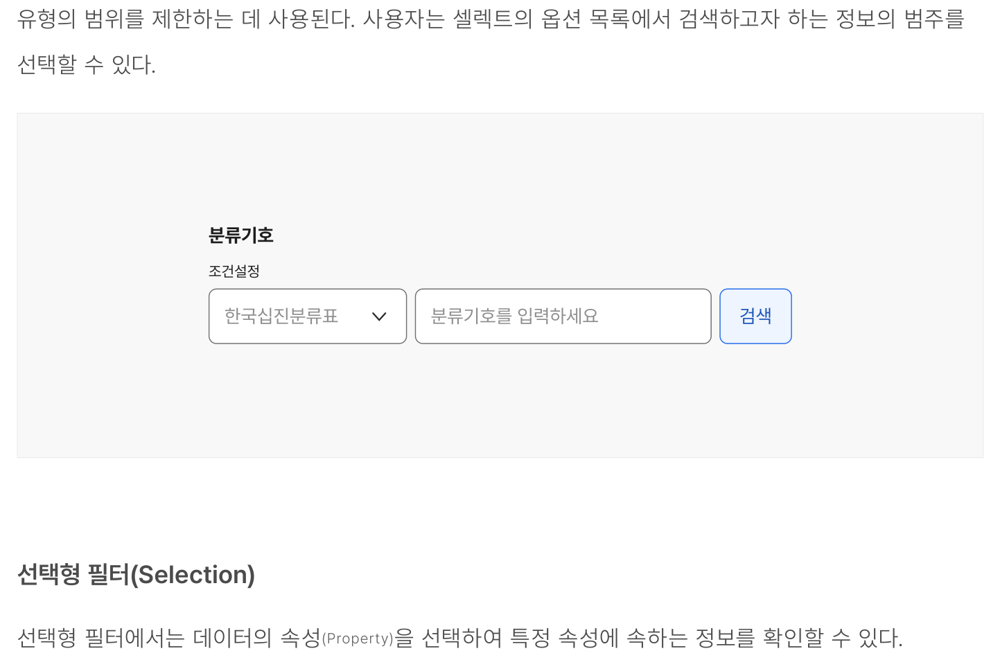

**시각 자료 텍스트 보완**

```text
선택형 필터(Selection)
선택형 필터에서는 데이터의 속성 (Property) 을 선택하여 특정 속성에 속하는 정보를 확인할 수 있다. 사용자는 1개 이상의 속성에 대해 각 속성별로 1개의 옵션을 선택하거나, 여러 개의 옵션을 선택할 수 있다.
```
### 선택형 필터(Selection)

선택형 필터에서는 데이터의 속성(Property)을 선택하여 특정 속성에 속하는 정보를 확인할 수 있다.

- 사용자는 1개 이상의 속성에 대해 각 속성별로 1개의 옵션을 선택하거나, 여러 개의 옵션을 선택할 수 있다.

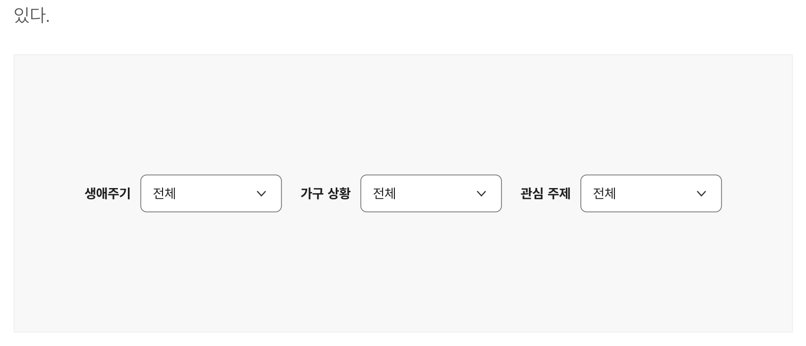

**시각 자료 텍스트 보완**

```text
원본 PDF의 UI 배치·상태·다이어그램을 보존한 시각 자료입니다.
```
### 범위 필터(Range)

범위 필터는 정량적 데이터의 범위 또는 날짜 범위별로 데이터 집합을 조회하고자 하는 경우에 사용하며 슬라이더, 날짜 범위 입력 컴포넌트로 제공된다.

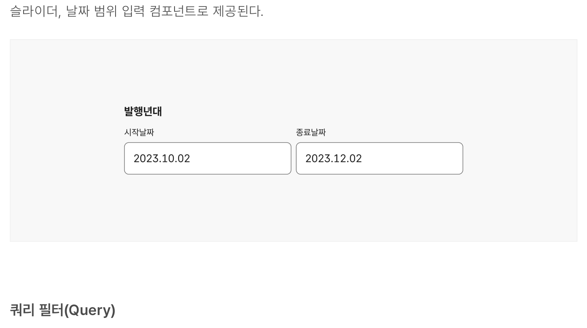

**시각 자료 텍스트 보완**

```text
쿼리 필터(Query)
여러 속성과 옵션 항목에 대해 'AND' 조건 외에 다양한 연산 조건을 적용하여 데이터 집합을 조회하고자 하는 경우에 사용한다. 매우 복잡한 데이터 집합에 사용하는 것이 적합하다.
```
### 쿼리 필터(Query)

여러 속성과 옵션 항목에 대해 'AND' 조건 외에 다양한 연산 조건을 적용하여 데이터 집합을 조회하고자 하는 경우에 사용한다. 매우 복잡한 데이터 집합에 사용하는 것이 적합하다.

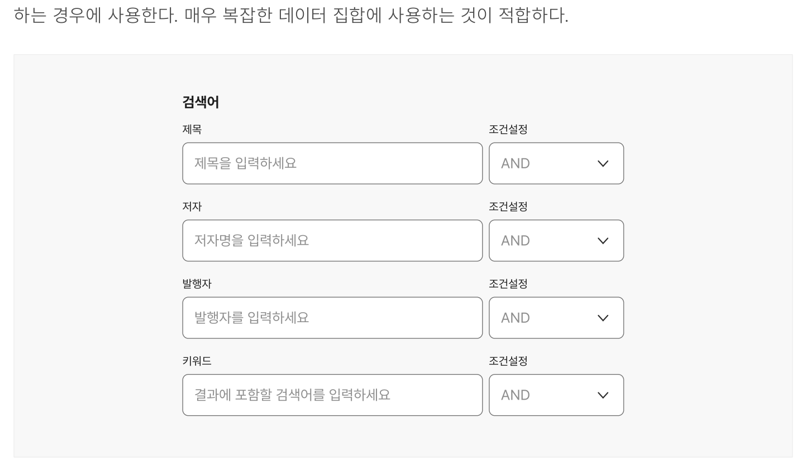

**시각 자료 텍스트 보완**

```text
원본 PDF의 UI 배치·상태·다이어그램을 보존한 시각 자료입니다.
```
### 관계형 필터(Relationship)

관계형 필터에는 데이터 속성 간 관계 또는 수준이 표현된다. 한 속성 내 옵션 선택을 통해 조회 가능한 다른 속성 정보를 빠르게 파악할 필요가 있거나 데이터 속성 간 위계 구조가 존재하는 경우 사용하기 적합하다.

### 정보 조회와 표시

### 즉각 표시(Instant display)

사용자가 옵션을 선택하자마자 필터링·정렬·조회 동작이 실행된다. 사용자가 한 번에 1~2개의 속성을 필터링하거나 정렬하는 경우, 필터링·정렬·조회 속도가 빠른 경우에 사용하기 적합하다.

### 일괄 표시(Batch display)

사용자가 옵션을 선택하고 별도의 확정 행동(예 - '조회하기', '적용하기')을 수행한 경우에 필터링·정렬·조회 동작이 실행된다. 사용자가 필터링할 옵션을 선택하는 데 긴 시간이 소요되는 복잡한 데이터 목록이나 필터링·정렬·조회 속도가 느린 경우에 사용하기 적합하다.
### 레이아웃

### 수평 막대(Filter bar)

필터링·정렬하고자 하는 목록 상단에 얇고 긴 막대 형태로 제공된다. 필터링, 정렬 컨트롤을 실행하면 상세 옵션을 위한 목록이 드롭다운에서 표시된다.
### 인라인(Inline)

필터링·정렬하고자 하는 데이터 목록 자체 또는 데이터의 열 헤더에 직접 필터링·정렬 컨트롤이 표시된다. 필터링, 정렬 컨트롤을 실행하면 상세 옵션을 위한 목록이 드롭다운에 표시된다.

수평 막대에 비해 수직 공간을 절약할 수 있으나 열 헤더에 컨트롤을 표시할 만큼의 충분한 너비가 확보된 화면에 사용하기 적합하다. 인라인 정렬을 사용할 경우 한 번에 하나의 속성만을 기준으로 정렬할 수 있고 속성 간 관계를 복합적으로 설정할 수 없으므로 필터링·정렬을 사용하는 사용자의 행동이 단순한 경우에 사용하기 적합하다.

### 사이드 패널(Aside panel)

필터링·정렬하고자 하는 데이터 목록 그리드의 좌측 또는 우측에 필터링 컨트롤이 수직으로 배치된다. 이때, 정렬 옵션은 대개 필터링 패널과는 별개로 목록 상단에 수평 막대 형식으로 배치된다. 모든 필터링 옵션과 목록을 부가적인 맥락 변경 없이 한 화면에서 비교할 수 있다.
### 모달(Modal)

필터링 조건 전체 또는 일부를 본문과 분리되는 별도의 모달에 제공하는 형태로 사용자가 빈번하게

- 사용하지는 않지만 고급 옵션을 필요로 하는 사용자에게 관련 컨트롤을 제공하거나, 화면의 너비가 충분하지 않아 다른 레이아웃으로 필터링·정렬 옵션을 표시할 수 없는 경우에 사용한다.

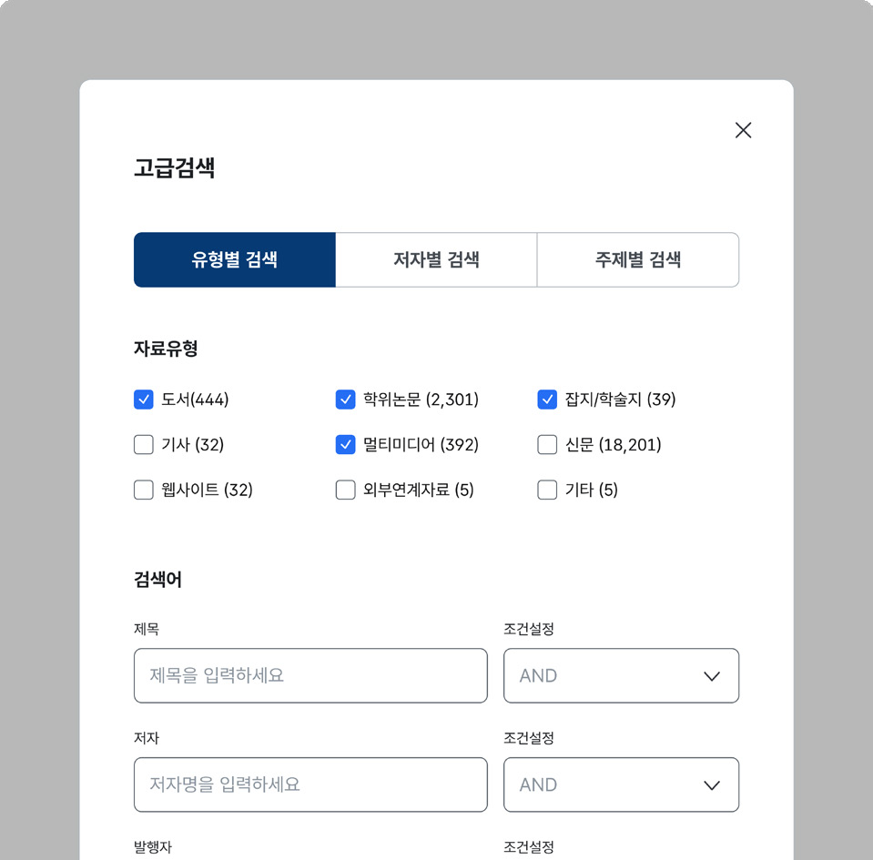
## 구조

- 1 정렬 컨트롤: 정렬 조건 설정을 위한 입력 양식과 레이블의 모음
- 2 필터 컨트롤: 필터 조건 설정을 위한 입력 양식과 레이블의 모음. 기본으로 노출되어 있거나 상세 필터 표시 버튼을 통해 활성화할 수 있음
- 3 적용된 필터링 조건: 적용된 필터 조건, 조건 수, 조건에 해당하는 데이터 항목 개수, 개별 조건 해제 버튼 등으로 구성됨
- 4 적용된 필터링 조건 해제 버튼: 적용된 모든 필터링 조건을 일괄 해제하기 위한 컨트롤

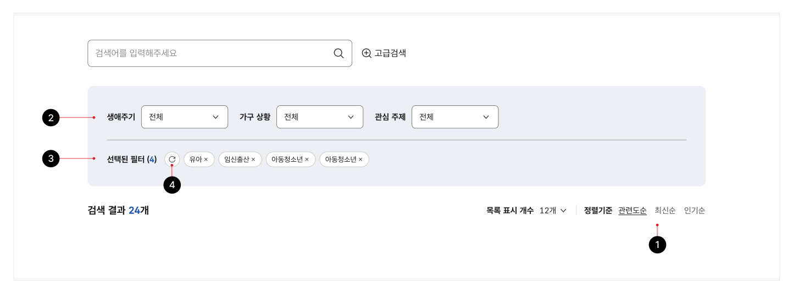

## 사용성 가이드라인

- 01 필터링·정렬 컨트롤을 가능한 한 숨기지 않는다.
- 02 선택된 필터링·정렬 옵션이 명확하게 구분되도록 표현한다.
- 03 조건이 적용되었음을 확인할 수 있는 명확한 시각적 단서를 제공한다.
- 04 모든 필터링·정렬 컨트롤에 레이블과 그룹 헤딩을 제공한다.
- 05 필터링·정렬 컨트롤 레이블은 이해가 쉽도록 간결하고 정확한 내용으로 제공한다.
- 06 필터링 컨트롤은 우선 순위에 따라 좌측 또는 상단부터 순차적으로 배치한다.
- 07 관련 있거나 유사한 필터링 컨트롤을 군집화하여 제공한다.
- 08 인라인 형식의 정렬을 사용할 때를 제외하고 정렬 컨트롤은 대상 목록 오른쪽 상단에 배치한다.
- 09 필터링 옵션으로 제공되는 메타 데이터가 색인화되고 검색 가능한지 확인한다.
- 10 데이터 집합의 특성과 사용자의 요구사항에 적합한 수준의 필터링·정렬 옵션을 제공한다.
- 11 날짜, 시간을 기준으로 한 필터링은 범위를 입력할 수 있도록 제공한다.
- 12 적용된 필터링·정렬 옵션을 한 번에 해제할 수 있는 기능을 제공한다.
### 01. 필터링·정렬 컨트롤을 가능한 한 숨기지 않는다.

화면 너비가 충분한 경우 필터링·정렬 컨트롤은 축약된 버튼 형태가 아니라 필터링할 수 있는 주요 옵션이 항상 노출되도록 표현한다. 이를 통해 사용자는 설정한 필터링·정렬 조건에 따른 결과 목록의 변화를 함께 비교할 수 있다.

### 02. 선택된 필터링·정렬 옵션이 명확하게 구분되도록 표현한다.

라디오 버튼, 체크박스, 드롭다운 등 필터링·정렬 옵션 선택에 활용되는 컴포넌트 가이드라인을 참고하여 선택된 옵션이 명확하게 구분되도록 표현해야 한다.
### 03. 조건이 적용되었음을 확인할 수 있는 명확한 시각적 단서를 제공한다.

상세 검색 조건이 적용되어 데이터 집합 목록이 변경된 상황을 사용자가 빠르고 직관적으로 인지할 수 있도록 제공해야 한다.

- [모범 사례 1]

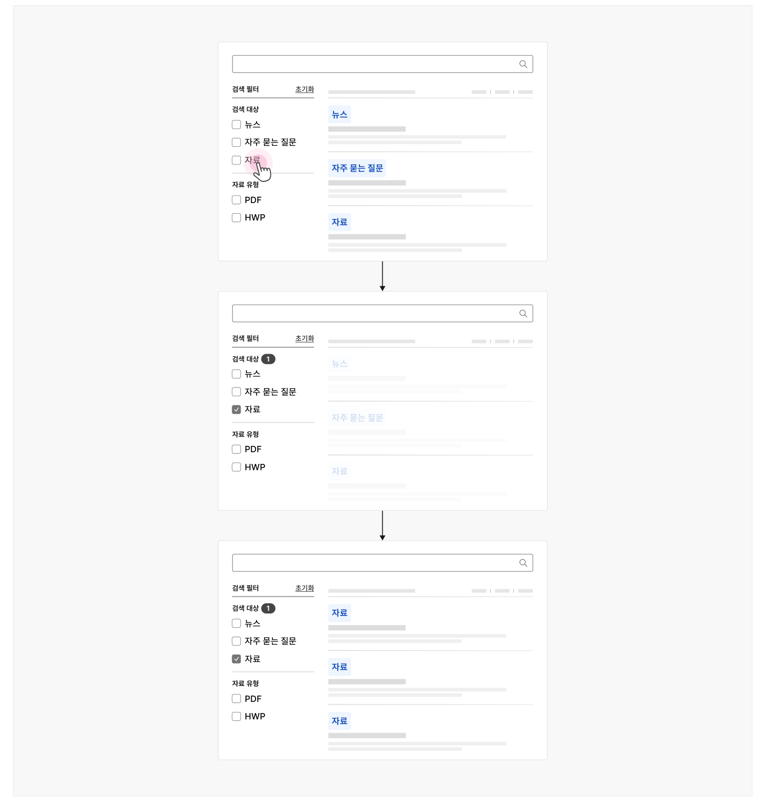

**사례 텍스트 보완**

```text
검색 필터
초기화
검색 대상
뉴스
자주 묻는 질문
자료
자료 유형
PDF
HWP
검상
상 초필
상
```
### [모범 사례 2]

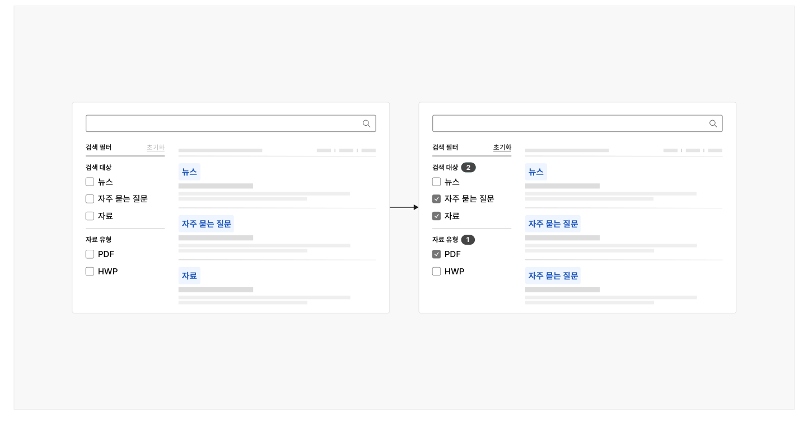

**사례 텍스트 보완**

```text
검색 필터
검
초기화
검색 대상
뉴스
자주 묻는 질문
자료
자료 유형
PDF
HWP
자주 믇는 질문
```
### [모범 사례 3]

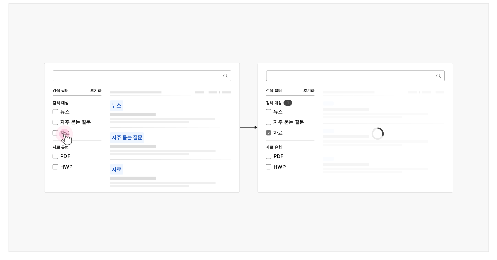

**사례 텍스트 보완**

```text
검색 필터
초기화
검색 대상
뉴스
자주 묻는 질문
자료
자료 유형
PDF
HWP
```
### 04. 모든 필터링·정렬 컨트롤에 레이블과 그룹 헤딩을 제공한다.

사용자에 따라 각 필터링·정렬 컨트롤에 대한 레이블, 그룹 헤딩이 생략되면 어떤 속성의 옵션을 선택하는 것인지 분명하게 인지하지 못할 수 있다.

### 05. 필터링·정렬 컨트롤 레이블은 이해가 쉽도록 간결하고 정확한 내용으로 제공한다.

필터링·정렬 컨트롤 레이블을 서술형으로 제공하게 되면 빠른 인지가 어려울 수 있다. 또한 특수한 서비스를 제외하고 레이블에 전문 용어를 사용하거나 축약어를 사용하면 내용을 이해하기 어려우므로 필터링·정렬 옵션의 의미를 정확하게 전달하되 간결하게 작성되어야 한다.

### 06. 필터링 컨트롤은 우선 순위에 따라 좌측 또는 상단부터 순차적으로 배치한다.

사용자가 빈번하게 사용하거나 데이터 집합을 조회하는 데 핵심적인 속성을 설정하기 위한 필터링 컨트롤은 일관된 위치, 사용자가 접근하기 쉬운 영역에 배치하여 빠르게 접근 가능하도록 한다.
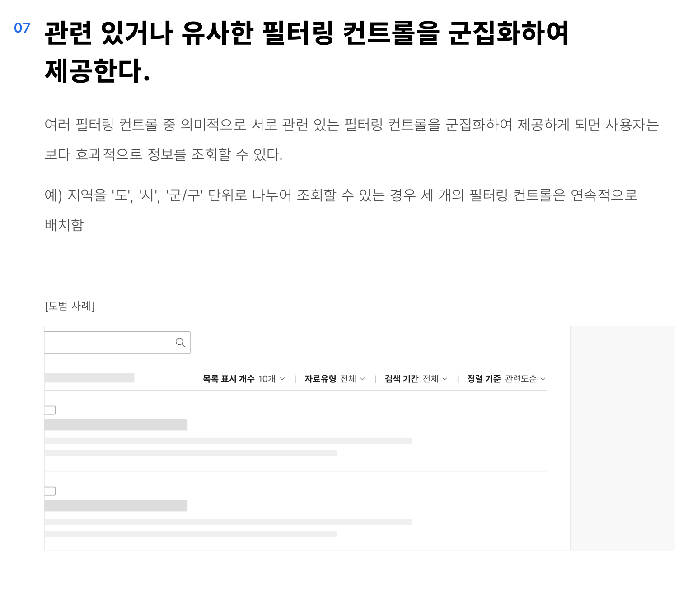
### 07. 관련 있거나 유사한 필터링 컨트롤을 군집화하여 제공한다.

여러 필터링 컨트롤 중 의미적으로 서로 관련 있는 필터링 컨트롤을 군집화하여 제공하게 되면 사용자는 보다 효과적으로 정보를 조회할 수 있다.

예) 지역을 '도', '시', '군/구' 단위로 나누어 조회할 수 있는 경우 세 개의 필터링 컨트롤은 연속적으로 배치함

[모범 사례]
### 08. 인라인 형식의 정렬을 사용할 때를 제외하고 정렬 컨트롤은 대상 목록 오른쪽 상단에 배치한다.

디지털 정부서비스를 이용하는 사용자의 일관된 경험을 위해 정렬 컨트롤은 필터링·정렬을 수행하고자 하는 정보 목록의 오른쪽 상단에 배치한다.

### 09. 필터링 옵션으로 제공되는 메타 데이터가 색인화되고 검색 가능한지 확인한다.

각 필터링 옵션을 선택하였을 때, 선택한 메타 데이터에 속하는 데이터가 적절하게 반환되는지 정기적으로 점검한다. 사용자가 옵션을 자주 이용하지 않거나, 해당 메타 데이터 속성을 가진 데이터가 더 이상 존재하지 않고 앞으로도 존재할 가능성이 낮다면 필터링 옵션을 선택하는 과정의 인지적 부담을 줄이기 위해 필터링 옵션에서 항목을 삭제하는 방안을 검토한다.

### 10. 데이터 집합의 특성과 사용자의 요구사항에 적합한 수준의 필터링·정렬 옵션을 제공한다.

필터링·정렬 옵션을 지나치게 다양한 유형으로 세분화하여 제공하게 되면 사용자가 압박을 느끼거나 혼란을 느낄 수도 있다. 먼저 데이터 집합의 특성을 고려하여 결과를 좁히는 데 도움이 되는 속성을 중심으로 필터링·정렬할 수 있도록 하고 사용자가 필요로 하는 옵션을 추가 제공한다.
### 11. 날짜, 시간을 기준으로 한 필터링은 범위를 입력할 수 있도록 제공한다.

단일 날짜만 설정할 수 있도록 제공하게 되면 사용자는 데이터에 부여된 정확한 날짜 메타 데이터를 알지 못하기 때문에 조건을 여러 번 설정해야 한다.

- [모범 사례 1]

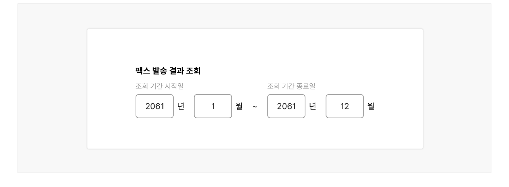

**사례 텍스트 보완**

```text
팩스 발송 결과 조회
팩스 발송일
2061
년
월
```
- [모범 사례 2]


**사례 텍스트 보완**

```text
팩스 발송 결과 조회
조회 기간 시작일
조회 기간 종료일
2061
년
월
~
```
### [피해야 할 사례]

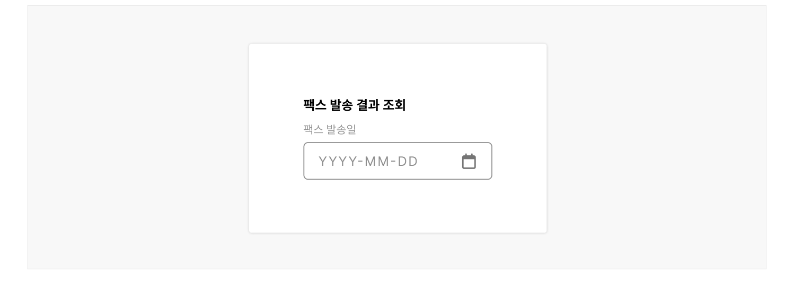

**사례 텍스트 보완**

```text
팩스 발송 결과 조회
팩스 발송일
YYYYMMDD
```
### 12. 적용된 필터링·정렬 옵션을 한 번에 해제할 수 있는 기능을 제공한다.

여러 가지 조건이 적용된 필터링 컨트롤과 옵션을 하나씩 눌러 해제하는 동작이 반복되지 않도록 3개 이상의 속성에 대해 필터링 컨트롤이 제공되는 경우 옵션 선택을 한 번에 해제할 수 있는 기능을 제공해야 한다.

[모범 사례]

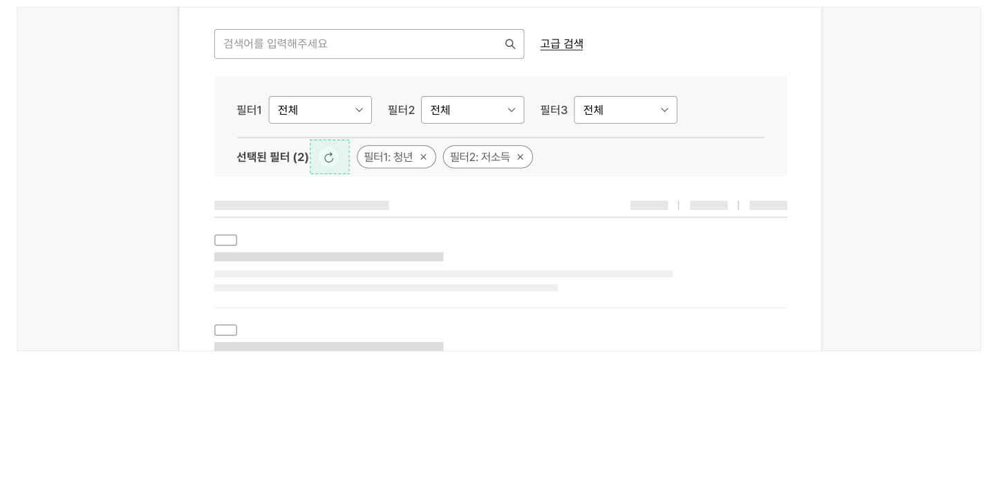

**사례 텍스트 보완**

```text
검색어를 입력해주세요
고급 검색
필터1
전체
필터2
필터3
선택된 필터 (2)
필터1: 청년
필터2: 저소득
```


### 플랫폼에 대한 고려 사항

모든 필터링·정렬 컨트롤을 표시하기에 화면 너비가 충분하지 않은 경우, 필터링 및 정렬 컨트롤 버튼을 축약하여 제공한다.

### 컨트롤 버튼은 목록의 우측 상단에 배치하며, 필터 컨트롤이 먼저 배치되도록 한다.

[모범 사례]


**사례 텍스트 보완**

```text
필터
```


## 접근성 가이드라인

### 조건이 적용되었음을 확인할 수 있는 명확한 프로그램적 단서를 제공한다.

전체 검색 결과 수 안내 텍스트에 live-region을 적용하고 값이 변경되자마자 해당 정보가 스크린 리더로 전달될 수 있도록 aria-live="assertive"를 사용해야 한다.

- WCAG 2.1 Name, Role, Value (A)
- WCAG 2.1 Status Messages (AA)

### 정보 조회가 완료된 이후 키보드 초점이 적절한 요소에 유지되도록 한다.

필터링·정렬 결과를 즉각적으로 표시할 때, 키보드 초점은 값을 변경하거나 선택한 옵션 항목에 유지되도록 한다. 결과를 일괄 표시할 때는 키보드 초점을 제출 버튼에 유지시킨다. 사용자가 선택한 옵션 요소를 벗어나 문서 가장 처음이나 예측할 수 없는 요소로 초점이 이동하게 되면 키보드, 스크린 리더 사용자는 추가적인 필터링·정렬 옵션 선택을 실행하기 위해 부가적인 탐색 과정을 거치는 불편을 겪게 된다.

- KWCAG 2.2 초점 이동과 표시
- WCAG 2.1 Focus Order (A)


## 상호작용 가이드라인

### 즉각 표시

사용자가 옵션값을 선택하거나 값이 변경되었을 때 해당 속성과 옵션값을 기준으로 데이터 집합에 대한 조회 또는 정렬 동작이 발생한다.

### 일괄 표시

'적용', '조회' 버튼에서 Enter 키나 Space 키에 대해 Keyup 이벤트가 발생하거나, Click 이벤트가 발생하였을 때 사용자가 설정한 옵션이 일괄 적용된다.

### 인라인 정렬

### 정렬 컨트롤 탐색

### 정렬 순서 변경

| 구분 | 설명 |
|---|---|
| Tab, Shift + Tab | 모든 정렬 버튼은 Tab, Shift + Tab 키를 눌렀을 때 접근할 수 있어야 한다. |

| 구분 | 설명 |
|---|---|
| Click | 정렬 버튼을 Click 하면 오름차순, 내림차순 정렬 상태가 토글된다. |
| Enter, Space | 정렬 버튼이 초점을 가진 상태에서 실행했을 때 오름차순, 내림차순 정렬 상태가 토글된다. |
