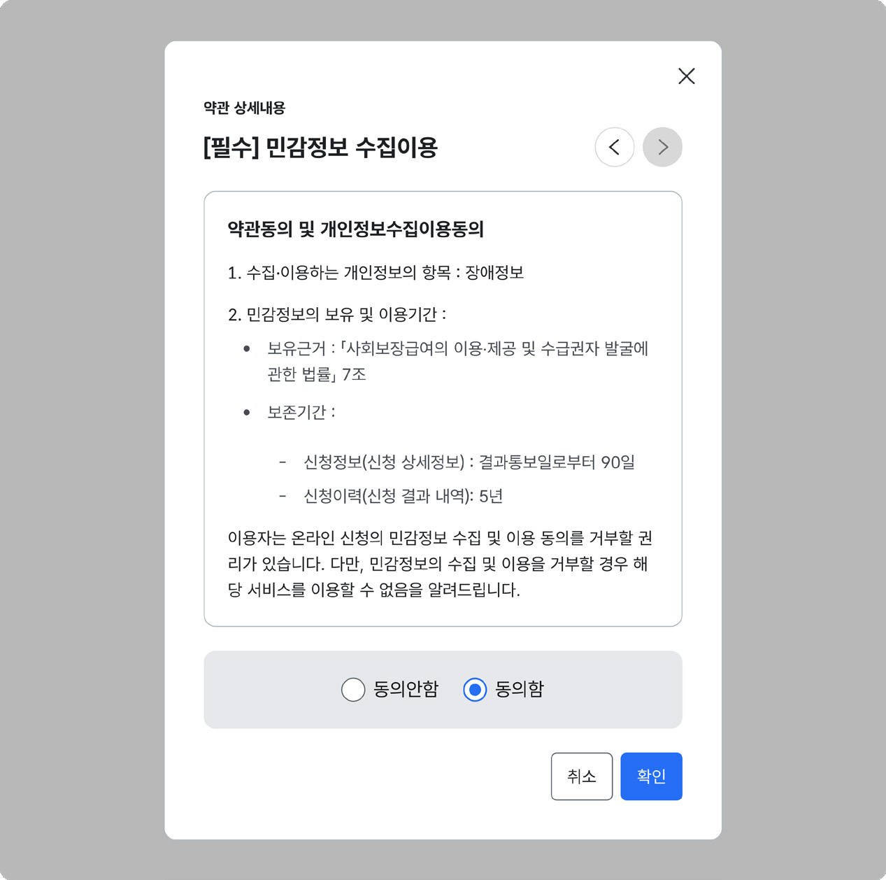

### 확인

확인은 사용자가 요청한 행위가 쉽게 취소할 수 없는 결과로 이어지거나, 행동의 효과 또는 부작용을 사용자가 인지해야 하는 경우에 사용한다. 사용자가 작업 내용을 확인하거나 수행을 승인하도록 함으로써, 어떤 작업이 수행될 것인지에 관한 불확실성을 감소시키고 내용을 한 번 더 점검할 수 있어 오류를 예방할 수 있다.

## 유형

입력폼을 제출할 때

화면의 중요한 맥락이 변경될 때

## 사용성 가이드라인

- 01 심각하거나 취소가 어려운 행동에 확인을 요청한다.
- 02 상황에 대한 명확하고 간결한 설명을 제공한다.
- 03 행동을 확정, 취소할 수 있는 버튼을 모두 제공한다.
- 04 버튼의 레이블에 행동을 구체적으로 설명한다.
### 01. 심각하거나 취소가 어려운 행동에 확인을 요청한다.

중요도가 낮은 행동에 반복적으로 확인을 요청하면 사용자는 불편을 느끼며, 시간이 지남에 따라 실제로 중요한 확인 메시지에는 신경 쓰지 않게 된다. 그러므로 결과가 매우 중요한 경우에 확인을 사용해야 한다.

### 02. 상황에 대한 명확하고 간결한 설명을 제공한다.

왜 그 행위를 수행하지 않아야 하는지, 어떤 결과가 발생하는지를 명확하고 간단하게 설명하여 사용자가 빠르게 내용을 인지할 수 있게 해 주어야 한다. 확인이 필요한 사항과 기능이 실행되었을 때 사용자에게 미칠 수 있는 내용에 대한 설명을 제공한다.
### 03. 행동을 확정, 취소할 수 있는 버튼을 모두 제공한다.

행동을 확정하는 버튼과 함께 행동을 취소하고 이전으로 돌아갈 수 있는 버튼을 제공하여, 오류를 방지하는 역할을 수행해야 한다.

[모범 사례]

### 04. 버튼의 레이블에 행동을 구체적으로 설명한다.

버튼 레이블에 작동 시 어떤 동작을 수행하는 것인지 구체적으로 기술되어 있으면 사용자는 본문을 읽지 않더라도 어떤 행위를 할 것인지 또는 하지 말아야 하는지를 이해하고, 효과적으로 다음 행동을 취할 수 있다.
## Ⅵ. 서비스 패턴
