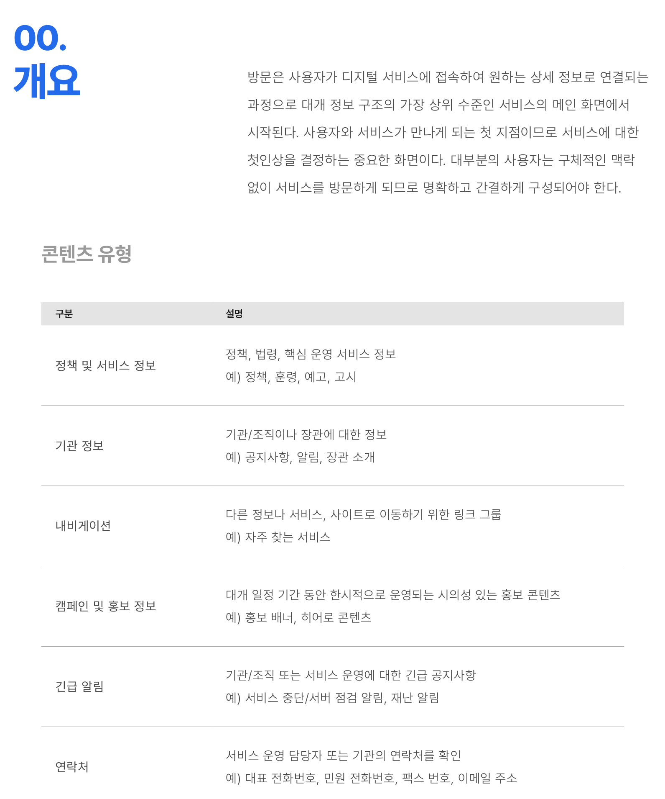
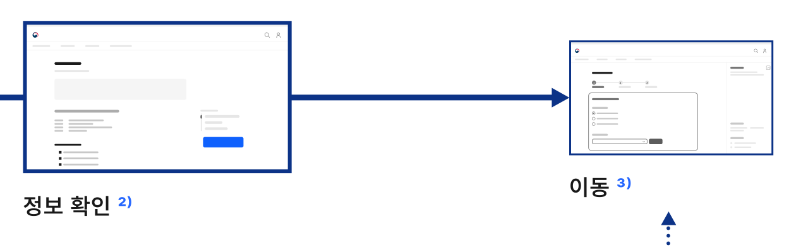

방문은 사용자가 디지털 서비스에 접속하여 원하는 상세 정보로 연결되는 과정으로 대개 정보 구조의 가장 상위 수준인 서비스의 메인 화면에서 시작된다. 사용자와 서비스가 만나게 되는 첫 지점이므로 서비스에 대한 첫인상을 결정하는 중요한 화면이다. 대부분의 사용자는 구체적인 맥락 없이 서비스를 방문하게 되므로 명확하고 간결하게 구성되어야 한다.

### 콘텐츠 유형

| 구분 | 설명 |
|---|---|
| 정책 및 서비스 정보 | 정책, 법령, 핵심 운영 서비스 정보 예) 정책, 훈령, 예고, 고시 |
| 기관 정보 | 기관/조직이나 장관에 대한 정보 예) 공지사항, 알림, 장관 소개 |
| 내비게이션 | 다른 정보나 서비스, 사이트로 이동하기 위한 링크 그룹 예) 자주 찾는 서비스 |
| 캠페인 및 홍보 정보 | 대개 일정 기간 동안 한시적으로 운영되는 시의성 있는 홍보 콘텐츠 예) 홍보 배너, 히어로 콘텐츠 |
| 긴급 알림 | 기관/조직 또는 서비스 운영에 대한 긴급 공지사항 예) 서비스 중단/서버 점검 알림, 재난 알림 |
| 연락처 | 서비스 운영 담당자 또는 기관의 연락처를 확인 예) 대표 전화번호, 민원 전화번호, 팩스 번호, 이메일 주소 |
### 이용 상황별 플로 (Flow)

접속

정보 탐색 ¹⁾

서비스의 메인 화면에 접속하는 과정으로 사용자는 검색 엔진, 외부 링크를 거치거나 직접 방문할 수 있음 자주 찾는

서비스

### 1) 정보 탐색

정책 및 서비스 정보, 기관 정보, 내비게이션, 캠페인 및 홍보, 긴급 알림, 연락처와 같은 다양한 유형의 콘텐츠에서 필요한 정보를 찾는 과정

### 2) 정보 확인

콘텐츠의 의미를 해석하고 인지하는 과정

### 3) 이동

탐색과 확인 과정에서 발견한 정보를 기반으로 서비스의 정보 구조를 탐색하는 과정으로 서비스 내부로 이동하거나 관련된 외부 서비스로 이동할 수 있음


**ASCII 흐름 보완**

```text
접속 -> 정보 탐색 -> 정보 확인 -> 이동
```
