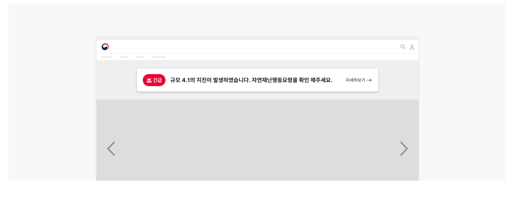
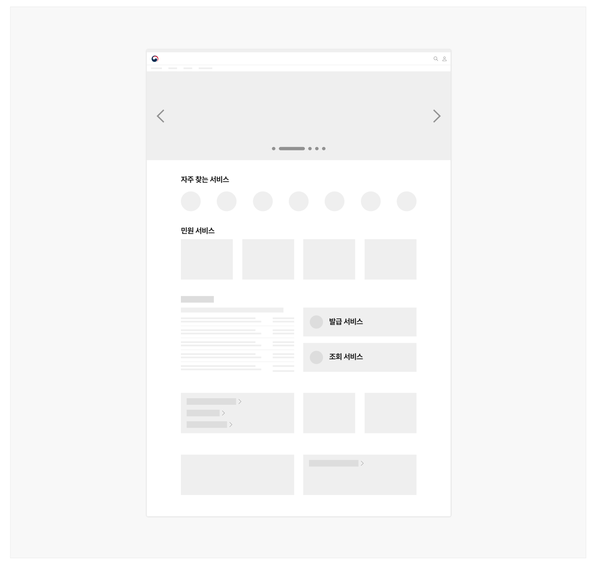
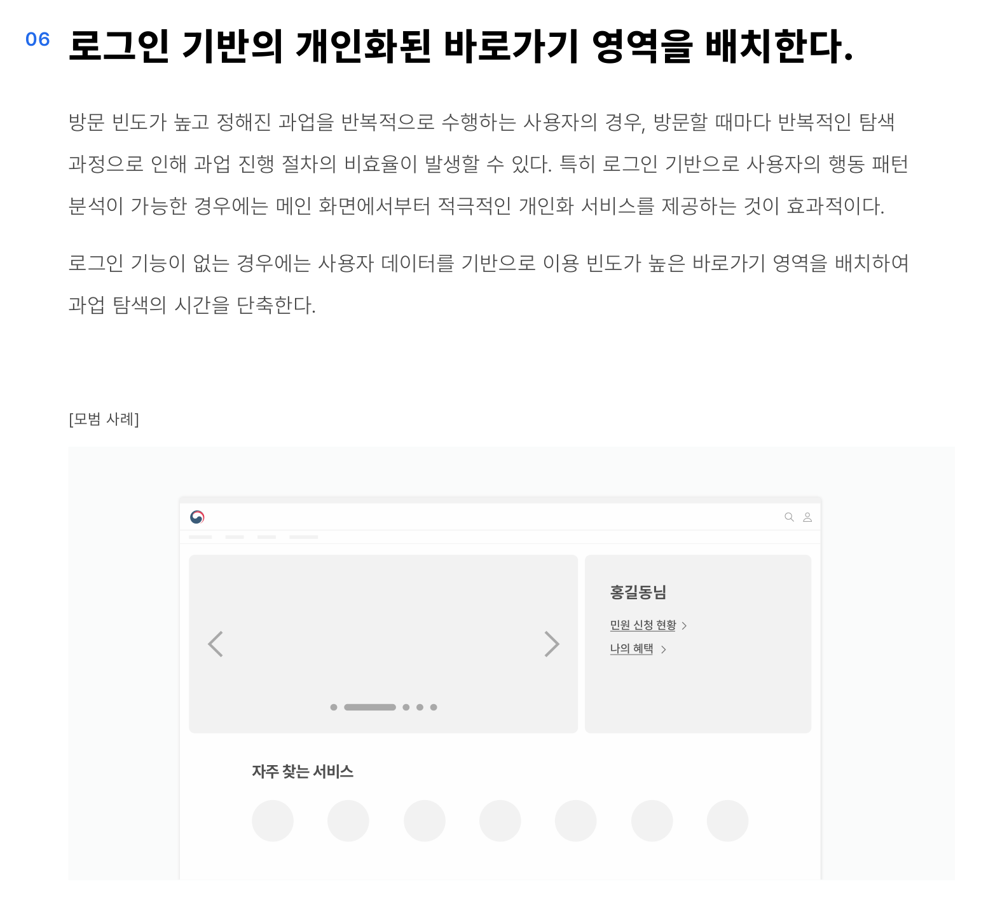

## 사용성 가이드라인

- 01 다양한 콘텐츠의 구성 요소를 일관성 있게 구성한다.
- 02 시급하거나 중요한 정보를 사용자가 빠르게 인지할 수 있도록 제공한다.
- 03 사용자 데이터를 기반으로 한 우선순위에 따라 콘텐츠를 배치한다.
- 04 사용자 관점에서 같은 목적의 콘텐츠들은 섹션으로 모아서 구성한다.
- 05 방문 목적 및 사용자 유형별로 핵심적인 정보와 서비스를 탐색할 수 있는 영역을 구성한다.
- 06 로그인 기반의 개인화된 바로가기 영역을 배치한다.
- 07 사용자가 정보를 빠르게 구분하고 정확하게 이동할 수 있는 방법을 제시한다.
- 08 최신의 정확한 정보를 제공한다.
- 09 콘텐츠 및 서비스 명칭은 친숙하고 일관성이 있어야 한다.
### 01. 다양한 콘텐츠의 구성 요소를 일관성 있게 구성한다.

메인 화면에는 사용자가 원하는 다양한 콘텐츠와 서비스가 배치된다. 이를 구성하는 요소별로 표현과 작동 방식을 일관성 있게 구성하여 사용자가 원하는 정보를 탐색하고 이동하는 과정에서 불필요한 시간이 소요되지 않도록 해야 한다.

메인 화면에 배치되는 콘텐츠 구성 요소의 유형은 다음과 같다.

- 캐러셀
- 탭
- 목록과 더보기 링크
- 기타 링크 및 버튼
### 02. 시급하거나 중요한 정보를 사용자가 빠르게 인지할 수 있도록 제공한다.

서비스 점검이나 제공 기능 중단 등 사용자가 서비스 이용 전에 반드시 알아야 하는 정보는 가장 먼저 인지할 수 있도록 구성해야 한다.

[모범 사례]



**사례 텍스트 보완**

```text
규모 4.1의 지진이 발생하였습니다. 자연재난행동요령을 확인 해주세요.
```
### 03. 사용자 데이터를 기반으로 한 우선순위에 따라 콘텐츠를 배치한다.

메인 화면을 구성하는 요소들의 우선순위를 제공자의 관점으로만 결정하면 사용자들이 주로 찾는 정보와 기능이 찾기 어려운 곳에 배치되거나 주목도가 낮아지게 되어 방문 단계에서부터 사용자가 원하는 목적을 달성할 수 없게 된다.
### 04. 사용자 관점에서 같은 목적의 콘텐츠들은 섹션으로 모아서 구성한다.

같은 목적의 콘텐츠를 여러 섹션에 산발적으로 배치하거나 하나의 섹션에 목적이 다른 콘텐츠를 모아서 배치하면 사용자의 직관적인 탐색이 어렵고 원하는 내용을 찾는 데 많은 시간이 소요된다. 섹션을 구성할 때는 명확한 타이틀과 간단한 안내를 제공하여 사용자가 섹션의 관련성을 이해하거나 다른 콘텐츠와의 구별에 어려움을 겪지 않도록 해야 한다.

[피해야 할 사례]



**사례 텍스트 보완**

```text
자주 찾는 서비스
민원 서비스
발급 서비스
조회 서비스
```
### 05. 방문 목적 및 사용자 유형별로 핵심적인 정보와 서비스를 탐색할 수 있는 영역을 구성한다.

사용자마다 다른 방문 목적에 대응하기 위해 다양하고 많은 콘텐츠를 메인 화면에 배치하는 것에는 한계가 있다. 서비스의 이용 패턴을 고려하여 '방문 목적별/사용자 유형별 바로가기' , '자주 찾는 서비스'와 같은 방식으로 사용자가 원하는 정보를 직접 선택하고 빠르게 탐색 및 이동할 수 있는 기능을 제공해야 한다.

### 06. 로그인 기반의 개인화된 바로가기 영역을 배치한다.

방문 빈도가 높고 정해진 과업을 반복적으로 수행하는 사용자의 경우, 방문할 때마다 반복적인 탐색 과정으로 인해 과업 진행 절차의 비효율이 발생할 수 있다. 특히 로그인 기반으로 사용자의 행동 패턴 분석이 가능한 경우에는 메인 화면에서부터 적극적인 개인화 서비스를 제공하는 것이 효과적이다.

로그인 기능이 없는 경우에는 사용자 데이터를 기반으로 이용 빈도가 높은 바로가기 영역을 배치하여 과업 탐색의 시간을 단축한다.

[모범 사례]
### 07. 사용자가 정보를 빠르게 구분하고 정확하게 이동할 수 있는 방법을 제시한다.

사용자는 메인 화면에서 원하는 콘텐츠를 탐색한 이후에 내용을 확인하고 해당 링크로 이동하게 된다. 이 과정에서 사용자가 콘텐츠를 쉽게 이해하고 정확하게 이동할 수 있도록 돕는 것이 중요하며, 콘텐츠의 특성에 따라 제공할 수 있는 방법은 다음과 같다.

- 최신 업데이트, 기한 표시 등의 레이블 제공
- 용어 및 콘텐츠의 간략한 설명
- 외부 사이트로 이동하는 링크의 표시
사용성 가이드라인 적용 수준: 필수 권장 우수


### 08. 최신의 정확한 정보를 제공한다.

메인 화면에서 제공하는 콘텐츠가 최신 정보가 아니거나 부정확한 정보인 경우 사용자는 서비스가 정상적으로 운영 및 관리되고 있지 않다고 판단할 수 있다. 메인 화면에서 제공되는 정보는 최신으로 업데이트된 정보인지 내용은 정확한지 수시로 점검해야 한다.

### 09. 콘텐츠 및 서비스 명칭은 친숙하고 일관성이 있어야 한다.

메인 화면에서 사용자가 인지한 용어가 서비스의 다른 영역에서 동일하지 않게 제공되면 사용자는 자신의 이동 과정에 대해 혼동을 겪을 수 있다. 서비스에서 사용하는 용어는 정확하고 일관성이 있어야 하며 사용자가 쉽게 이해할 수 있게 친숙하고 명확해야 한다.
### 관련 구성 요소

### 컴포넌트

캐러셀
서비스 패턴

- 00 개요
- 01 검색 기능 찾기
- 02 검색어 입력
- 03 검색 결과 확인
- 04 상세 검색
- 05 검색 결과 이용
- 06 재검색
- 07 검색 종료
