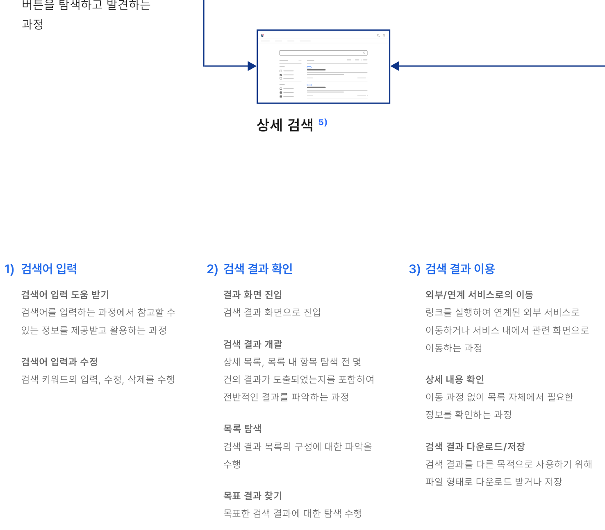
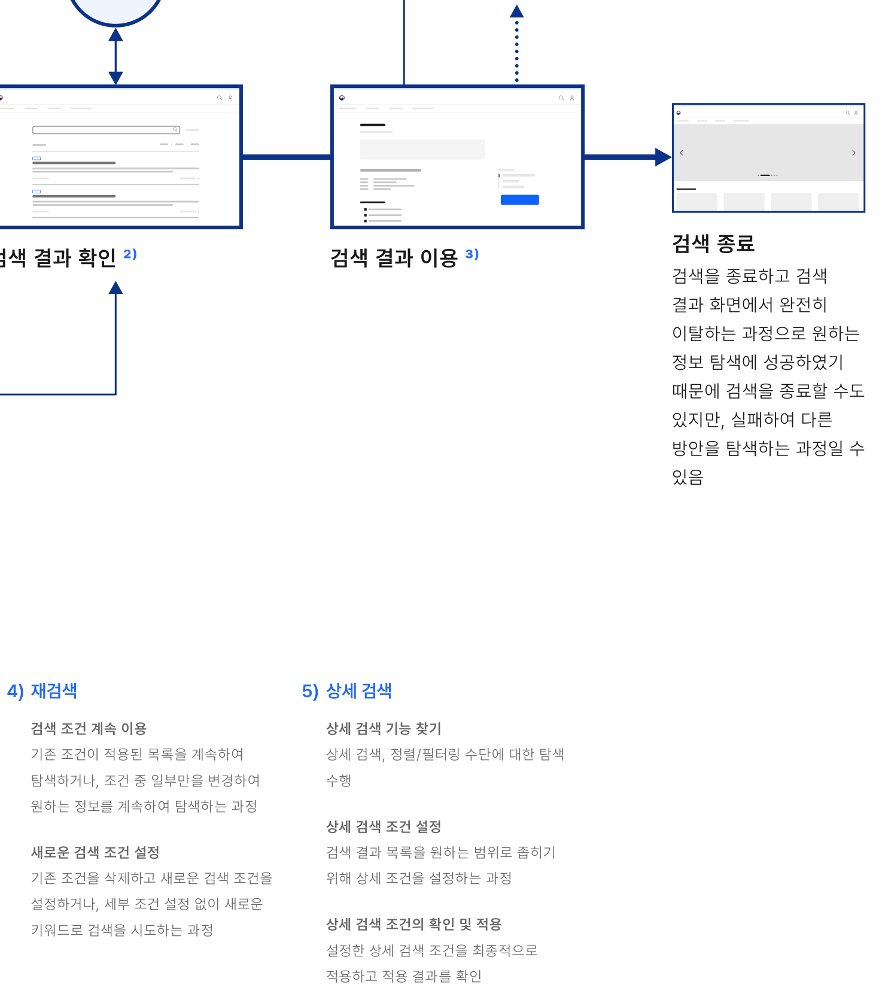

검색은 사용자가 큰 데이터 집합에서 원하는 정보를 찾을 수 있도록 도와주는 기능이다. 사용자가 무엇을 찾고 싶은지 알고 있는 경우에는 일차적인 정보 탐색 수단으로 사용될 수 있으며, 탐색 수단을 통해 원하는 콘텐츠를 찾지 못하는 상황에는 특정 정보와 관련된 단서를 제공함으로써 사용자가 필요한 콘텐츠를 쉽게 찾을 수 있도록 해준다.

## 용례

### 사용하기 적합하지 않은 경우

단일 화면 웹사이트나 서비스 또는 규모가 매우 작은 서비스에서는 통합 검색 없이 정보를 탐색할 수 있다.
## 유형

### 통합 검색

웹사이트 또는 애플리케이션 전체를 검색하는 것으로 사용자가 서비스에 익숙하지 않은 경우, 검색을 통해 서비스의 데이터 구조와 활용할 수 있는 정보를 더 쉽게 파악할 수 있다. 일반적으로 헤더 영역에 배치되며, 검색 결과는 별도의 결과 화면에서 제공된다.

- 웹사이트 통합 검색
- 자료 검색
### 부분 검색

소규모 웹사이트, 단일 화면 서비스, 특정 정보 목록, 표와 같은 소규모 데이터 집합을 검색하는 데 사용한다. 데이터 집합 상단에 배치되며, 검색 결과는 데이터 집합에 직접 반영된다.

- 게시물 검색
- 목록 부분 검색
### 이용 상황별 플로 (Flow)

검색하기

검색 기능 찾기

검색어 입력 ¹⁾

검색어 입력 필드와 검색 버튼을 탐색하고 발견하는 과정



**ASCII 흐름 보완**

```text
검색하기 -> 검색 기능 찾기 -> 검색어 입력 -> 상세 검색
```
### 상세 검색 ⁵⁾

### 1) 검색어 입력

검색어 입력 도움 받기 검색어를 입력하는 과정에서 참고할 수 있는 정보를 제공받고 활용하는 과정

검색어 입력과 수정 검색 키워드의 입력, 수정, 삭제를 수행

### 2) 검색 결과 확인

결과 화면 진입 검색 결과 화면으로 진입

검색 결과 개괄 상세 목록, 목록 내 항목 탐색 전 몇 건의 결과가 도출되었는지를 포함하여 전반적인 결과를 파악하는 과정

목록 탐색 검색 결과 목록의 구성에 대한 파악을 수행

목표 결과 찾기 목표한 검색 결과에 대한 탐색 수행

### 3) 검색 결과 이용

외부/연계 서비스로의 이동 링크를 실행하여 연계된 외부 서비스로 이동하거나 서비스 내에서 관련 화면으로 이동하는 과정

상세 내용 확인 이동 과정 없이 목록 자체에서 필요한 정보를 확인하는 과정

검색 결과 다운로드/저장 검색 결과를 다른 목적으로 사용하기 위해 파일 형태로 다운로드 받거나 저장
외부/연계 서비스로 이동

재검색 ⁴⁾



**ASCII 흐름 보완**

```text
검색 결과 확인 -> 검색 결과 이용 -> 재검색 -> 검색 종료
```
### 4) 재검색

검색 조건 계속 이용 기존 조건이 적용된 목록을 계속하여 탐색하거나, 조건 중 일부만을 변경하여 원하는 정보를 계속하여 탐색하는 과정

새로운 검색 조건 설정 기존 조건을 삭제하고 새로운 검색 조건을 설정하거나, 세부 조건 설정 없이 새로운 키워드로 검색을 시도하는 과정

### 5) 상세 검색

상세 검색 기능 찾기 상세 검색, 정렬/필터링 수단에 대한 탐색 수행

상세 검색 조건 설정 검색 결과 목록을 원하는 범위로 좁히기 위해 상세 조건을 설정하는 과정

상세 검색 조건의 확인 및 적용 설정한 상세 검색 조건을 최종적으로 적용하고 적용 결과를 확인
