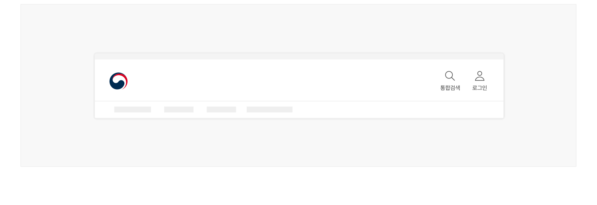
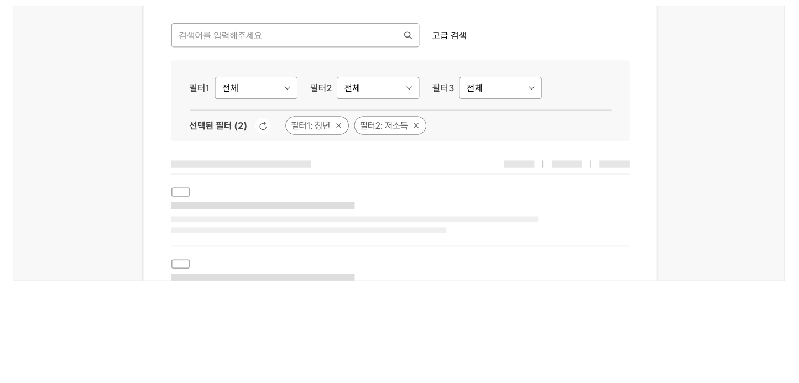

## 구조

1 돋보기 아이콘: 검색을 실행하거나 검색 레이어/화면을 실행하는 버튼 2 레이블: 돋보기 아이콘에 대한 텍스트 레이블로 돋보기 아이콘과 함께 버튼으로 작동함

## 사용성 가이드라인

- 01 서비스 내 모든 화면에서 통합 검색 기능을 실행할 수 있도록 한다.
- 02 통합 검색 기능 실행 버튼은 모든 화면에서 헤더 우측에 일관성 있게 배치한다.
- 03 통합 검색 기능은 검색어 입력 필드와 돋보기 버튼의 조합 또는 돋보기 버튼 형태로 사용한다.
- 04 부분 검색 기능은 콘텐츠 목록의 수준과 맥락을 고려하여 사용자가 예측할 수 있는 영역에 배치한다.
- 05 검색 기능 주변에 불필요한 요소의 배치를 최소화한다.
### 01. 서비스 내 모든 화면에서 통합 검색 기능을 실행할 수 있도록 한다.

통합 검색 기능을 실행할 수 있는 버튼이나 링크가 메인 화면 또는 일부 화면에서만 제공될 경우, 사용자는 통합 검색 기능이 제공되지 않는 것으로 오인하여 필요한 정보를 발견하지 못할 수 있다. 만일 사용자가 어떤 화면에서 통합 검색 기능을 사용할 수 있는지를 기억하고 있는 상황이라고 할지라도 해당 화면으로 이동하는 부가적인 행동이 필요하므로 원하는 기능에 빠르게 접근할 수 없다.
### 02. 통합 검색 기능 실행 버튼은 모든 화면에서 헤더 우측에 일관성 있게 배치한다.

통합 검색 기능 실행 버튼은 화면의 오른쪽 상단에 배치하는 것이 일반적인 관행이며 사용자는 통합 검색 기능 실행 버튼이 해당 위치에 있기를 기대한다. 사용자가 예측할 수 있는 영역에 통합 검색 기능을 제공함으로써 어떤 서비스를 이용하든 기능에 빠르게 접근할 수 있다.
### 03. 통합 검색 기능은 검색어 입력 필드와 돋보기 버튼의 조합 또는 돋보기 버튼 형태로 사용한다.

통합 검색 기능은 사용자가 쉽게 찾을 수 있도록 직관적인 형태로 표현해야 한다. 첫 번째 방법은 돋보기 버튼과 쌍을 이루는 검색어 입력 필드를 기본으로 노출시킴으로써 사용자가 검색 기능을 빠르게 인지하고 접근할 수 있도록 하는 것이다. 메인 메뉴의 링크 개수가 적거나 텍스트가 간결한 경우에 사용하기 적합하다.

두 번째 방법은 검색어 입력 필드 없이 돋보기 버튼을 제공하고 실행 시 연결되는 별도의 레이어나 화면에서 검색어를 입력하는 것이다. 이때, 검색의 목적에 따라 '검색', '통합검색'이라는 텍스트 레이블이 반드시 함께 사용되어야 한다. 메인 메뉴의 링크 개수가 많거나 검색어를 입력하는 동안에 부가적인 도움말을 풍부하게 제공하고자 하는 경우에 사용하기 적합하다.

- [모범 사례 1]



**사례 텍스트 보완**

```text
로그인
```
- [모범 사례 2]


**사례 텍스트 보완**

```text
통합검색
로그인
```
### 04. 부분 검색 기능은 콘텐츠 목록의 수준과 맥락을 고려하여 사용자가 예측할 수 있는 영역에 배치한다.

기본적으로 검색하고자 하는 목록 레이아웃의 오른쪽 상단에 제공한다. 보다 복잡한 검색이 필요한 경우에는 목록 상단 전체 영역을 활용할 수 있다.

- [모범 사례 1]



**사례 텍스트 보완**

```text
필터
정책 분야
정책 대상
검색어
정책명, 부서 이름 등
```
- [모범 사례 2]


**사례 텍스트 보완**

```text
검색어를 입력해주세요
고급 검색
필터1
전체
필터2
필터3
선택된 필터 (2)
필터1: 청년
필터2: 저소득
```
### 05. 검색 기능 주변에 불필요한 요소의 배치를 최소화한다.

검색어 입력 필드, 돋보기 아이콘 주변에 다른 기능 버튼, 안내 배너 등이 제공되는 경우 검색 관련 인터페이스의 현출성이 저하되어 인지가 어려울 수 있다.


## 접근성 가이드라인

### 돋보기 아이콘은 키보드 및 스크린 리더로 접근 및 조작할 수 있도록 한다.

검색어 입력 필드 없이 단독으로 사용되는 돋보기 아이콘은 상호작용이 가능한 요소로 제공해야 한다. 별도의 검색 화면으로 이동하지 않는 한 모든 플랫폼에서 버튼 역할을 가지도록 구현한다.

- KWCAG 2.2 키보드 사용 보장
- WCAG 2.1 Keyboard (A)
- WCAG 2.1 No Keyboard Trap (A)
- WCAG 2.1 Name, Role, Value (A)

### 돋보기 아이콘에 적절한 이름을 제공한다.

시각적으로 확인 가능한 레이블이 없는 돋보기 아이콘 버튼에 대한 접근 가능한 이름은 '돋보기'가 아니라 '검색' 또는 '통합 검색'으로 제공하여 스크린 리더 사용자가 용도를 명확하게 이해할 수 있어야 한다.

- KWCAG 2.2 적절한 링크 텍스트
- WCAG 2.1 Headings and Labels (AA)


### 관련 구성 요소

### 컴포넌트

헤더
