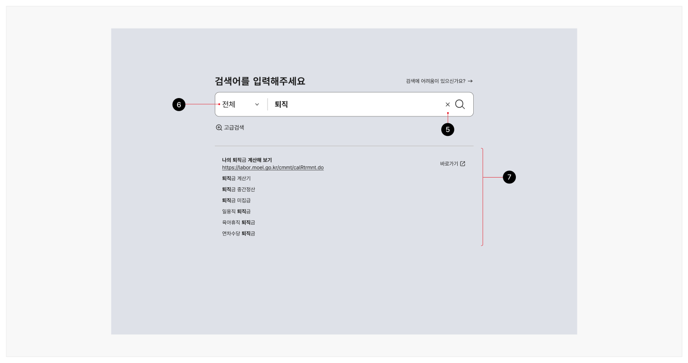
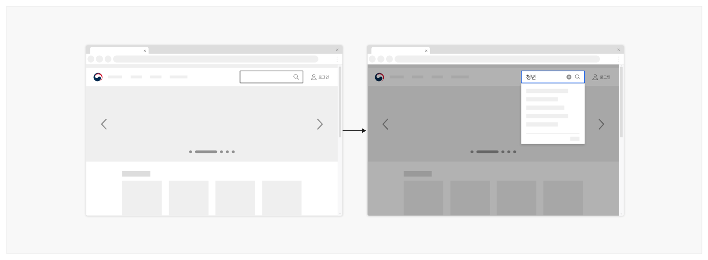
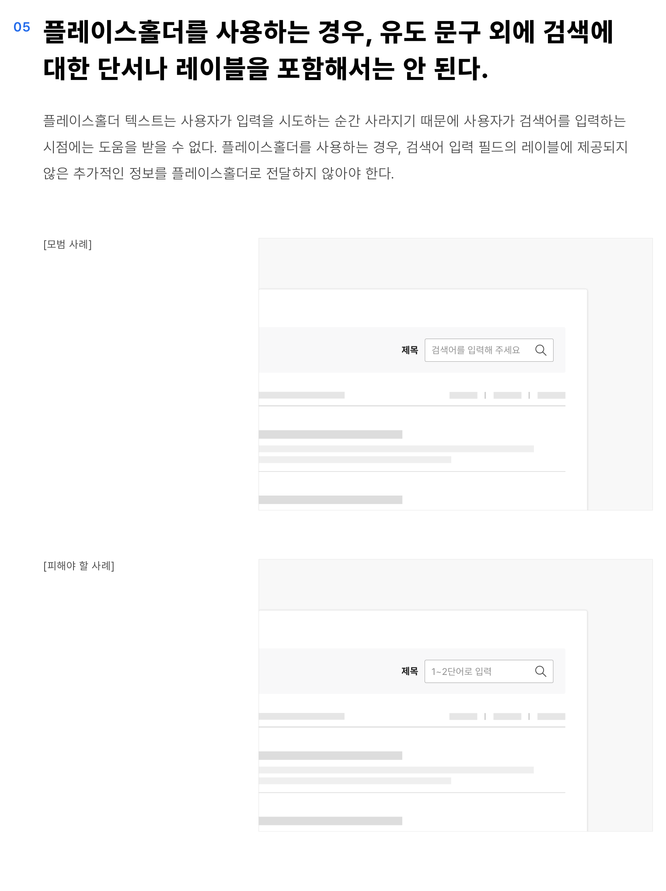
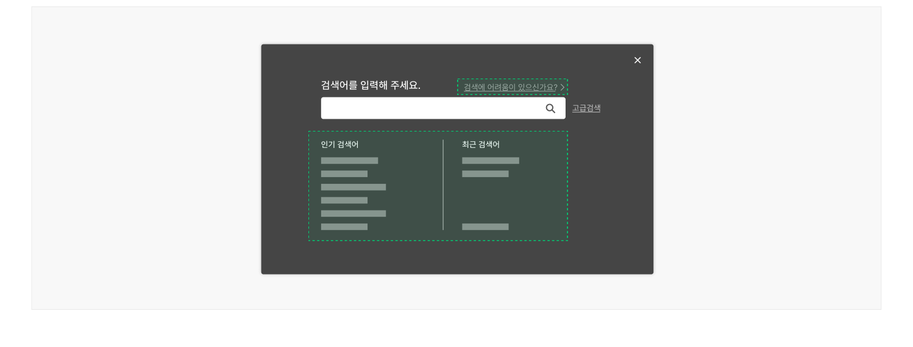
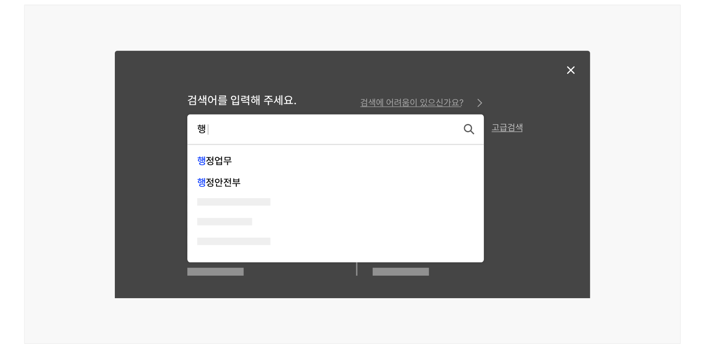

## 구조

- 1 검색어 입력 필드: 사용자가 검색어를 입력하는 텍스트 입력 영역
- 2 레이블: 사용자가 검색할 수 있는 내용을 암시하는 유용하고 짧은 텍스트
- 3 돋보기 아이콘: 검색을 실행하는 버튼
- 4 플레이스홀더(선택): 검색을 유도하기 위한 문구
- 5 검색어 삭제 버튼: 사용자가 검색어 입력 필드에 글자를 입력한 후 제공되어, 실행 시 입력한 검색어 전체를 삭제하는 기능이 작동됨
- 6 스코프 필터(선택): 특정 정보 범주나 섹션에 대한 검색으로 결과를 제한하는 데 사용됨
- 7 실시간 검색어 제안(선택): 검색어 입력 필드가 활성화된 상태에서는 사용자의 최근 검색어, 인기 검색어와 같은 추천 검색어가 제공되며, 검색어 입력 필드에 텍스트 입력이 시작되면 검색어에 기반한 검색어 제안이 제공됨
- 8 검색 도움말(선택): 간단한 검색의 경우 검색어 입력 방식에 대한 예제나 도움말을 직접 제공할 수 있으며, 검색 도움말 문서에 접근할 수 있는 링크로 제공할 수 있음



## 사용성 가이드라인

- 01 사용자가 검색어 입력 행위에 집중할 수 있도록 한다.
- 02 스코프 필터를 사용하는 경우, '전체' 옵션을 제공한다.
- 03 검색어 입력 필드는 일반적인 검색어가 한눈에 파악될 수 있는 너비로 제공하고 줄 바꿈이나 말줄임표를 사용하지 않는다.
- 04 통합 검색이 아닌 검색에는 입력 필드에 레이블을 제공한다.
- 05 플레이스홀더를 사용하는 경우, 유도 문구 외에 검색에 대한 단서나 레이블을 포함해서는 안 된다.
- 06 사용자에게 다양한 방식의 검색어 입력 도움을 제공한다.
- 07 검색어 입력 도움은 가능한 사용자가 검색어를 입력하는 시점에 실시간으로 제공한다.
- 08 실시간으로 검색어를 제안할 수 없는 경우, 검색 결과 화면에서 보조적인 도움 수단을 제공한다.
### 01. 사용자가 검색어 입력 행위에 집중할 수 있도록 한다.

헤더에서 확장된 검색어 입력 필드를 사용하는 경우, 검색어 입력 필드와 실시간 검색어 제안 레이어를 제외한 나머지 영역의 명도나 불투명도를 낮추어 사용자가 검색어를 입력하는 행동에 집중할 수 있도록 도와야 한다.

- [모범 사례 1]



**사례 텍스트 보완**

```text
검색어를 입력해 주세요.
검색에 어려움이 있으신가요?
고급검색
인기 검색어
최근 검색어
```
- [모범 사례 2]


**사례 텍스트 보완**

```text
로그인
청년
```
### 02. 스코프 필터를 사용하는 경우, '전체' 옵션을 제공한다.

스코프 필터를 사용하면 목록의 특정 섹션 또는 특정 범주의 데이터로 사전에 검색을 제한할 수 있다. 범위 필터는 한 번에 하나의 옵션만을 선택할 수 있기 때문에 항상 '전체' 옵션을 제공하고 기본값으로 설정하여 모든 정보의 범주를 검색할 수 있도록 해야 한다.
### 03. 검색어 입력 필드는 일반적인 검색어가 한눈에 파악될 수 있는 너비로 제공하고 줄 바꿈이나 말줄임표를 사용하지 않는다.

사용자가 입력한 검색어 검색어 입력 필드의 너비를 초과하였을 때 말줌임표를 사용하게 되면 사용자는 입력한 검색어를 확인할 수 없게 된다. 검색어 입력 필드에 스크롤이 생성되면 커서의 위치를 조정하여 입력한 검색어를 부분적으로 확인할 수 밖에 없으므로 사용자의 일반적인 검색어 텍스트 길이를 고려하여 입력 필드를 적절한 너비로 제공해야 한다.
### 04. 통합 검색이 아닌 검색에는 입력 필드에 레이블을 제공한다.

통합 검색 입력 필드는 용도가 명확하여 사용자가 서비스 전체 콘텐츠를 검색하게 됨을 예측할 수 있으므로 레이블을 제공하지 않는 것이 적절하다.

그러나 범위 검색, 길찾기와 같은 부분 검색인 경우 검색할 수 있는 대상에 대한 단서를 가능한 간결하고 명확하게 명시해야 한다. 이를 통해 사용자는 검색의 목적이 무엇인지 직관적으로 이해할 수 있다.

[모범 사례]

[피해야 할 사례]

### 05. 플레이스홀더를 사용하는 경우, 유도 문구 외에 검색에 대한 단서나 레이블을 포함해서는 안 된다.

플레이스홀더 텍스트는 사용자가 입력을 시도하는 순간 사라지기 때문에 사용자가 검색어를 입력하는 시점에는 도움을 받을 수 없다. 플레이스홀더를 사용하는 경우, 검색어 입력 필드의 레이블에 제공되지 않은 추가적인 정보를 플레이스홀더로 전달하지 않아야 한다.

[모범 사례]

[피해야 할 사례]
### 06. 사용자에게 다양한 방식의 검색어 입력 도움을 제공한다.

검색 가능한 항목이 복잡한 경우 사용자가 원하는 항목을 찾는 데 도움이 된다. 사용자에게 제공할 수 있는 검색 도움은 다음과 같다.

- 검색어 예제
- 다른 사용자가 많이 사용한 검색어
- 사용자가 이전에 입력한 검색어
- 첫 단어 제안
- 검색 도움말 등

[모범 사례]



**사례 텍스트 보완**

```text
검색어를 입력해 주세요.
검색에 어려움이 있으신가요?
고급검색
인기 검색어
최근 검색어
```
### 07. 검색어 입력 도움은 가능한 사용자가 검색어를 입력하는 시점에 실시간으로 제공한다.

실시간 검색어 제안은 검색어를 입력하는 시간을 단축함으로써 사용자가 빠르게 검색을 수행할 수 있도록 돕는다.

[모범 사례]



**사례 텍스트 보완**

```text
검색어를 입력해 주세요.
검색에 어려움이 있으신가요?
고급검색
행
행정업무
인기 검색어
최근 검색어
행정안전부
```
### 08. 실시간으로 검색어를 제안할 수 없는 경우, 검색 결과 화면에서 보조적인 도움 수단을 제공한다.
## 접근성 가이드라인

### 01. 검색어 입력/실행 관련 컨트롤 요소에 적절한 이름을 제공한다.

각 요소에 명시적인 텍스트 레이블이 제공되지 않더라도 스크린 리더가 접근할 수 있는 이름을 제공해야 한다. 검색어 입력 필드, 검색어 삭제 버튼, 검색 실행 버튼에 각각 '검색어', '검색어 전체 삭제', '검색'이라는 이름을 제공한다.

- KWCAG 2.2 적절한 링크 텍스트
- KWCAG 2.2 레이블 제공
- WCAG 2.1 Headings and Labels (AA)
- WCAG 2.1 Name, Role, Value (A)

### 02. 검색어 입력/실행 관련 대화형 요소는 키보드로 접근과 조작이 가능하도록 한다.

검색어 입력/실행과 관련된 모든 대화형 요소는 키보드로 접근과 조작이 가능해야 한다.

- KWCAG 2.2 키보드 사용 보장
- WCAG 2.1 Keyboard (A)
- WCAG 2.1 No Keyboard Trap (A)

### 03. 자동완성이나 추천 검색 정보에 보조 기술이 접근할 수 있도록 표현한다.

보조 기술 사용자가 자동완성이나 추천 검색어를 활용할 수 있으려면 검색어가 표시되는 콘텐츠 영역에 키보드 및 보조 기술이 접근할 수 있도록 제공되어야 한다.

- KWCAG 2.2 키보드 사용 보장
- WCAG 2.1 Keyboard (A)
- WCAG 2.1 No Keyboard Trap (A)
### 04. 실시간 검색어 입력 도움창의 출현 여부 및 추천 검색어를 스크린 리더가 탐지할 수 있도록 한다.

스크린 리더 사용자는 검색어 입력 도움창의 출현과 검색어 입력에 따른 추천 검색어의 변경 사항을 인지하지 못할 수 있다. WAI-ARIA 표준을 활용하여 추천 검색어 정보가 보조 기술 사용자에게 실시간으로 전달되도록 제공함으로써 보조 기술 사용자의 사용성을 향상시킬 수 있다.

- WCAG 2.1 Status Messages (AA)

### 05. 실시간 검색어 입력 도움창은 검색어 입력 필드의 다음 요소로 제공한다.

검색어 입력 도움창을 검색어 입력 필드와 검색 버튼 사이에 제공하여 스크린 리더 가상 초점으로 콘텐츠에 접근하는 경우에도 논리적인 순서에 따라 콘텐츠를 이용할 수 있도록 한다.

- KWCAG 2.2 콘텐츠의 선형화
- WCAG 2.1 Meaningful Sequence (A)

### 06. 자동완성이나 추천 검색어 목록을 계층화하여 제공한다.

자동완성이나 추천 검색어 목록을 계층화하여 표현하면 사용자는 보조 기술을 통해 검색어 목록에 관한 요약된 정보를 제공받을 수 있다.

- KWCAG 2.2 제목 제공
- WCAG 2.1 Info and Relationships
## 상호작용 가이드라인

### 검색어 입력 필드

| 구분 | 설명 |
|---|---|
| Focusin | 검색어 입력 필드가 키보드 초점을 가진 상태이고 아무런 값이 입력되지 않았다면 인기 검색어와 이전 검색 기록이 제공된다. |
| Keyup | 검색어 입력 필드가 키보드 초점을 가진 상태이고 Keyup 이벤트가 발생하였으며 사용자가 검색어를 한 글자 이상 입력한 경우 인기 검색어와 이전 검색 기록은 검색어 제안으로 변경된다. |
| Enter | 검색어 입력 필드가 키보드 초점을 가진 상태에서 Enter 키를 누르면 검색이 실행된다. |
| 방향키 ↓ | 검색어 입력 필드가 키보드 초점을 가진 상태이면서 검색어 제안 목록이 제공되는 경우, 방향키 ↓를 누르면 검색어 제안 목록 중 가장 첫 번째 요소로 초점이 이동한다. |
### 실시간 검색어 입력 도움

| 구분 | 설명 |
|---|---|
| 방향키 ↑, ↓ | 검색어 제안 목록을 순회한다. 목록 가장 첫 번째 항목에서 방향키 ↑를 누르면 가장 마지막 항목으로 초점이 이동하며, 가장 마지막 항목에서 방향키 ↓를 누르면 가장 첫 항목으로 초점이 이동한다. |
| Click | 검색어 제안 목록에서 특정 항목을 Click 하면 선택된 항목으로 검색 동작이 실행된다. |
| Enter | 키보드 초점을 가진 검색어 제안 목록에서 Enter 키를 누르면 해당 항목으로 검색 동작이 실행된다. |
| Esc | 실시간 검색어 입력 도움창이 활성화된 상태에서 Esc 키를 누르면 창이 닫히면서 키보드 초점이 검색어 입력 필드로 이동한다. |


### 관련 구성 요소

### 컴포넌트

링크 버튼 텍스트 입력 필드

### 기본 패턴

도움
