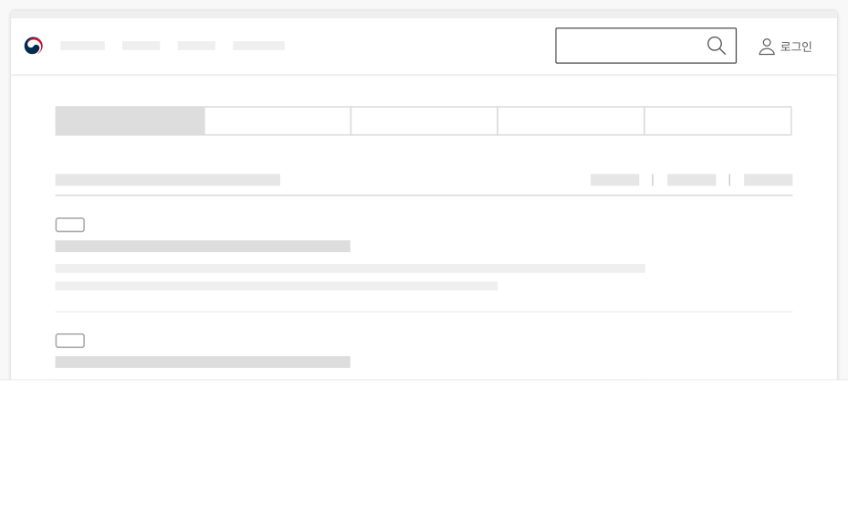
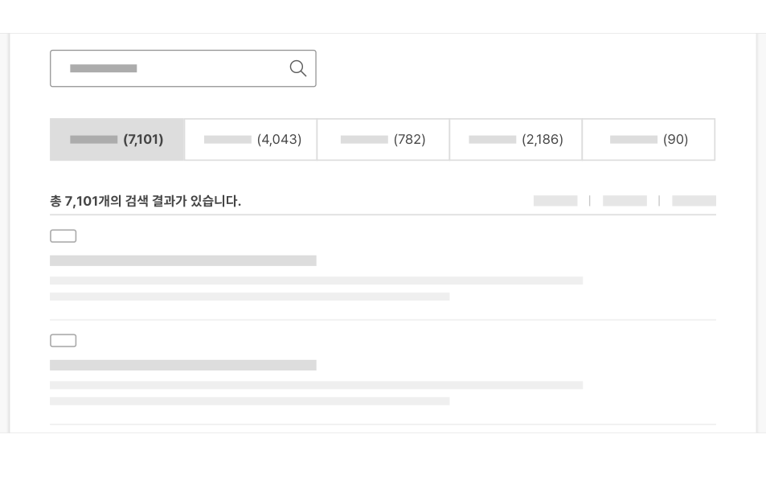
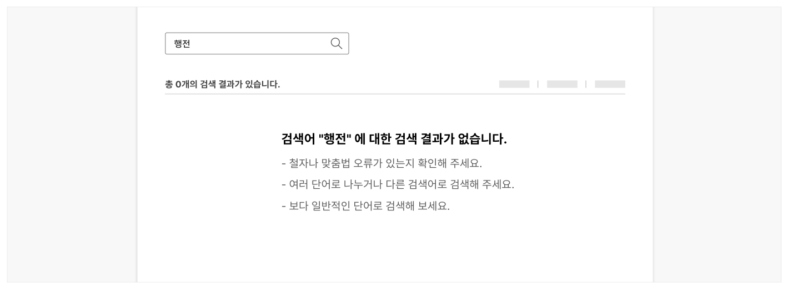

## 구조

- 1 주제 탐색 탭: 별도 필터나 고급 검색 동작 없이 검색 결과 목록을 검색 주제별로 탐색할 수 있는 수단
- 2 결과 수: 전체 검색 결과의 양을 나타는 지표
- 3 결과 목록: 검색 결과로 반환된 데이터 목록

## 사용성 가이드라인

- 01 검색 결과가 표시되기 전에 로딩 상태에 대한 정보를 제공한다.
- 02 검색 결과 화면에 검색어 입력 필드를 유지한다.
- 03 검색 결과 화면에 여러 개의 검색어 입력 필드를 사용하지 않는다.
- 04 사용자가 재검색을 시도하지 않는 한 검색어 입력 필드에 검색어를 유지한다.
- 05 검색 결과 수를 표시한다.
- 06 검색어와 관련된 결과가 반환되는지 확인한다.
- 07 유사 검색어나 관련된 검색어에 대한 검색 결과를 함께 제공한다.
- 08 초기 검색 결과 목록은 정확도 또는 관련도순으로 정렬하여 제공한다.
- 09 검색 결과가 지나치게 많이 제공되는 경우 사용자에게 범위를 제한할 수 있는 방법에 대해 안내한다.
- 10 검색 결과가 없는 경우, 결과를 명확하게 알리고 적절한 대안을 제공한다.

### 01. 검색 결과가 표시되기 전에 로딩 상태에 대한 정보를 제공한다.

검색 결과가 표시되기 전까지 스피너와 스켈레톤(Skeleton)을 표시하여 검색이 진행되고 있음을 사용자가 인지할 수 있도록 해야 한다. 검색 엔진이 느리거나 고급 검색으로 인해 결과 표시에 더 많은 시간이 소요되는 경우 스피너 대신 진행률 표시 막대를 제공함으로써 대략적으로 검색이 어느 정도로 진행되었고 얼마 후에 결과를 확인할 수 있는지 사용자가 예측할 수 있도록 해야 한다.

### 02. 검색 결과 화면에 검색어 입력 필드를 유지한다.

검색을 실행하여 검색 결과 화면으로 전환되었을 때, 연속적이고 추가적인 검색이 가능하도록 검색어 입력 필드를 유지해야 한다.

### 03. 검색 결과 화면에 여러 개의 검색어 입력 필드를 사용하지 않는다.

동일한 기능과 목적을 가진 검색어 입력 필드가 한 화면에 여러 개 제공될 경우 사용자에게 혼동을 줄 수 있다.

[모범 사례]



**사례 텍스트 보완**

```text
로그인
```
[피해야 할 사례]


**사례 텍스트 보완**

```text
로그인
```
### 04. 사용자가 재검색을 시도하지 않는 한 검색어 입력 필드에 검색어를 유지한다.

검색 결과 화면 상단의 검색어 입력 필드에 검색 결과를 반환한 검색어, 즉 사용자가 검색을 시도한 검색어를 유지하여 결과 화면에 진입하기 직전에 수행한 작업을 사용자가 기억한 상태에서 원하는 결과를 탐색할 수 있도록 해야 한다.
### 05. 검색 결과 수를 표시한다.

검색 결과 수를 명시하여 사용자가 다음 행동을 빠르게 결정할 수 있도록 도와야 한다. 검색 결과를 검색 주제별 탭으로 구분하고 있는 경우, 검색 주제별 결과 수도 반드시 제공해야 한다.

[모범 사례]



**사례 텍스트 보완**

```text
(7,101)
(4,043)
(782)
(2,186)
(90)
총 7,101개의 검색 결과가 있습니다.
```
### 06. 검색어와 관련된 결과가 반환되는지 확인한다.

사용자는 원하는 정보를 찾기 위해 검색 패턴을 이용한다. 많은 사용자가 자주 검색하는 검색어를 중심으로 검색 결과가 적절한 내용과 순서로 제공되고 있는지 정기적으로 점검하여 검색 결과의 정확성을 향상해야 한다.
### 07. 유사 검색어나 관련된 검색어에 대한 검색 결과를 함께 제공한다.

사용자 중 일부는 여러 가지 탐색 수단을 통해 원하는 콘텐츠를 찾지 못한 상황에서 필요한 정보의 단서를 발견하기 위해 검색을 사용하므로 정확한 검색어로 검색을 시도하지 못할 가능성이 높다. 또한 사용자가 검색어를 입력하는 과정에서 오타를 포함했을 가능성도 있으므로 입력한 검색어의 유의어, 축약어 등 관련 검색어에 대한 결과를 함께 제시하여 사용자가 필요한 정보에 빠르게 접근할 수 있도록 해야 한다.
### 08. 초기 검색 결과 목록은 정확도 또는 관련도순으로 정렬하여 제공한다.

관련성은 키워드 매칭을 통해 결정할 수 있지만, 사용자 경험을 실제로 향상시키려면 확률 기반 접근 방식을 구현하는 것이 좋다.
### 09. 검색 결과가 지나치게 많이 제공되는 경우 사용자에게 범위를 제한할 수 있는 방법에 대해 안내한다.

검색 결과가 지나치게 많이 제공되는 경우 사용자에게 고급 검색 옵션 링크를 직접 제공하거나 정렬/필터 기능을 제안하여 결과 수를 줄이는 과정을 도와야 한다.

예) "원하는 결과를 찾지 못하셨나요? 고급 검색을 사용해 보세요."
### 10. 검색 결과가 없는 경우, 결과를 명확하게 알리고 적절한 대안을 제공한다.

검색 결과가 없는 현상은 실제로 데이터가 없거나 검색 과정에서의 실수 등 다양한 원인으로 인해 나타날 수 있으므로, 사용자에게 문제를 구체적으로 알려주어야 한다. 또한, 원인을 파악한 사용자가 입력한 검색어를 재확인하여, 철자를 수정하거나 다른 검색어를 입력함으로써 필요한 정보를 발견할 수 있도록 안내해야 한다.

- 검색 결과가 없는 경우 다음 내용이 화면에 반영되어야 한다.
- 결과 수: "0"
- 안내 메시지: "검색어와 일치하는 결과를 찾을 수 없습니다."

- 사용자에게 다음과 같은 대안적 행동을 제시한다.
- 검색어 철자 확인

- 다른 검색어 사용
- 더 일반적인 검색어 사용
- 검색 도움말 참조
사용성 가이드라인


[모범 사례]



**사례 텍스트 보완**

```text
행전
총 0개의 검색 결과가 있습니다.
검색어 "행전" 에 대한 검색 결과가 없습니다.
철자나 맞춤법 오류가 있는지 확인해 주세요.
여러 단어로 나누거나 다른 검색어로 검색해 주세요.
보다 일반적인 단어로 검색해 보세요.
```
[피해야 할 사례]


**사례 텍스트 보완**

```text
행전
(0)
```


### 관련 구성 요소

### 컴포넌트

구조화 목록 스피너 탭
