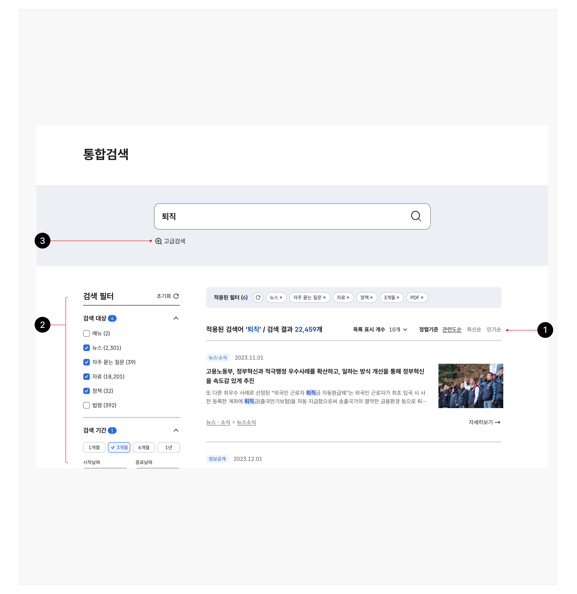
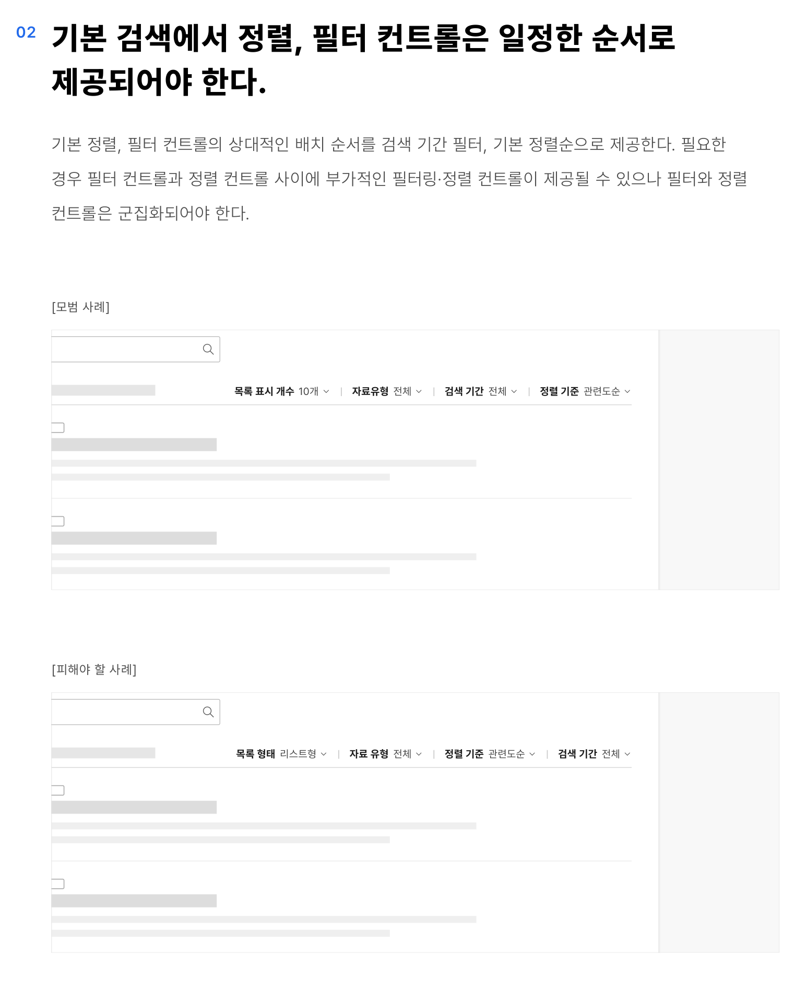
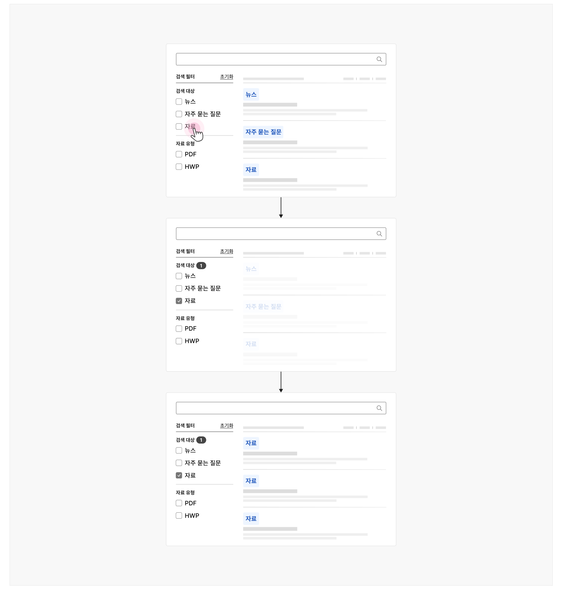
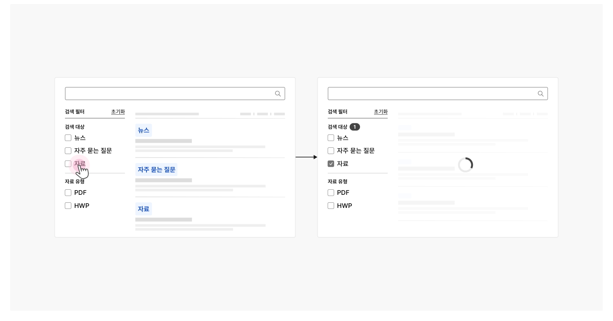

## 유형

### 기본 검색

기본 정렬, 필터 컨트롤만을 사용한 검색으로, 필터/정렬 컨트롤은 화면 너비가 허용하는 한 목록 상단에 막대 형태로 제공하여 모든 컨트롤이 시각적으로 드러나 있어야 한다.

### 복합 검색

기본 검색에 비해 복잡한 검색을 수행하기 위해 기본 정렬, 필터 컨트롤에 더 많은 유형과 속성의 필터를 제공한다. 세부 필터 유형과 수에 따라 목록 상단에 배치되는 막대나 사이드 패널에 제공한다.

### 고급 검색

여러 개의 키워드를 조합하거나 검색 조건을 다중으로 설정할 수 있는 유형이다. 사용자가 검색 조건을 설정하는 행동에 집중할 필요가 있는 경우, 검색 조건에 대한 부가적 설명이 필요한 경우, 데이터 조회에 긴 시간이 소요되는 경우에 사용하기 적합하다.

고급 검색은 복합 검색과 다르게 세부 검색 조건을 모달이나 별도 화면에서 설정한다.
### 유형 선택 방법

| 구분 | 기본 검색 | 복합 검색 | 고급 검색 |
|---|---|---|---|
| 검색 범위 | 웹사이트 또는 애플리케이션 전체<br />소규모 웹사이트, 단일 화면 서비스, 특정 정보 목록, 표 | 웹사이트 또는 애플리케이션 전체 | 웹사이트 또는 애플리케이션 전체<br />아카이브와 같은 대량의 정보 |
| 메타 데이터 복잡성 | 메타 데이터 유형의 수와 사용자가 필요로 하는 검색 주제의 수가 적음 | - | - |
| 검색 결과 정확도 | 사용자가 결과 목록 1~2페이지 내에서 원하는 결과를 발견할 수 있음 | - | - |
| 사용할 필터 유형 | - | - | 쿼리 연산자가 필요한 텍스트 필터를 사용해야 함 |
## 구조

1 정렬 컨트롤: 검색 결과 목록의 순서를 변경하는 데 사용되는 컨트롤 2 필터 컨트롤: 검색 결과 목록을 특정 주제, 범주, 속성으로 제한하는 데 사용되는 컨트롤 3 고급 검색 버튼/링크: 정렬, 필터 컨트롤에서 제공되지 않는 보다 복잡한 검색 조건 설정에 접근할

수 있는 수단



## 사용성 가이드라인

- 01 기본 정렬, 필터 컨트롤을 제공한다.
- 02 기본 검색에서 정렬, 필터 컨트롤은 일정한 순서로 제공되어야 한다.
- 03 스코프 필터를 사용하는 경우 결과 화면 상단에 설정된 범위를 명시적으로 표시한다.
- 04 정렬, 필터 적용 결과는 가능한 한 사용자가 값을 선택하였을 때 적용한다.
- 05 조건이 적용되었음을 확인할 수 있는 명확한 시각적 단서를 제공한다.
### 01. 기본 정렬, 필터 컨트롤을 제공한다.

사용자가 간단한 정렬, 필터 옵션을 활용하여 결과를 좁힐 수 있도록 가장 기본적인 속성에 대한 정렬, 필터 컨트롤을 제공해야 한다. 통합검색의 경우, 검색 기간 필터, 기본 정렬 컨트롤을 제공한다.

각 컨트롤 요소에 기본으로 제공해야 하는 옵션은 다음과 같다.

- 검색 기간 필터: 1일/일주일/1개월 선택 옵션 및 사용자 정의 컨트롤
- 기본 정렬: 정확도/관련도순, 최신순, 인기순

### 02. 기본 검색에서 정렬, 필터 컨트롤은 일정한 순서로 제공되어야 한다.

기본 정렬, 필터 컨트롤의 상대적인 배치 순서를 검색 기간 필터, 기본 정렬순으로 제공한다. 필요한 경우 필터 컨트롤과 정렬 컨트롤 사이에 부가적인 필터링·정렬 컨트롤이 제공될 수 있으나 필터와 정렬 컨트롤은 군집화되어야 한다.

[모범 사례]

[피해야 할 사례]
### 03. 스코프 필터를 사용하는 경우 결과 화면 상단에 설정된 범위를 명시적으로 표시한다.

검색 결과의 제한 사항에 대해 사용자가 명확하게 인지할 수 있도록 사용자가 값을 변경하기 전까지는 기본으로 선택된 스코프 필터가 유지되도록 하거나 검색 결과 화면의 제목에 설정된 옵션 정보를 포함하여 제공할 수 있다.
### 04. 정렬, 필터 적용 결과는 가능한 한 사용자가 값을 선택하였을 때 적용한다.

데이터의 수가 많지 않고 성능에 문제가 없는 경우, 필터의 적용/해제를 통해 결과 목록을 비교하여 원하는 결과를 더 빠르게 발견할 수 있게 한다.
사용성 가이드라인


### 05. 조건이 적용되었음을 확인할 수 있는 명확한 시각적 단서를 제공한다.

상세 검색 조건이 적용되어 전체 검색 결과 수가 변경되었을 때, 상태가 변경된 상황을 사용자가 빠르고 직관적으로 인지할 수 있도록 제공해야 한다.

[모범 사례 1]



**사례 텍스트 보완**

```text
검색 필터
초기화
검색 대상
뉴스
자주 묻는 질문
자료
자료 유형
PDF
HWP
검상
상 초필
상
```
접근성 가이드라인


- [모범 사례 2]



**사례 텍스트 보완**

```text
검색 필터
검
초기화
검색 대상
뉴스
자주 묻는 질문
자료
자료 유형
PDF
HWP
자주 믇는 질문
```
- [모범 사례 3]


**사례 텍스트 보완**

```text
검색 필터
초기화
검색 대상
뉴스
자주 묻는 질문
자료
자료 유형
PDF
HWP
```
관련 구성 요소


## 접근성 가이드라인

### 조건이 적용되었음을 확인할 수 있는 명확한 프로그램적 단서를 제공한다.

전체 검색 결과 수 안내 텍스트에 live-region을 적용하고 값이 변경되자마자 해당 정보가 스크린 리더로 전달될 수 있도록 aria-live="polite"를 사용해야 한다.

- WCAG 2.1 Status Messages (AA)

### 관련 구성 요소

### 기본 패턴

도움 필터링·정렬
