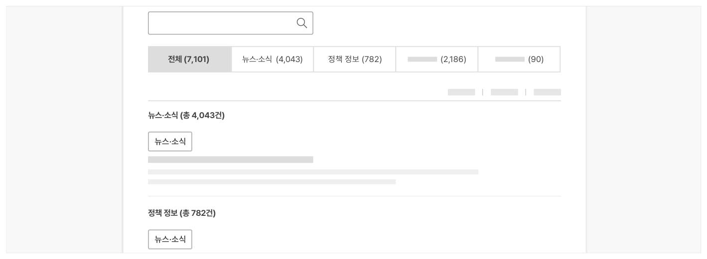
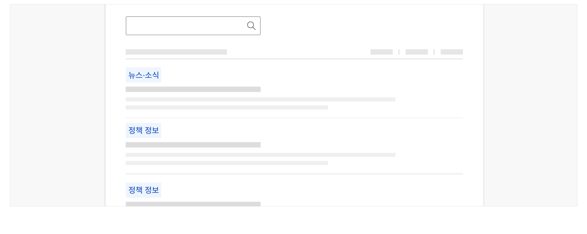

## 구조

- 1 주제 탐색 탭: 별도 필터나 고급 검색 동작 없이 검색 결과 목록을 검색 주제별로 탐색할 수 있는 수단
- 2 배지(선택): 검색 결과의 주제와 같은 범주 관련 메타 데이터를 표시하기 위한 문자
- 3 날짜: 결과 정보의 등록 일자 또는 최종 업데이트 일자
- 4 제목: 결과 정보의 본문 제목, 첨부 파일명, 메뉴명 등의 메타 정보로 결과 식별에 사용됨
- 5 설명: 결과 정보에 대한 설명
- 6 인덱스: 결과 정보의 정보 구조 위계를 표시함
- 7 URL(선택): 결과 정보가 제공되는 링크 주소로 결과가 외부 사이트로 연결되는 경우에 표시함
- 8 액션 버튼 또는 링크(선택): 결과 화면으로 이동하거나 화면 이동 없이 관련 기능을 실행하는 데 이용되는 요소


## 사용성 가이드라인

- 01 사용자가 필요로 하는 주제별로 검색 결과가 제공되도록 설계한다.
- 02 검색 주제 분류는 7개를 초과하지 않도록 한다.
- 03 주제별 탐색 탭을 사용하는 경우 전체 목록이 가장 첫 번째 탭으로 제공되어야 한다.
- 04 전체 결과 목록은 주제별 섹션 구분 없이 결과의 정확도나 관련도 순으로 정렬한다.
- 05 제목과 설명은 명확하고 간결하게 제공한다.
- 06 항목에 검색 결과 범주 정보가 명확하게 드러나도록 표현한다.
- 07 검색어와 일치하는 항목을 강조 표시한다.
- 08 기본 검색 결과 목록에 표시되는 항목의 수를 10개 이상으로 제공한다.

### 사용자가 필요로 하는 주제별로 검색 결과가 제공되도록 설계한다.

사용자가 빈번하게 검색하는 주제별로 검색 결과를 구조화하여 제공하게 되면 사용자는 원하는 정보에 더 빠르고 정확하게 접근할 수 있다.

일반적인 디지털 서비스의 통합 검색에서 제공할 수 있는 검색 주제는 다음과 같다.

- 메뉴
- 자주 묻는 질문
- 뉴스, 공지, 소식
- 첨부파일 등 자료
- 정책, 고시, 법령
- 이미지, 동영상 등의 미디어
- 직원

### 검색 주제 분류는 7개를 초과하지 않도록 한다.

지나치게 많은 검색 분류는 사용자의 인지적 부담을 증가시키므로 주제별 탐색 탭 패널은 최대 7개만 사용한다. 더 많은 분류가 필요한 경우 검색 필터나 고급 검색에서 분류를 제공한다.

### 주제별 탐색 탭을 사용하는 경우 전체 목록이 가장 첫 번째 탭으로 제공되어야 한다.

전체 목록을 제공하지 않으면 검색 결과의 정확도나 관련도에 상관없이 고정된 주제별 탭 순서로 정보를 탐색해야 하므로 사용자는 원하는 결과에 빠르게 접근할 수 없다.

### 전체 결과 목록은 주제별 섹션 구분 없이 결과의 정확도나 관련도 순으로 정렬한다.

전체 목록에서 주제별로 모든 섹션을 구분하는 레이아웃은 검색 주제가 이미지, 동영상과 같이 텍스트가 아닌 형태이거나, 주제별로 독특하게 구성된 레이아웃이 항목을 탐색하는 데 도움이 된다는 명확한 근거가 있는 경우에만 사용해야 한다.

[모범 사례]



**사례 텍스트 보완**

```text
(90)
전체 (7,101)
뉴스·소식 (4,043)
정책 정보 (782)
(2,186)
뉴스·소식 (총 4,043건)
뉴스·소식
정책 정보 (총 782건)
```
[피해야 할 사례]


**사례 텍스트 보완**

```text
전체 (7,101)
뉴스·소식 (4,043)
정책 정보 (782)
(2,186)
(90)
뉴스·소식 (총 4,043건)
더보기
자주 묻는 질문 (총 0건)
```

### 제목과 설명은 명확하고 간결하게 제공한다.

제목과 설명은 2줄 이내로 제공하여 사용자가 결과 목록을 효율적으로 탐색할 수 있도록 해야 한다. 2줄을 초과하는 텍스트는 말줄임표를 사용해 잘라 표현함으로써 상세 화면에서 추가로 정보가 제공되고 있음이 드러나야 한다.

### 항목에 검색 결과 범주 정보가 명확하게 드러나도록 표현한다.

항목이 검색 주제와 같은 범주 정보로 구분되어 있는 경우 직관적으로 인지할 수 있는 방식으로 표현하여 원하는 결과 탐색에 걸리는 시간을 최소화해야 한다.

[모범 사례]



**사례 텍스트 보완**

```text
뉴스·소식
정책 정보
```

### 검색어와 일치하는 항목을 강조 표시한다.

검색 결과를 표시할 때는 사용자가 입력했던 검색어와 일치하는 항목을 강조 표시하여, 인지의 흐름에 단절이 생기지 않도록 해야 한다.

### 기본 검색 결과 목록에 표시되는 항목의 수를 10개 이상으로 제공한다.

한 화면에서 확인할 수 있는 검색 결과를 적절한 수로 제공하여 부가적인 탐색 행동 없이 결과 목록을 탐색할 수 있도록 해야 한다. 결과 목록에 표시되는 메타 데이터의 수가 적어 항목이 간결하거나 검색 대상 데이터 규모가 큰 경우 사용자가 표시할 항목 수를 원하는 대로 조정할 수 있도록 옵션을 제공하는 것이 좋다.


### 관련 구성 요소

### 컴포넌트

구조화 목록 배지 태그

### 기본 패턴

목록 탐색
