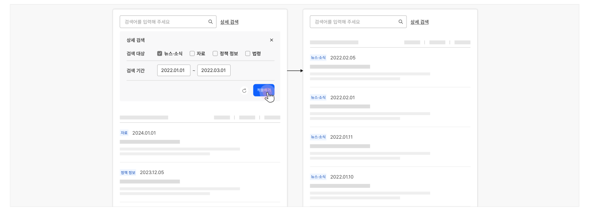

### 재검색

## 구조

- 1 정렬 컨트롤: 검색 결과 목록의 순서를 변경하는 데 사용되는 컨트롤
- 2 필터 컨트롤: 검색 결과 목록을 특정 주제, 범주, 속성으로 제한하는 데 사용되는 컨트롤


## 사용성 가이드라인

- 01 상세 검색 컨트롤을 숨기지 않는다.
- 02 사용자가 설정한 상세 검색 조건을 유지한다.
- 03 상세 검색 조건의 적용을 일괄적으로 해제할 수 있는 수단을 제공하고 직관적으로 인지할 수 있도록 표현한다.
### 01. 상세 검색 컨트롤을 숨기지 않는다.

화면 너비로 인해 상세 검색 컨트롤이 모달에서 제공되지 않는 한 상세 검색 컨트롤은 사용자가 검색 과정을 반복하는 동안 항상 표시되어야 한다. 상세 검색 컨트롤을 숨기면 재검색 과정에서 상세 검색 수단을 발견하지 못하거나, 설정한 조건을 기억하지 못해 실수할 가능성이 높아진다.

[모범 사례]



**사례 텍스트 보완**

```text
검색어를 입력해 주세요
상세 검색
뉴스·소식
자료
정책 정보
법령
검색 대상
시작 날짜
~
종료 날짜
2022.01.01
2022.0.01
검색 기간
적용하기
2024.01.01
2022.02.0
202.12.0
2022.02.01
```
[피해야 할 사례]


**사례 텍스트 보완**

```text
상세 검색
검색어를 입력해 주세요
뉴스·소식
자료
정책 정보
법령
검색 대상
2022.02.0
2022.01.01
~
2022.0.01
검색 기간
적용하기
2022.02.01
2024.01.01
2022.01.11
202.12.0
2022.01.10
```
### 02. 사용자가 설정한 상세 검색 조건을 유지한다.

사용자가 의도적으로 설정을 해제하기 전까지 재검색 전 과정 동안 상세 검색 조건을 유지하여 사용자가 필요한 맥락 내에서 연속적으로 검색을 수행할 수 있도록 해야 한다.

### 03. 상세 검색 조건의 적용을 일괄적으로 해제할 수 있는 수단을 제공하고 직관적으로 인지할 수 있도록 표현한다.

기본 검색 외에 복합 검색, 고급 검색이 사용되는 경우 사용자가 여러 개의 범주와 속성별로 조건을 설정할 수 있으므로 재검색 과정에서 조건 전체를 변경하고자 하는 경우 일괄 해제 기능을 제공하여 사용자의 행동을 단축시켜야 한다.
### 관련 구성 요소

### 기본 패턴

필터링·정렬
