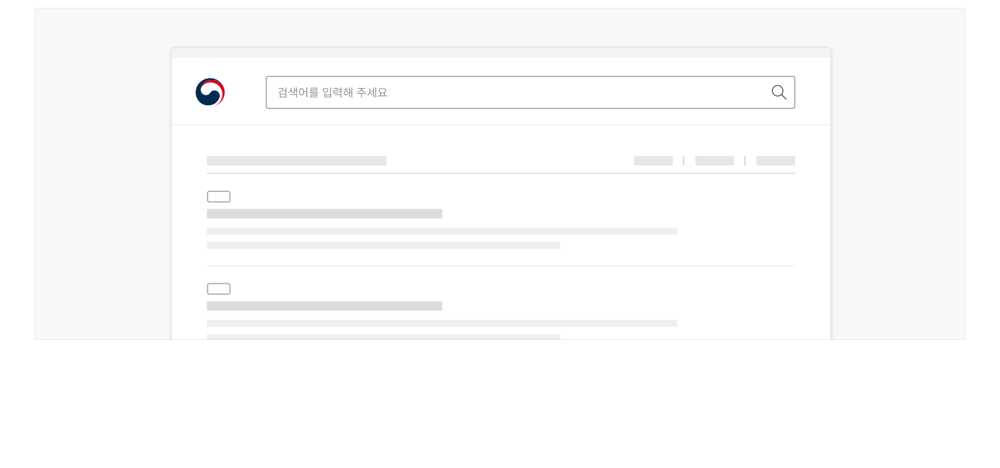

사용성 가이드라인


### 검색 종료

## 사용성 가이드라인

01 검색 과업 맥락에서 벗어나 다른 화면 또는 다른 탐색 수단에 빠르게 접근할 수 있도록 해야 한다.

### 검색 과업 맥락에서 벗어나 다른 화면 또는 다른 탐색 수단에 빠르게 접근할 수 있도록 해야 한다.

사용자는 검색 결과에서 필요한 정보를 발견한 경우에 검색을 종료하기도 하지만, 다른 방식을 사용하여 서비스 정보 구조를 탐색하기로 결정한 경우 검색 과업의 맥락에서 벗어나기를 시도할 수 있다. 후자의 상황을 고려하여 검색 결과 화면에도 메인 메뉴, 사이트맵 같은 탐색 인터페이스를 제공해야 한다.

[모범 사례]



**사례 텍스트 보완**

```text
통합검색
로그인
메뉴1
메뉴2
메뉴3
메뉴4
검색어를 입력해 주세요
```
[피해야 할 사례]


**사례 텍스트 보완**

```text
검색어를 입력해 주세요
```


### 관련 구성 요소

### 컴포넌트

헤더
서비스 패턴

00 개요 01 로그인 기능 찾기 02 로그인 안내 03 로그인 방식 확인·선택 04 로그인 정보 입력 05 로그인 완료 06 서비스 이용 07 로그아웃
