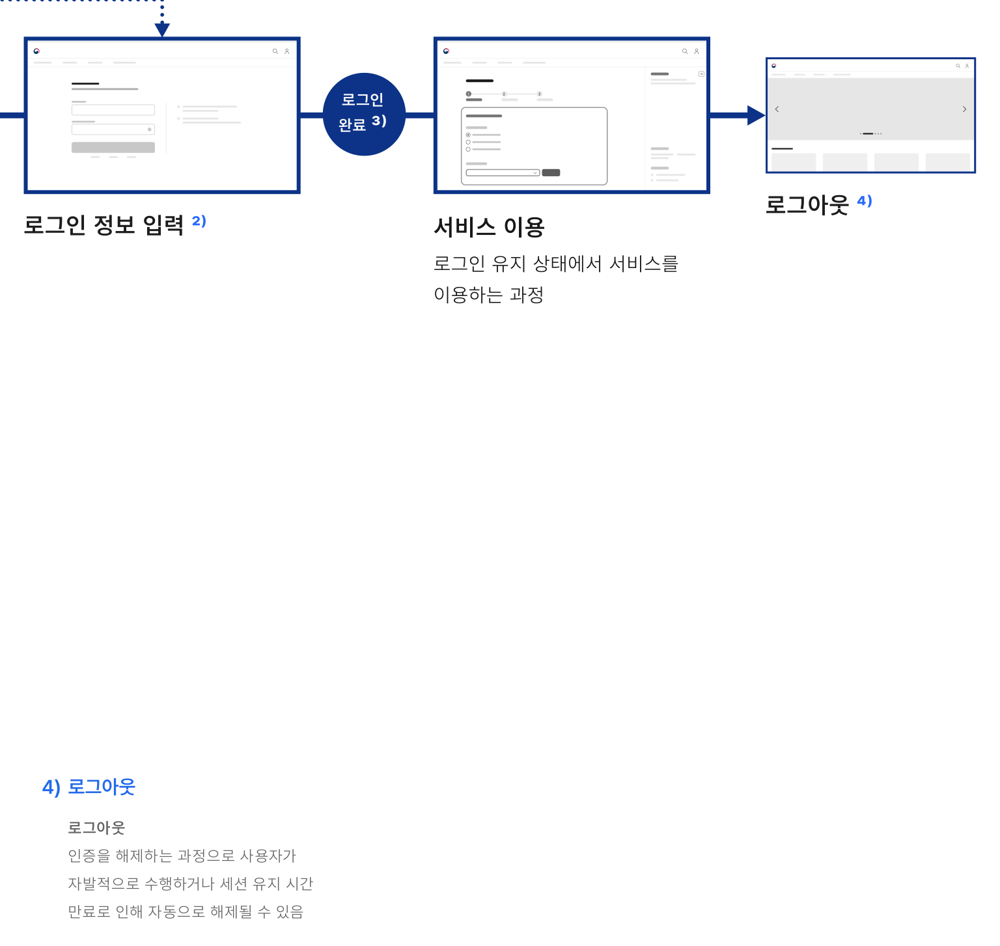

## 개요

로그인은 사용자의 신원을 확인하는 과정으로 사용자가 서비스에 접근할 수 있도록 하는 수단이다. 사용자에게 개인화된 경험을 제공하거나 사용자의 신분/신원을 인증하고자 하는 경우에 사용하기 적합하다.

## 유형

| 구분 | 설명 |
|---|---|
| 지식 기반 인증 | 사용자만이 유일하게 알고 있는 내용에 기반한 사용자 확인 방법 예) 아이디/패스워드, PIN |
| 소유 기반 인증 | 사용자가 보유하고 있는 품목을 활용한 인증 방법 예) 토큰, 공동인증, 간편인증, 문자 인증 |
| 생체 기반 인증 | 사용자의 생체 정보, 행동에 기반한 인증 방법 예) 지문 인증, 페이스 아이디 |
| 다중 요소 인증 | 여러 가지 인증 방식을 결합하여 제공하는 인증 방법 |
### 이용 상황별 플로 (Flow)

로그인 방식을 저장한 경우

로그인 실행

로그인 방식을 선택한 뒤 실행하는 과정

로그인 기능 찾기

로그인 방식 확인 및 선택 ¹⁾

로그인 수단을 탐색하고 발견하는 과정

### 로그인 안내

로그인 화면으로 전환에 대한 설명을 확인하고 진행 여부를 확정하는 과정

### 1) 로그인 방식 확인 및 선택

로그인 방식 탐색 2개 이상의 로그인 방식에 대해 비교하고 선택하는 과정

도움말 확인 로그인 방식, 방법에 대한 안내를 확인하는 과정

### 2) 로그인 정보 입력

정보 입력 인증 방식에 따라 정보를 입력하는 과정

### 3) 로그인 완료

완료 로그인이 성공적으로 완료되어 화면을 벗어나는 과정


**ASCII 흐름 보완**

```text
로그인 기능 찾기 -> 로그인 안내 -> 로그인 방식 확인 및 선택 -> 로그인 정보 입력 -> 로그인 완료 -> 서비스 이용 -> 로그아웃
```
### 4) 로그아웃

로그아웃 인증을 해제하는 과정으로 사용자가 자발적으로 수행하거나 세션 유지 시간 만료로 인해 자동으로 해제될 수 있음
