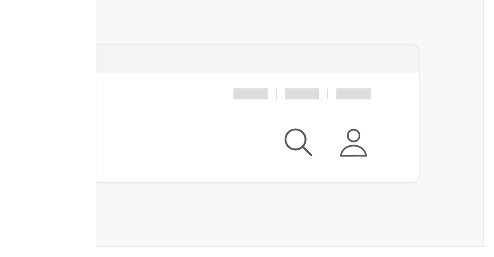

### 로그인 기능 찾기

## 구조

1 아이콘: 로그인에 사용되는 링크 요소임을 보다 직관적으로 인지할 수 있도록 제공되는 아이콘 2 레이블: 아이콘에 대한 텍스트 레이블


## 사용성 가이드라인

- 01 로그인 링크는 모든 화면에서 일관된 위치에 주목도 있게 배치한다.
- 02 헤더에서 제공되는 로그인 링크는 사용자 아이콘과 레이블로 구성한다.
- 03 로그인 링크는 항상 '로그인' 화면으로 연결되어야 한다.
### 01. 로그인 링크는 모든 화면에서 일관된 위치에 주목도 있게 배치한다.

로그인으로 이동할 수 있는 링크가 메인 화면 또는 일부 화면에만 제공될 경우, 로그인이 필요한 사용자는 특정 화면으로 이동하는 경우에만 기능을 이용할 수 있어 이용에 어려움을 겪게 된다. 주요 정보 및 서비스를 확인하는 데 로그인이 필요한 경우, 서비스 첫 화면에 로그인을 유도하는 문구와 링크를 강조하여 표시함으로써 로그인을 유도할 수 있다.
### 02. 헤더에서 제공되는 로그인 링크는 사용자 아이콘과 레이블로 구성한다.

아이콘만 단독으로 사용되는 경우 사용자에 따라 링크의 목적을 빠르게 이해하기 어려울 수 있으므로 텍스트 레이블을 함께 제공하는 것이 좋다.

[모범 사례]

[피해야 할 사례]



**사례 텍스트 보완**

```text
통합검색
로그인
```


**사례 텍스트 보완**

```text
필수 권장
아이콘만 단독으로 사용되는 경우 사용자에 따라 링크의 목적을 빠르게 이해하기 어려울 수 있으므로 텍스트 레이블을 함께 제공하는 것이 좋다.
```
### 03. 로그인 링크는 항상 '로그인' 화면으로 연결되어야 한다.

로그인 링크의 목적지는 로그인 프로세스를 시작하는 화면 또는 로그인할 수 있는 다양한 계정이 있는 계정 선택 화면으로 설정해야 한다.


### 플랫폼에 대한 고려 사항

화면 너비가 충분하지 않은 경우에도 로그인 링크를 직관적으로 인지할 수 있는 형태로 표현한다.

작은 화면 너비에서도 가능한 한 로그인 링크를 숨기지 않고 헤더나 탭바 영역에 로그인/마이페이지 링크를 상시 배치한다. 만약 서비스 이용에 로그인이 중요하지 않다면 메뉴 레이어에서만 로그인 링크를 제공할 수 있다.


## 접근성 가이드라인

### 01. 로그인 링크는 스크린 리더에서 링크로 인지될 수 있도록 한다.

로그인 링크를 버튼 요소로 마크업하게 되면 로그인 화면으로 이동하는 동작이 발생함을 예측할 수 없다.

- WCAG 2.1 Name, Role, Value (A)


### 관련 구성 요소

### 컴포넌트

헤더
