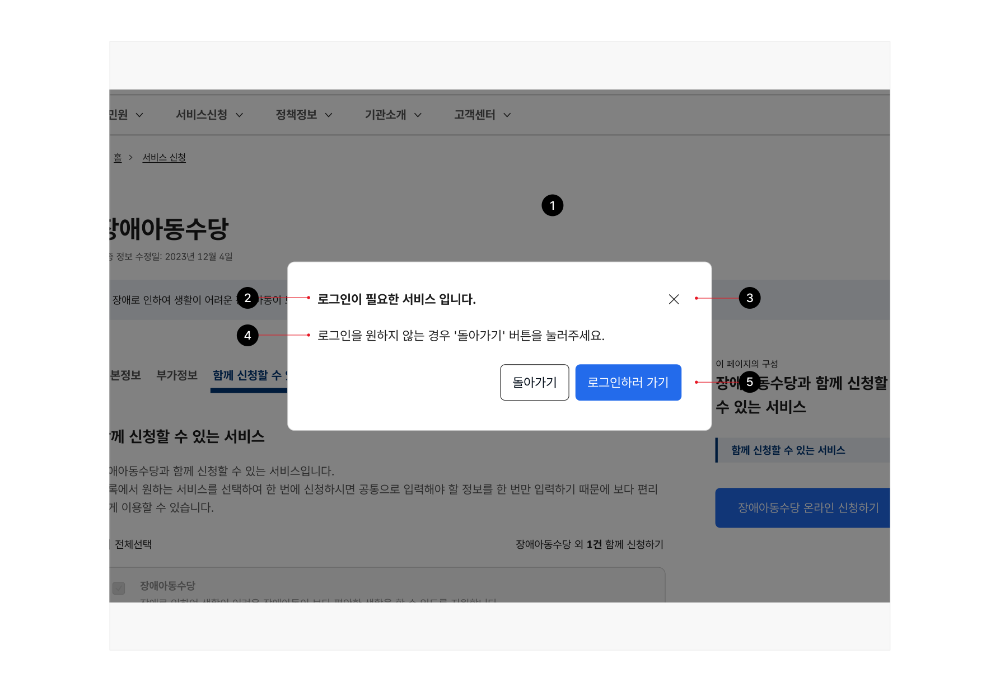
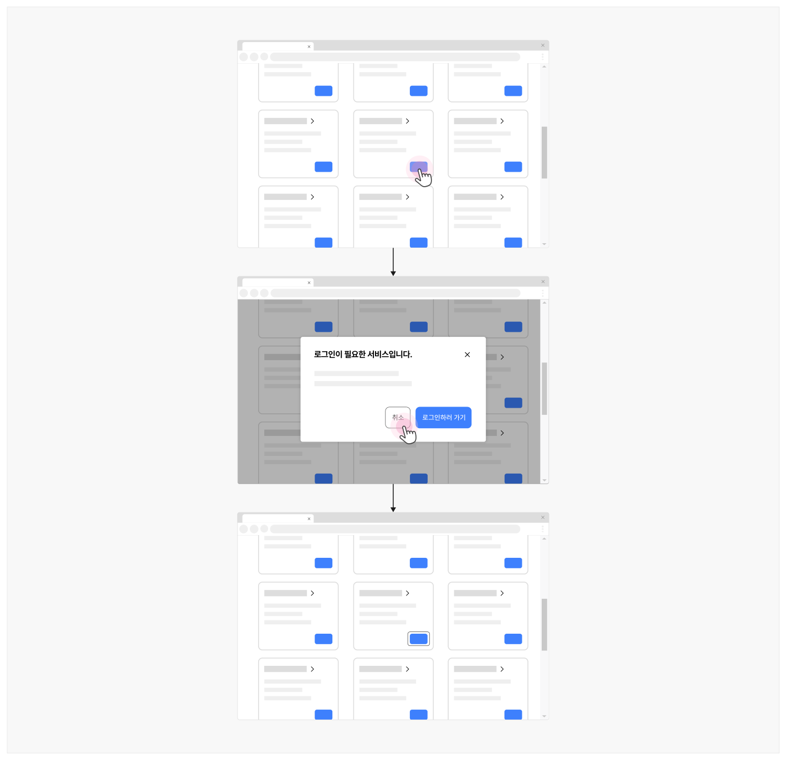
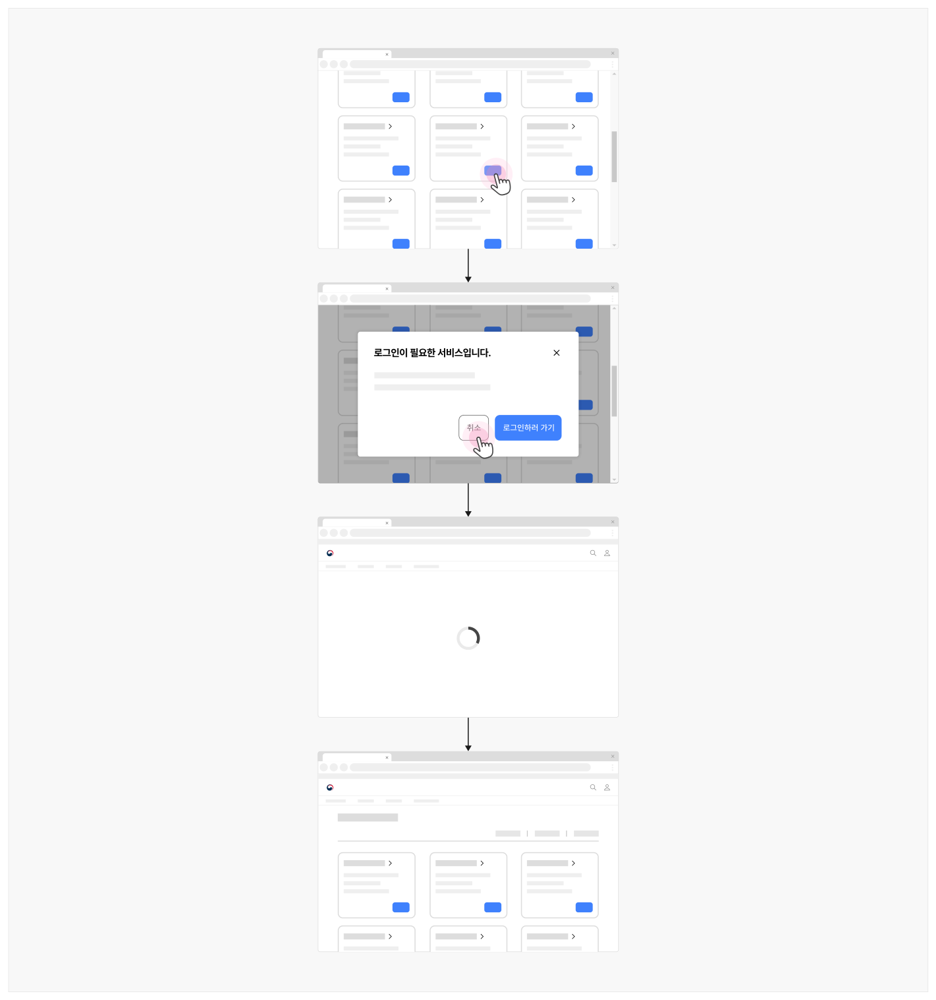
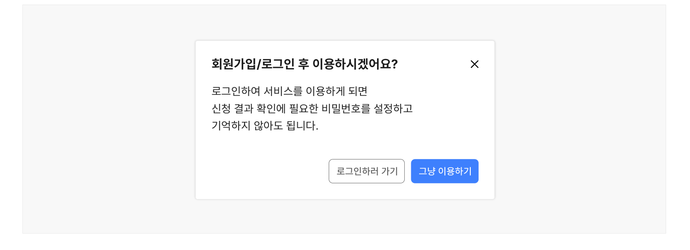
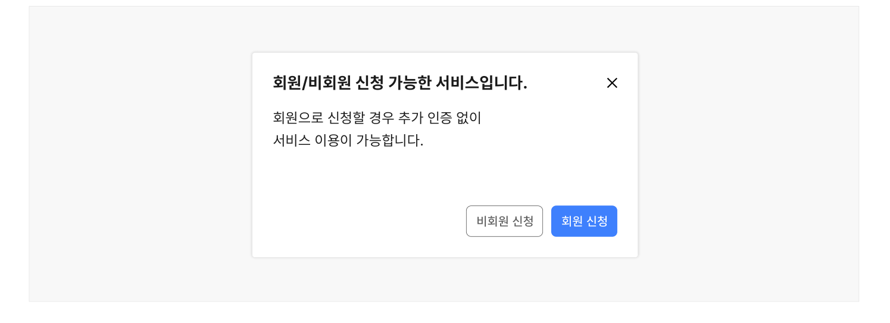
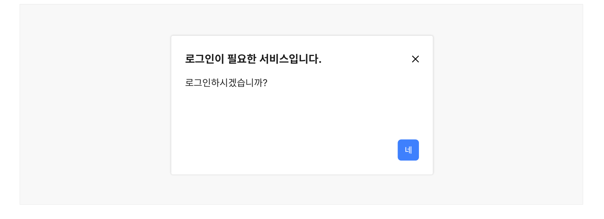

## 유형

### 기본

로그인이 필수적인 화면/기능에 접근을 시도하는 경우에 사용한다.

### 추천

로그인이 필수적인 화면/기능에 접근을 시도하는 상황에서 로그인 방식에 따라 이후 서비스 이용 과정이 달라지는 경우에 사용한다.

### 제안

로그인이 필수적인 화면/기능은 아니지만 로그인을 했을 때의 이점이 존재하여 로그인할 것을 제안하는 경우에 사용한다.
## 구조

- 1 오버레이(Overlay): 로그인 안내 모달과 하단의 기본 창을 시각적으로 구분하기 위한 그림자 또는 가림막
- 2 헤더: 모달의 제목을 포함한 영역으로 제목 텍스트를 통해 로그인 화면으로의 전환이 필요함을 안내함
- 3 닫기 버튼(선택): 사용자가 모달을 닫을 수 있게 하는 버튼 요소
- 4 본문: 정보와 다른 컴포넌트 요소가 제공되는 영역
- 5 푸터: 모달의 하단 영역으로 로그인 안 함 옵션, 로그인 화면으로 이동하는 링크 등의 액션 버튼으로 구성됨



## 사용성 가이드라인

- 01 로그인에 대한 안내는 모달로 제공하여 사용자의 과업 맥락이 유지될 수 있도록 한다.
- 02 로그인은 꼭 필요한 상황에서 유도한다.
- 03 로그인을 제안하는 경우 모달 본문에서 로그인을 통해 얻을 수 있는 이점에 대해 명확한 설명을 제공해야 한다.
- 04 사용자가 이용 절차를 단축할 수 있는 로그인 방식을 추천한다.
- 05 로그인 안내 모달에는 '로그인 안 함' 옵션을 제공하여 원하지 않는 이동 동작이 발생하지 않도록 한다.
사용성 가이드라인 적용 수준: 필수 권장 우수


### 01. 로그인에 대한 안내는 모달로 제공하여 사용자의 과업 맥락이 유지될 수 있도록 한다.

로그인하지 않는 옵션을 선택하여 탐색 중인 화면에 머무르고자 하는 사용자, 로그인 없이 서비스를 이용하고자 하는 사용자가 현재의 이용 맥락이 유지됨을 인지할 수 있도록 모달 레이아웃을 이용하여 안내를 제공한다.

[모범 사례]



**사례 텍스트 보완**

```text
로그인이 필요한 서비스입니다.
취소
로그인하러 가기
```
### [피해야 할 사례]



**사례 텍스트 보완**

```text
원본 PDF의 UI 배치·상태·다이어그램을 보존한 시각 자료입니다.
```
### 02. 로그인은 꼭 필요한 상황에서 유도한다.

사용자의 작업 과정을 방해하지 말고, 로그인이 필요한 작업을 수행하는 상황에서 로그인을 요청해야 한다.

기본, 추천 유형에서 로그인 안내는 사용자가 로그인이 필수적인 화면/기능에 접근하기 위한 액션 버튼을 실행하였을 때 제공한다.

제안 유형에서 로그인 안내는 사용자가 접근을 시도한 화면이 로딩된 후에 제공한다.
### 로그인을 제안하는 경우 모달 본문에서 로그인을 통해 얻을 수 있는 이점에 대해 명확한 설명을 제공해야 한다.

### 03. 로그인 안내 모달이 제공되는 순간 사용자는 이용 흐름에 방해를 받게 된다. 따라서 로그인 제안은 로그인 상태에서 서비스/기능을 이용했을 때 사용자의 편의성을 향상할 수 있는 경우에만 사용해야 하며, 로그인했을 때의 이점, 로그인하지 않았을 때의 어려움을 포함하여 충분한 설명을 제공해야 한다.

[모범 사례]



**사례 텍스트 보완**

```text
회원가입/로그인 후 이용하시겠어요?
로그인하여 서비스를 이용하게 되면
신청 결과 확인에 필요한 비밀번호를 설정하고
기억하지 않아도 됩니다.
로그인하러 가기
그냥 이용하기
```
사용성 가이드라인 적용 수준: 필수 권장 우수


### 04. 사용자가 이용 절차를 단축할 수 있는 로그인 방식을 추천한다.

로그인 방식에 따라 서비스 이용 방식이 달라지는 경우 로그인 안내 과정에서 이용 절차를 단축할 수 있는 로그인 방식을 추천한다. 예를 들어, A 방식으로 로그인 했을 때에는 최종 단계에서 별도의 본인 인증 과정을 거쳐야 하지만 B 방식으로 로그인했을 때 본인 인증 과정을 건너뛸 수 있다면 로그인 안내에서 B 방식을 사용할 것을 추천하면 된다.

[모범 사례]



**사례 텍스트 보완**

```text
회원/비회원 신청 가능한 서비스입니다.
회원으로 신청할 경우 추가 인증 없이
서비스 이용이 가능합니다.
비회원 신청
회원 신청
```
### 로그인 안내 모달에는 '로그인 안 함' 옵션을 제공하여 원하지 않는 이동 동작이 발생하지 않도록 한다.

### 05. 현재 화면에 머무르기로 결정한 사용자가 서비스를 계속 이용할 수 있도록 모달 푸터에 '로그인 안 함' 옵션을 제공해야 한다.

[모범 사례]



**사례 텍스트 보완**

```text
로그인이 필요한 서비스입니다.
로그인을 원하지 않는 경우
'돌아가기' 버튼을 눌러주세요.
돌아가기
로그인하러 가기
```
[피해야 할 사례]


**사례 텍스트 보완**

```text
로그인이 필요한 서비스입니다.
로그인하시겠습니까?
네
```


### 관련 구성 요소

### 컴포넌트

모달

### 기본 패턴

확인
