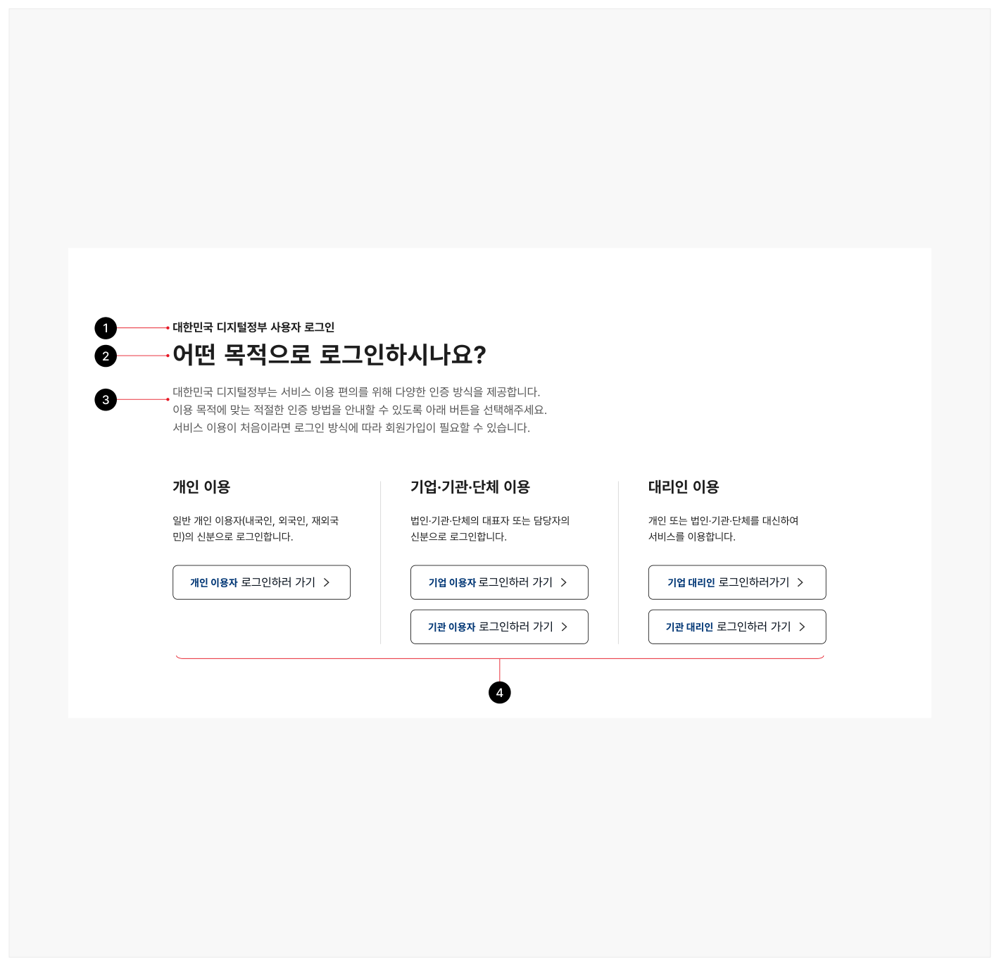
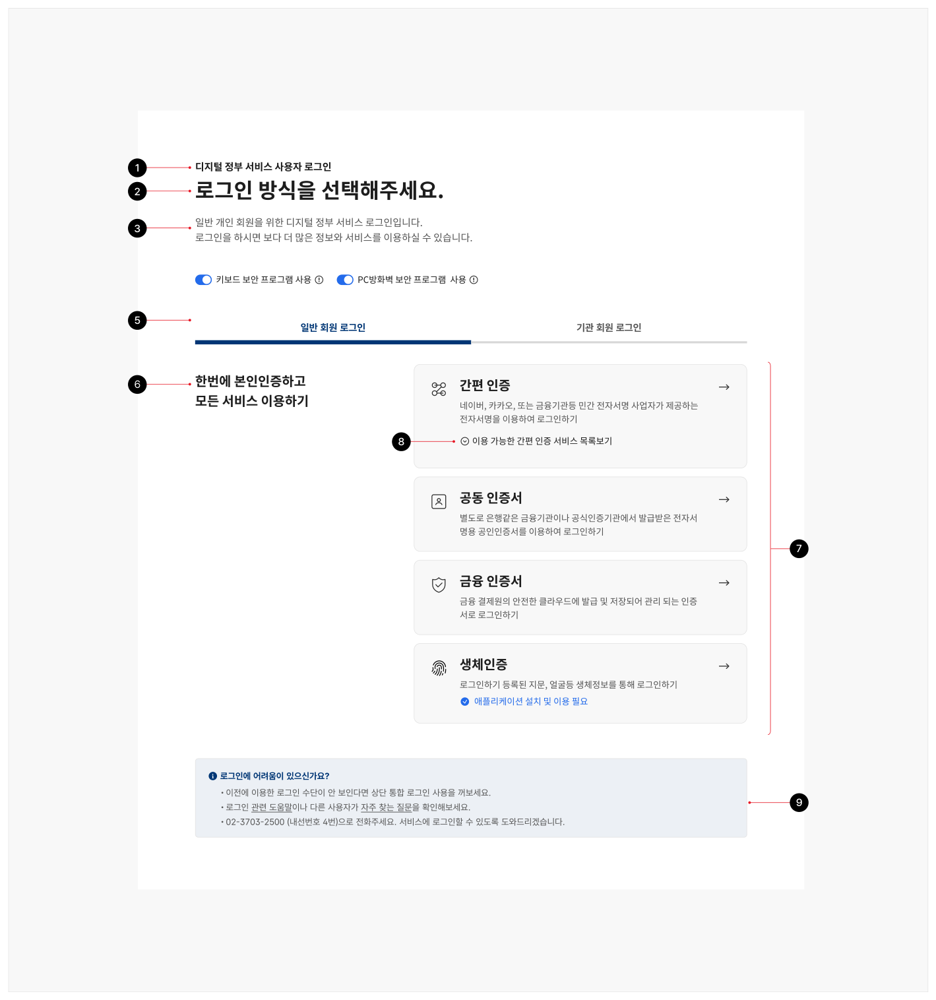
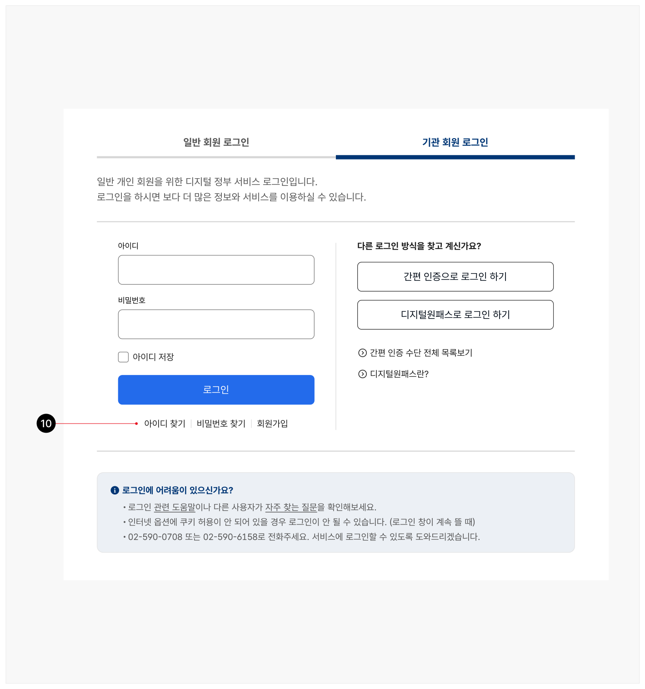
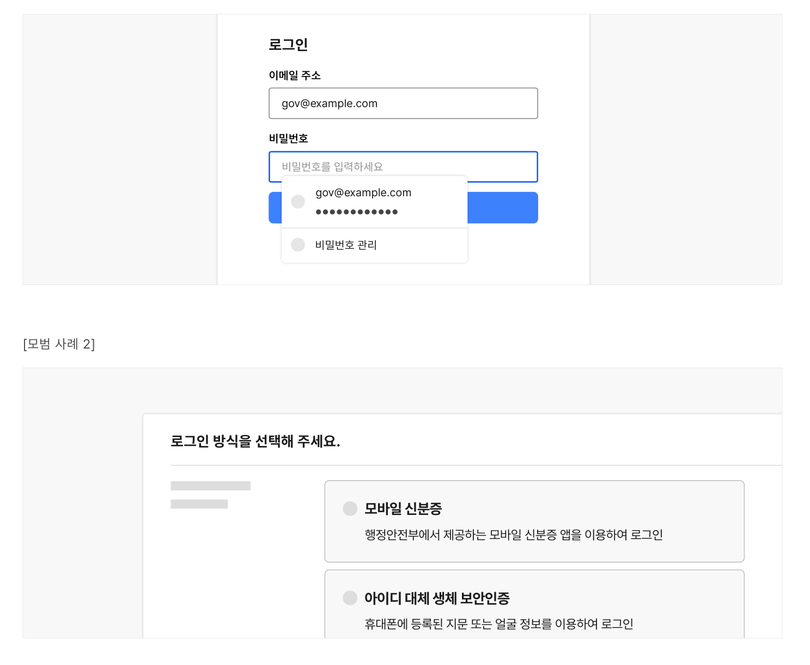

## 유형

### 레이아웃

목록

탭

### 절차

단일형

한 화면에서 로그인 방식에 대한 비교와 선택을 수행할 수 있게 함

단계형

하나 이상의 레이아웃을 사용하여 단계를 거쳐 로그인 방식 선택지를 좁히도록 함

집중형

단계형 방식을 사용하는 경우, 사용자가 가장 마지막에 로그인한 인증 방식을 저장하여 다음 로그인 시도 시 단계를 거치지 않고 저장된 로그인 방식을 이용할 수 있게 함
### 유형 선택 방법

### 레이아웃

### 절차

| 구분 | 목록 | 탭 |
|---|---|---|
| 인증 유형 | - | 인증의 주체나 로그인 방식에 구분이 있음<br />*인증 주체: 개인, 기관<br />*로그인 방식: 서비스 자체 로그인, 통합 로그인 |
| 인증 방식의 다양성 | 전체 인증 방식의 수가 15개 이하임 | 전체 인증 방식의 수가 15개를 초과함 |

| 구분 | 단일형 | 단계형 | 집중형 |
|---|---|---|---|
| 인증 유형 | 인증 주체의 구분 없음 | 인증의 주체나 로그인 방식에 구분이 있음<br />*인증 주체: 개인, 기관<br />*로그인 방식: 서비스 자체 로그인, 통합 로그인 | 인증 유형에 상관없이 단계형 로그인에 사용함 |
| 인증 권한 수준 | 모든 인증 방식의 권한(전자서명의 효력)이 동일함 | 인증 방식별로 권한이 다르고 권한의 차이가 서비스 이용에 영향을 미침 | - |
| 사용자 이용 빈도 | 관련 없음 | 이용 빈도 낮음 | 이용 빈도 높음 |
## 구조

- 1 부제목: 특정 기관/서비스의 로그인 화면임을 안내하는 제목
- 2 제목: 이용 목적을 선택하도록 유도하는 제목 텍스트
- 3 설명: 로그인 목적 선택에 대한 이해를 돕기 위해 제공되는 설명 텍스트. 이용 목적에 따라 다양한 인증 방법이 제공되며, 일부 인증 방식은 첫 방문이라면 회원 가입이 필요할 수 있음을 안내함
- 4 방식 선택 목록: 사용자의 유형, 목적에 따라 로그인 화면을 분리하여 달성 과업에 필요한 로그인 작업에 집중할 수 있도록 도움
- 5 방식 선택 탭: 사용자와의 상호작용에 반응하는 박스 영역으로 실행 시 각 탭에 상응하는 콘텐츠가 탭 패널에 표시됨. 통합 로그인과 기존 서비스 로그인을 분리하여 사용자 혼란을 방지함
- 6 섹션 제목: 인증 후 이용 가능한 서비스 범위를 식별하는 텍스트
- 7 방식 선택 목록: 인증 후 이용 가능한 서비스 범위에 따라 로그인 방식을 선택할 수 있는 목록
- 8 디스클로저: 로그인 방식에 대한 세부 정보, 참고 사항 등을 나타내거나 숨기기 위해 사용하는 컨트롤
- 9 로그인 관련 도움말: 로그인 관련 질문 및 문제 해결을 위한 도움말을 확인할 수 있는 화면으로 이동하는 링크
- 10 회원 가입 링크: 계정 생성을 위한 화면으로 연결되는 링크






## 사용성 가이드라인

- 01 빈번하게 사용되는 로그인 방식에 우선적으로 접근할 수 있는 수단을 제공한다.
- 02 동일한 수준의 로그인 방식을 탭으로 구분하여 선택하게 하지 않는다.
- 03 다양한 로그인 방식에 대한 분류 체계에 사용자의 관점과 언어를 반영한다.
- 04 로그인 방식에 따라 서비스 이용 절차가 달라지는 경우, 사전에 안내를 제공한다.
- 05 로그인 방식과 입력 항목에 대한 직관적인 안내를 제공한다.
- 06 도움말 정보, 매뉴얼 링크를 제공한다.
- 07 도움말 정보는 사용자의 다양한 이용 환경을 고려하여 작성한다.
적용 수준: 필수 권장 우수

### 01. 빈번하게 사용되는 로그인 방식에 우선적으로 접근할 수 있는 수단을 제공한다.

사용자 데이터를 기반으로 사용자들이 보편적으로 많이 사용하거나 서비스 관점에서 추천하는 방식을 먼저 노출한 뒤, 필요한 경우 다른 로그인 방법을 선택할 수 있도록 제시한다.

사용성 가이드라인 적용 수준: 필수 권장 우수

### 02. 동일한 수준의 로그인 방식을 탭으로 구분하여 선택하게 하지 않는다.

탭은 사용자가 한 번에 두 개 이상의 콘텐츠 섹션을 확인하면서 정보를 비교하는 데 적합한 레이아웃이 아니다. 로그인 주체, 로그인 방식이 명확하게 구분되는 경우에만 사용자가 탭 컴포넌트를 기반으로 선택하도록 설계한다.

[피해야 할 사례]
사용성 가이드라인 적용 수준: 필수 권장 우수


### 03. 다양한 로그인 방식에 대한 분류 체계에 사용자의 관점과 언어를 반영한다.

로그인 방식을 기술적인 관점으로 구분하지 않고 사용자의 관점에서 그 이용 목적에 따라 분류하여 제공한다. 이때 선택할 수 있는 로그인 방식 목록은 화면 구성을 고려하여 배치할 수 있다. 이렇게 함으로써 사용자는 여러 가지 로그인 방식 중에서 방문 목적에 적합한 로그인 방식을 빠르게 비교하여 선택할 수 있다.
### 04. 로그인 방식에 따라 서비스 이용 절차가 달라지는 경우, 사전에 안내를 제공한다.

로그인 방식에 따라 서비스가 다르게 제공되며 이용할 수 있는 기능의 차이가 있을 수 있음을 사용자가 사전에 인지하고 로그인 방식을 선택할 수 있도록 한다.
### 05. 로그인 방식과 입력 항목에 대한 직관적인 안내를 제공한다.

로그인 방식과 입력 항목에 대한 설명은 해당 항목 주변에 제공한다. 안내 정보를 본문 상단 또는 하단 영역에 서로 다른 로그인 방식에 대한 정보와 동시에 표현하게 되면 인지가 어려우며 안내 정보가 필요한 시점에 곧바로 접근할 수 없다.
### 06. 도움말 정보, 매뉴얼 링크를 제공한다.

처음 방문자, 익숙하지 않은 사용자를 위해 사용자가 스스로 문제를 해결할 수 있는 링크를 제공한다. 필요한 경우, 로그인에 대한 도움을 받을 수 있는 관련 오프라인 채널 정보나 챗봇 링크가 제공될 수 있다.
적용 수준: 필수 권장 우수

사용성 가이드라인


### 07. 도움말 정보는 사용자의 다양한 이용 환경을 고려하여 작성한다.

도움말 정보에 예시 화면 이미지가 포함되어 있거나 운영 체제, 사용자 에이전트의 옵션/설정과 관련된 내용을 포함해야 하는 경우, 사용자가 다양한 디바이스를 통해 서비스를 이용하고 있음을 고려해야 한다. 특정 화면 크기, 특정 디바이스에서만 참고할 수 있는 정보는 일부 사용자의 문제 해결에 도움을 주지 못한다.


## 접근성 가이드라인

### 인지 기능 테스트에 의존하지 않는 인증 방식을 제공한다.

사용자 로그인 등과 같은 인증 과정이 인지 기능 테스트(예 - 로그인을 위한 비밀번호 입력, 터치스크린 화면의 패턴 인식, 임의의 문자열 기억, 계산 수행, 특정 객체를 포함하고 있는 이미지 찾기 등)에 의존하는 경우, 인지 기능 테스트에 의존하지 않는 인증 방법을 적어도 하나 이상 제공해야 한다.

다만, 이미 사용자 자신에게 익숙하여 별도의 인지적인 노력을 필요로 하지 않는 사용자의 이름이나 이메일 주소, 전화번호는 인지 기능 테스트로 간주하지 않는다.

- KWCAG 2.2 접근 가능한 인증

- [모범 사례 1]



**사례 텍스트 보완**

```text
로그인
이메일 주소
gov@example.com
비밀번호
비밀번호를 입력하세요
●●●●●●●●●●●●
비밀번호 관리
```
- [모범 사례 2]


### 관련 구성 요소

### 기본 패턴

도움 입력폼
