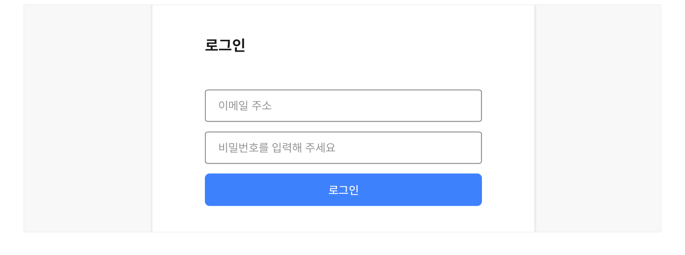
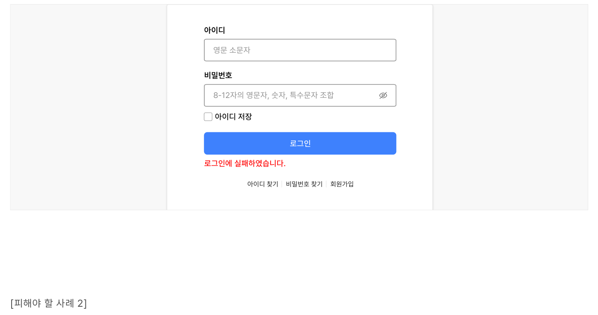
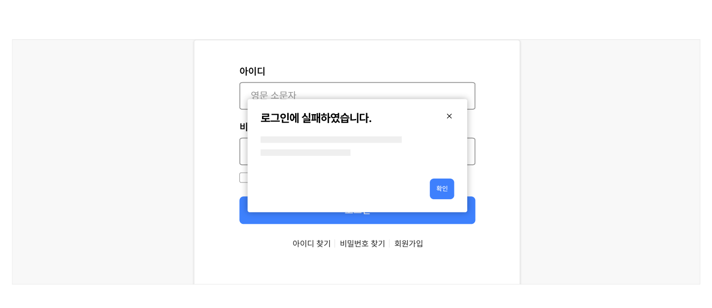

## 구조

- 1 레이블: 계정 정보 입력 필드의 이름
- 2 계정 정보 입력 필드: 계정 정보를 입력하기 위한 텍스트 입력 필드
- 3 로그인 정보 저장 옵션: 사용자가 다음 번에 로그인을 시도하였을 때 활용할 수 있는 계정 정보를 저장하기 위한 체크박스 옵션. 아이디, 비밀번호, 전체 계정 정보를 저장할 수 있음
- 4 아이디/비밀번호 찾기 링크: 계정 정보를 기억하지 못하는 사용자가 아이디를 조회하거나 비밀번호를 재설정할 수 있도록 관련 기능으로 연결하는 링크
- 5 도움말: 계정 정보 입력 과정 또는 로그인 방식에 대해 참고할 수 있는 정보 또는 관련 서비스 링크


## 사용성 가이드라인

- 01 아이디 형식에 대한 단서를 사전에 제공한다.
- 02 비밀번호를 표시할 수 있는 옵션을 제공한다.
- 03 복사/붙여넣기를 제한하지 않는다.
- 04 로그인 정보를 저장할 수 있는 옵션을 제공한다.
- 05 아이디/비밀번호 찾기 링크를 제공한다.
- 06 오류 메시지는 명확하고 간결하게 제공한다.
### 01. 아이디 형식에 대한 단서를 사전에 제공한다.

이메일 주소를 아이디로 사용하는 경우, 아이디를 이메일 형식으로 입력해야 한다는 것을 안내하지 않으면 기억에 의존해야 하므로 많은 시간이 걸린다. 사용자가 입력해야 하는 정보를 추측하지 않도록 레이블 및 도움말을 플레이스홀더가 아닌 레이블로 제공한다.

[피해야 할 사례]



**사례 텍스트 보완**

```text
로그인
이메일 주소
비밀번호를 입력해 주세요
```
### 02. 비밀번호를 표시할 수 있는 옵션을 제공한다.

사용자가 비밀번호를 입력할 때 공공장소에 있을 수 있으므로 기본적으로 비밀번호를 숨겨야 한다. 이때, 사용자가 원하는 경우 비밀번호를 볼 수 있도록 '비밀번호 표시' 버튼을 통해 사용자가 비밀번호를 입력할 수 있도록 돕는다. 이를 통해 사용자가 비밀번호를 올바르게 입력하는 동시에, 필요할 때 개인정보를 보호할 수 있다.
### 03. 복사/붙여넣기를 제한하지 않는다.

아이디와 비밀번호를 키보드/키패드로만 입력하도록 제한하게 되면 사용자의 실수를 유발할 수 있다. 계정 정보의 기억에 어려움이 있거나 키보드/키패드를 빠르고 정확하게 입력하기 어려운 사용자를 위해 복사/붙여넣기 기능을 제한하지 않아야 한다.
### 04. 로그인 정보를 저장할 수 있는 옵션을 제공한다.

로그인 시 사용자의 최근 로그인 방식을 저장하거나, 사용자가 선호하는 로그인 방식을 직접 설정할 수 있게 함으로써 자주 방문하는 사용자의 로그인 경로를 단축할 수 있다.

부가적으로 아이디나 비밀번호 중 어떤 정보가 저장되는지, 얼마 동안 저장되는지에 관한 정보를 제공할 수 있다.
### 05. 아이디/비밀번호 찾기 링크를 제공한다.

대부분의 로그인 오류는 사용자가 계정 정보를 잊어버리는 것에서 기인한다. 사용자가 로그인에 필요한 정보를 쉽게 검색할 수 있도록 로그인 양식 주변에 아이디/비밀번호 찾기 링크를 제공해야 한다.
### 06. 오류 메시지는 명확하고 간결하게 제공한다.

사용자가 무엇이 잘못되었는지 이해할 수 있도록 도와주고 오류를 해결할 수 있는 방법을 안내해야 한다. 오류 메시지는 가능한 한 구체적으로 작성한다.

[모범 사례]



**사례 텍스트 보완**

```text
아이디
아이디를 잘못 입력하였습니다. 다시 한번 확인해 주세요.
비밀번호
아이디 저장
로그인
아이디 찾기
비밀번호 찾기
회원가입
```
- [피해야 할 사례 1]


**사례 텍스트 보완**

```text
아이디
영문 소문자
비밀번호
8-12자 영문자, 숫자, 특수문자 조합
아이디 저장
로그인
로그인에 실패하였습니다.
아이디 찾기
비밀번호 찾기
회원가입
```
- [피해야 할 사례 2]
사용성 가이드라인




**표/목록 텍스트 보완**

```text
아이디
영문 소문자
로그인에 실패하였습니다.
비밀번호
8-12자 영문자, 숫자, 특수문자 조합
아이디 저장
확인
로그인
아이디 찾기
비밀번호 찾기
회원가입
```


## 접근성 가이드라인

### 초점이 논리적인 순서로 이동할 수 있도록 제공한다.

로그인 입력 양식의 시각적 배열에 상관없이 초점은 논리적인 순서대로 이동할 수 있도록 제공해야 한다. 비밀번호 입력 양식 이전에 로그인 버튼으로 초점이 이동하거나, 로그인 버튼 이후에 아이디 및 비밀번호 저장 옵션으로 초점이 이동해서는 안 된다.

- KWCAG 2.2 초점 이동과 표시
- KWCAG 2.2 콘텐츠의 선형 구조
- WCAG 2.1 Focus Order (A)
- WCAG 2.1 Meaningful Sequence (A)

### 입력 필드에 자동 완성 속성을 설정한다.

정보 입력에 필요한 사용자의 인지적, 신체적 노력을 최소화할 수 있도록 사용자 에이전트가 사용자가 기존에 입력한 정보를 활용할 수 있는 기술을 제공해야 한다. 웹사이트에서는 HTML 표준인 autocomplete 속성을 사용하여 입력 필드의 목적에 맞는 자동완성 정보를 사용자 에이전트에 전달할 수 있다.

- WCAG 2.1 Identify Input Purpose (AA)


## 상호작용 가이드라인

### 제출하기 전 가능한 한 많은 사용자 데이터의 유효성을 검사한다.

실시간 유효성 검사는 입력 필드가 포커스를 잃을 때 발생하며 유효하지 않은 문자나 빈 필드와 같은 입력 오류를 확인해야 한다. 이를 통해 사용자는 로그인 양식을 제출하기 전에 실수를 쉽게 식별하고 수정할 수 있다.

### 사용자가 로그인 폼을 제출하였을 때 오류가 발생한 경우 해당 항목으로 초점을 이동시킨다.

서버 측 오류가 발생하면 화면을 다시 로드하고 비밀번호 필드를 지운 다음 사용자 이름 입력 필드로 사용자를 돌려보내야 한다. 인라인 알림을 사용하여 오류를 표시하고 사용자가 문제를 해결하는 방법에 대한 명확한 지침을 제공한다.


### 관련 구성 요소

### 기본 패턴

입력폼 오류
