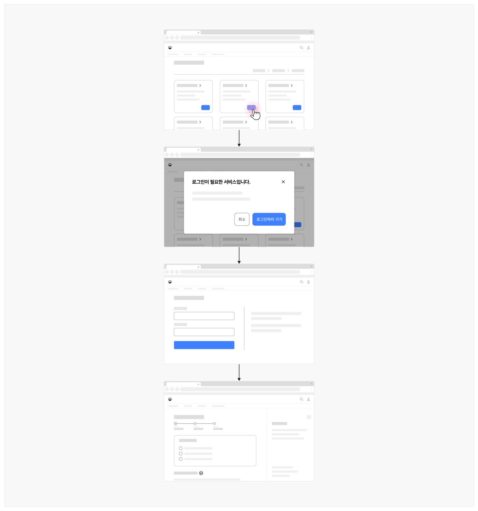
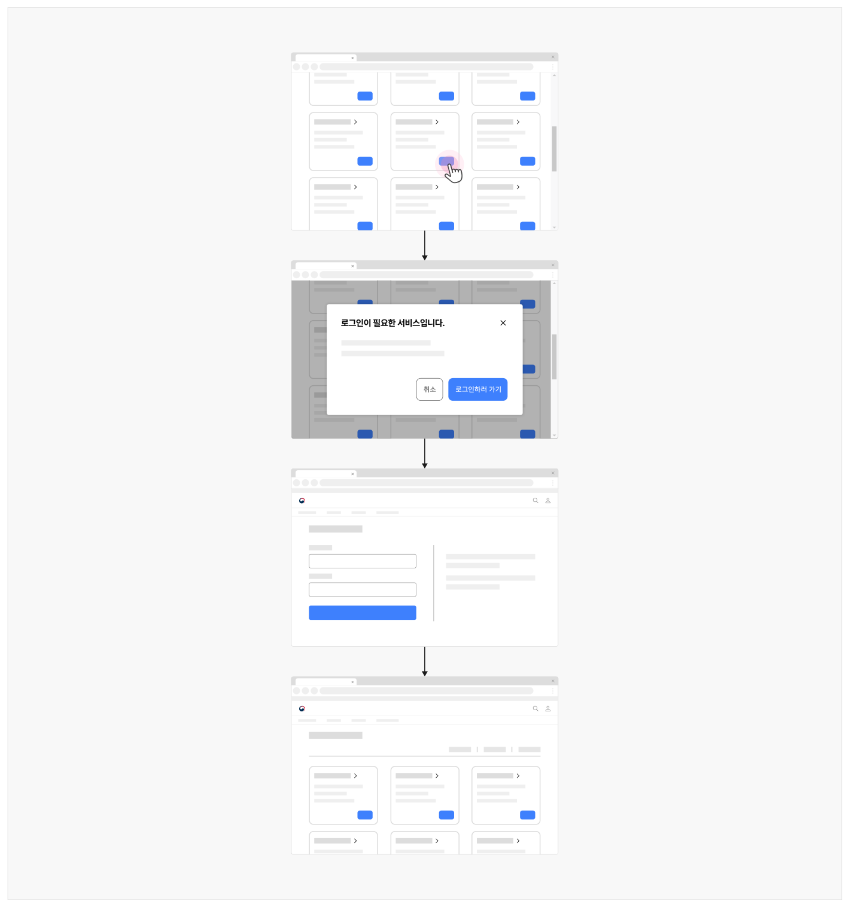

### 로그인 완료

## 구조

- 1 사용자 이름: 사용자의 이름, 별명, 프로필 사진이 제공됨. 사용자의 개인화 서비스로 이동하는 링크나 계정 관련 옵션 목록을 확인하기 위한 메뉴 실행 버튼으로 사용될 수 있음
- 2 로그아웃 버튼: 로그인 상태를 해제하기 위한 버튼
- 3 개인화 메뉴: 사용자 개인화 서비스, 설정 화면, 로그아웃 버튼 등의 기능을 제공하는 메뉴로 드롭다운 메뉴나 드로어 메뉴로 제공될 수 있음
- 4 로그아웃까지 남은 시간: 로그인 세션이 유지되기까지 남은 시간을 표시함
- 5 로그인 연장 버튼: 로그인 상태 유지 시간을 연장하기 위한 버튼


- 2 5


### 4. 사용성 가이드라인

- 01 로그인이 완료된 후, 로그인 상황에 적합한 화면으로 이동해야 한다.
- 02 로그인 상태로 전환되었음을 명확하게 표현한다.
사용성 가이드라인 적용 수준: 필수 권장 우수


### 로그인이 완료된 후, 로그인 상황에 적합한 화면으로 이동해야 한다.

로그인 플로(Flow)에 진입하기 전의 사용자 여정이 단절되지 않도록 로그인을 시도한 상황에 적합한 화면으로 연결해야 한다.

- 사용자가 의도적으로 로그인 버튼을 눌러 로그인한 경우, 사용자가 탐색 중이던 화면으로 연결되어야 한다.
- 사용자가 특정 서비스에 접근을 시도하여 '로그인 안내' 단계를 거쳐 로그인이 완료된 경우 사용자가 접근을 시도한 화면으로 이동하면 된다.
- 사용자가 특정 기능의 사용/적용을 시도하여 '로그인 안내' 단계를 거쳐 로그인이 완료된 경우 사용자가 탐색 중이던 화면으로 연결되어야 한다.
[모범 사례]



**사례 텍스트 보완**

```text
로그인이 필요한 서비스입니다.
취소
로그인하러 가기
```
[피해야 할 사례]


**시각 자료 텍스트 보완**

```text
로그인이 필요한 서비스입니다.
취소
로그인하러 가기
```
사용성 가이드라인 적용 수준: 필수 권장 우수


### 로그인 상태로 전환되었음을 명확하게 표현한다.

로그인 기능이 사라지고 로그아웃 옵션을 표시하는 등의 방법으로 현재 로그인 상태에 있음을 사용자에게 알려주어야 한다. 마이페이지 버튼을 실행시켜 활성화된 레이어에 사용자 이름을 제공하면 로그인 상태를 표현하면서도 개인 정보를 보호할 수 있다.


## 접근성 가이드라인

### 로그인 완료 후 화면이 로딩되었을 때 초점은 문서 가장 처음부터 접근되도록 한다.

로그인 완료 후 화면이 로딩되었을 때 키보드 및 스크린 리더 초점은 문서 가장 처음부터 접근하도록 구현한다. 문서의 시작 영역이 아닌 헤더나 본문에 초점이 자동으로 이동하게 예측하지 못한 위치에서 탐색이 시작되어 사용자가 당황할 수 있다.

- KWCAG 2.2 초점 이동과 표시
- WCAG 2.1 Focus Order (A)
