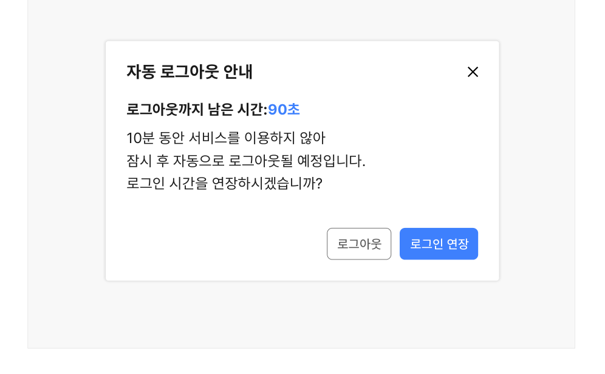
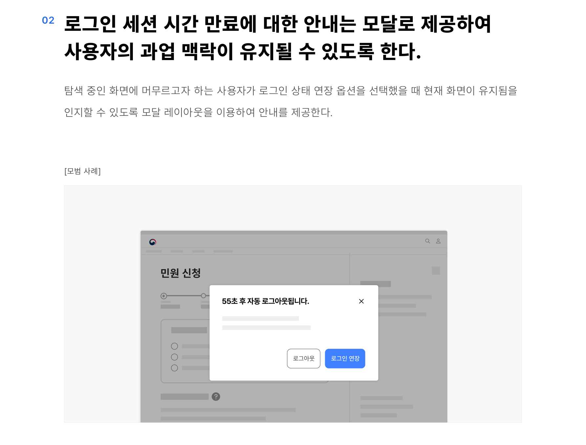
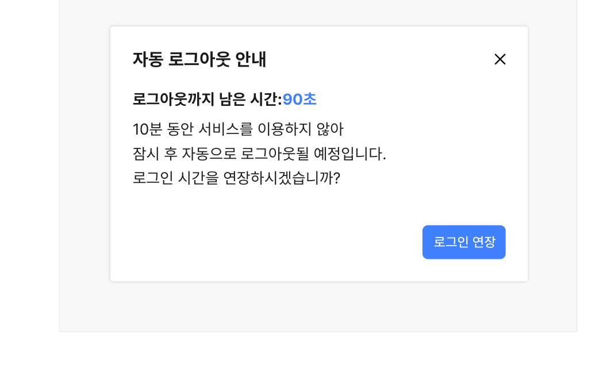

## 유형

### 로그인 만료 안내 모달

사용자가 서비스를 이용하는 중에 전역적으로 제공되는 로그인 만료 안내로 모달 양식으로 제공된다.

### 로그인 세션 유지 시간 안내

사용자의 이용 속도가 느린 화면/단계에서 로그인 세션 만료 시 사용자가 작업 중인 데이터의 손실이 발생하는 등의 돌이킬 수 없는 결과로 이어질 수 있는 경우에 제공되는 안내 사항이다. 로그인 만료 안내 모달과는 달리 로그인 기능을 찾거나 로그인 정보를 입력하는 시점 또는 사용자가 특정 기능을 사용하기 시작하기 전에 사전적으로 세션 유지 시간 제한에 대해 안내함으로써 오류를 예방하기 위한 목적으로 사용한다.
## 구조

- 1 오버레이(Overlay): 로그인 안내 모달과 하단의 기본 창을 시각적으로 구분하기 위한 그림자 또는 가림막
- 2 헤더: 모달의 제목으로 로그인 상태 유지 시간의 만료가 임박했음을 안내함
- 3 닫기 버튼(선택): 사용자가 모달을 닫을 수 있게 하는 버튼 요소
- 4 본문: 모달이 제공되는 상황에 대한 설명, 로그아웃되었을 때의 어려움 등에 대한 설명을 제공함
- 5 로그아웃까지 남은 시간: 로그인 세션이 유지되기까지 남은 시간을 표시함
- 6 푸터: 모달의 하단 영역으로 로그인 연장, 로그아웃 액션 버튼으로 구성됨
- 7 로그인 연장 버튼: 로그인 상태 유지 시간을 연장하기 위한 버튼


## 사용성 가이드라인

- 01 사용자에게 로그인 세션이 만료되기 전에 유지 시간에 제한이 있음을 안내한다.
- 02 로그인 세션 시간 만료에 대한 안내는 모달로 제공하여 사용자의 과업 맥락이 유지될 수 있도록 한다.
- 03 로그인 세션 시간 만료에 대한 안내는 세션이 만료되기 최소 20초 전에 제공한다.
- 04 로그인 만료 안내 모달에 시간 연장하기 버튼과 로그아웃하기 버튼을 제공한다.
### 01. 사용자에게 로그인 세션이 만료되기 전에 유지 시간에 제한이 있음을 안내한다.

로그인 시간제한, 시간 연장 여부, 시간제한으로 인해 로그아웃되는 등의 상황에 대해 사용자가 분명히 인지할 수 있도록 안내를 제공한다.

- [모범 사례 1]
- [모범 사례 2]



**사례 텍스트 보완**

```text
로그아웃까지 남은 시간
27:45 시간연장
```


**사례 텍스트 보완**

```text
자동 로그아웃 안내
로그아웃까지 남은 시간:90초
10분 동안 서비스를 이용하지 않아
잠시 후 자동으로 로그아웃될 예정입니다.
로그인 시간을 연장하시겠습니까?
로그아웃
로그인 연장
```

### 02. 로그인 세션 시간 만료에 대한 안내는 모달로 제공하여 사용자의 과업 맥락이 유지될 수 있도록 한다.

탐색 중인 화면에 머무르고자 하는 사용자가 로그인 상태 연장 옵션을 선택했을 때 현재 화면이 유지됨을 인지할 수 있도록 모달 레이아웃을 이용하여 안내를 제공한다.

[모범 사례]
### 03. 로그인 세션 시간 만료에 대한 안내는 세션이 만료되기 최소 20초 전에 제공한다.

사용자에 따라 로그인 만료 안내 내용을 확인하고 연장하기 버튼을 누르는 데 오랜 시간이 걸릴 수 있으므로 최소 20초 전에 안내 모달을 제공해야 한다. 시스템의 반응 속도가 느린 경우 더 긴 시간을 제공하는 것이 적절하다.
### 04. 로그인 만료 안내 모달에 시간 연장하기 버튼과 로그아웃하기 버튼을 제공한다.

서비스를 계속 이용하고자 하는 사용자와 이용을 종료하고자 하는 사용자가 다음 행동을 선택할 수 있는 수단을 제공한다.

[모범 사례]

[피해야 할 사례]



**사례 텍스트 보완**

```text
자동 로그아웃 안내
로그아웃까지 남은 시간:90초
10분 동안 서비스를 이용하지 않아
잠시 후 자동으로 로그아웃될 예정입니다.
로그인 시간을 연장하시겠습니까?
로그아웃
로그인 연장
```


**사례 텍스트 보완**

```text
자동 로그아웃 안내
로그아웃까지 남은 시간:90초
10분 동안 서비스를 이용하지 않아
잠시 후 자동으로 로그아웃될 예정입니다.
로그인 시간을 연장하시겠습니까?
로그인 연장
```


## 접근성 가이드라인

### 로그인 만료 안내 모달이 활성화된 상태에서 아무 키나 눌렀을 때 연장 가능하도록 한다.

로그인 만료 안내 모달이 활성화된 상태에서 반드시 '연장하기' 버튼을 누르지 않더라도 아무 키나 눌렀을 때 시간이 연장되도록 하는 방안을 고려한다. 사용자마다 시간 연장 버튼을 누르는 데 필요한 노력의 정도가 다를 수 있으므로 가능한 한 단순한 방법으로 로그인 연장 기능을 실행할 수 있는 방안을 제공하는 것을 고려한다.

- KWCAG 2.2 응답시간 조절
- WCAG 2.1 Timing Adjustable (A)

### 시간 연장은 최소 10회 이상 수행할 수 있도록 제공한다.

사용자에 따라 서비스 이용에 필요한 시간이 다를 수 있음을 고려하여 로그인 시간 연장은 최소 10번 이상 실행할 수 있도록 한다.

- KWCAG 2.2 응답시간 조절
- WCAG 2.1 Timing Adjustable (A)


### 관련 구성 요소

### 컴포넌트

모달 헤더
