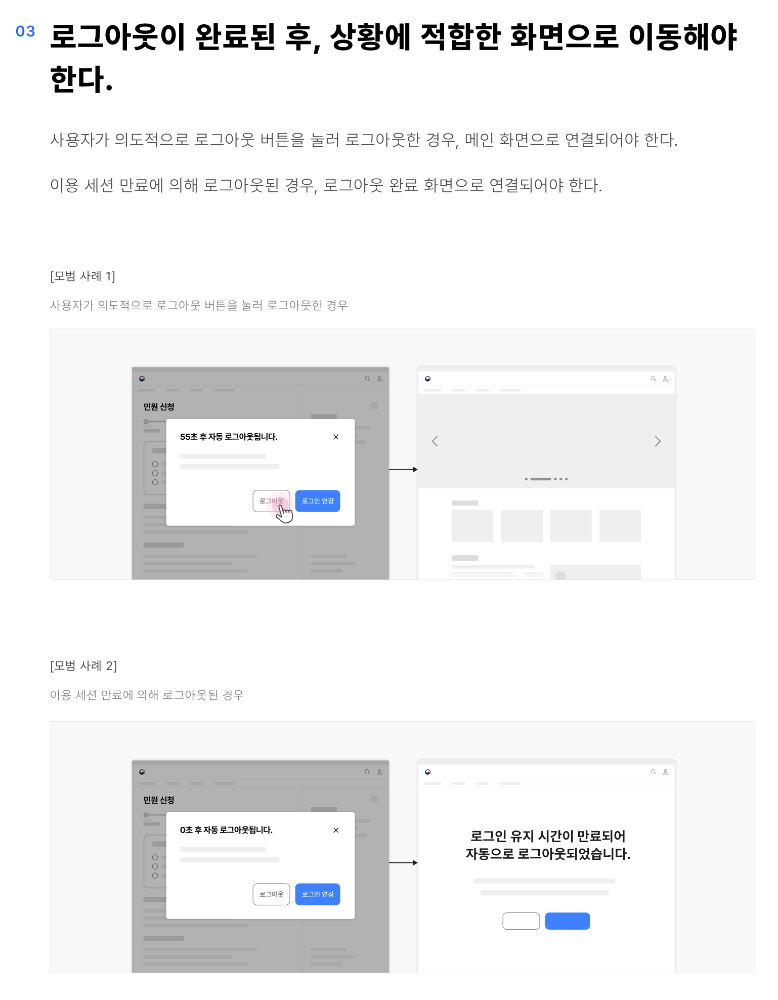
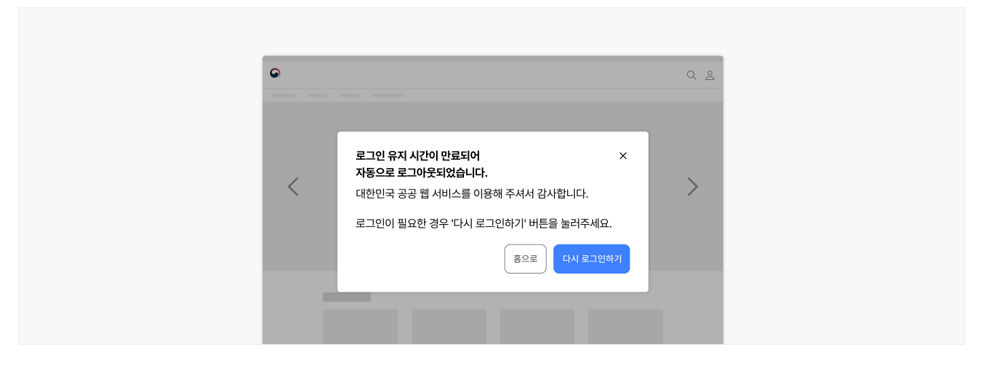
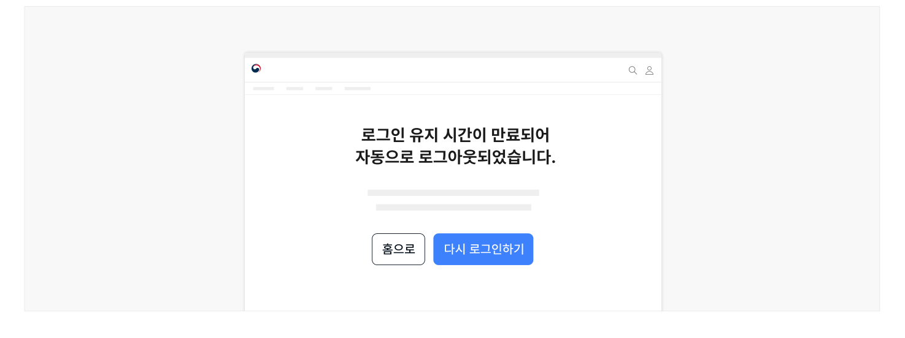

## 유형

### 사용자 요청에 의한 로그아웃

서비스의 이용을 완전하게 종료하기로 결정한 사용자 또는 로그인 상태를 해제하고자 하는 사용자가 로그아웃을 시도한 상황

### 이용 세션 만료에 의한 로그아웃

서비스 이용 중 로그인 세션 시간이 만료되어 로그인 만료 안내 모달 출현 후 로그아웃이 실행된 상황
## 구조

- 1 제목: 로그아웃된 상황을 안내하는 제목
- 2 본문: 로그아웃 상태로 전환된 이유에 대한 설명
- 3 액션 버튼: 로그아웃 이후의 사용자 행동을 유도하기 위한 액션 버튼으로 메인 화면으로 이동하는 링크와 다시 로그인하기 버튼이 제공됨


### 2. 사용성 가이드라인


## 사용성 가이드라인

- 01 로그아웃 상태로 전환되었음을 분명하게 보여준다.
- 02 사용자 요청에 의해 로그아웃이 실행되는 경우 결과 화면과 로그아웃 실행 사이에 스피너를 제공한다.
- 03 로그아웃이 완료된 후, 상황에 적합한 화면으로 이동해야 한다.
- 04 로그아웃에 대한 안내는 별도의 화면으로 구성하여 제공한다.
- 05 로그아웃 안내 화면에 사용자의 행동을 유도할 수 있는 액션 버튼을 제공한다.

### 로그아웃 상태로 전환되었음을 분명하게 보여준다.

로그인 실행 버튼의 레이블을 '로그인'으로 전환하는 등의 방법으로 로그아웃 상태에 있음을 사용자에게 알려주어야 한다.

### 사용자 요청에 의해 로그아웃이 실행되는 경우 결과 화면과 로그아웃 실행 사이에 스피너를 제공한다.

시스템이 사용자의 요청에 따라 로그아웃 동작을 실행하는 반응이 진행되고 있음을 사용자가 인지할 수 있도록 의도적으로 스피너를 통해 피드백을 제공한다.

### 로그아웃이 완료된 후, 상황에 적합한 화면으로 이동해야 한다.

사용자가 의도적으로 로그아웃 버튼을 눌러 로그아웃한 경우, 메인 화면으로 연결되어야 한다.

이용 세션 만료에 의해 로그아웃된 경우, 로그아웃 완료 화면으로 연결되어야 한다.

- [모범 사례 1] 사용자가 의도적으로 로그아웃 버튼을 눌러 로그아웃한 경우

- [모범 사례 2] 이용 세션 만료에 의해 로그아웃된 경우

### 로그아웃에 대한 안내는 별도의 화면으로 구성하여 제공한다.

로그아웃 상태로 이용 맥락이 완전히 변경되었음을 직관적으로 인지할 수 있도록 별도 화면에서 안내를 제공한다.

[모범 사례]



**사례 텍스트 보완**

```text
로그인 유지 시간이 만료되어
자동으로 로그아웃되었습니다.
대한민국 공공 웹 서비스를 이용해 주셔서 감사합니다.
로그인이 필요한 경우 '다시 로그인하기' 버튼을 눌러주세요.
홈으로
다시 로그인하기
```
[피해야 할 사례]


**사례 텍스트 보완**

```text
로그인 유지 시간이 만료되어
자동으로 로그아웃되었습니다.
대한민국 공공 웹 서비스를 이용해 주셔서 감사합니다.
로그인이 필요한 경우 '다시 로그인하기' 버튼을 눌러주세요.
홈으로
다시 로그인하기
```

### 로그아웃 안내 화면에 사용자의 행동을 유도할 수 있는 액션 버튼을 제공한다.

로그아웃 안내 화면은 사용자가 로그아웃을 의도하지 않은 상황에서 도착하는 화면이다. 사용자가 기존에 이용 중이던 맥락으로 돌아갈 수 있도록 '다시 로그인하기' 버튼을 제공하고 로그인이 완료되었을 때 사용자가 탐색 중이던 화면으로 연결되어야 한다.

[모범 사례]



**사례 텍스트 보완**

```text
로그인 유지 시간이 만료되어
자동으로 로그아웃되었습니다.
홈으로
다시 로그인하기
```
00 개요 01 신청 대상 탐색 02 서비스 정보 확인 03 유의 사항·자격 확인 04 신청서 작성 05 확인·확정 06 완료 07 신청 결과 확인
