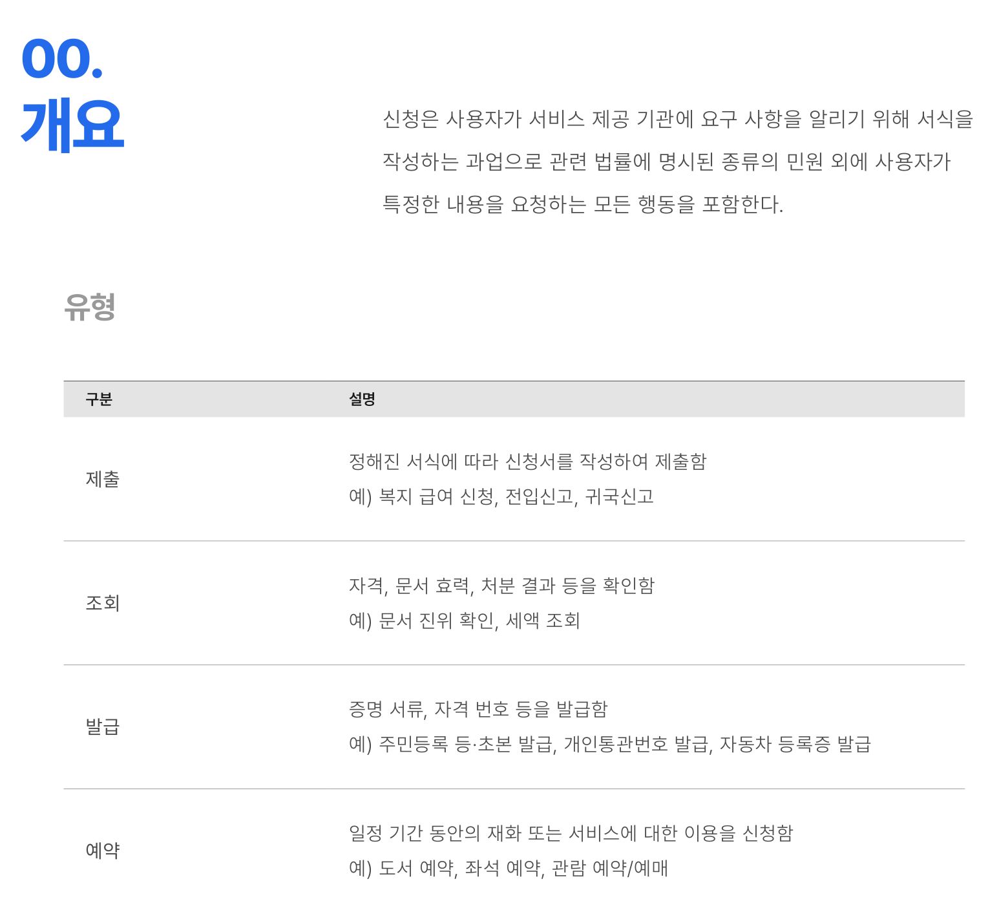
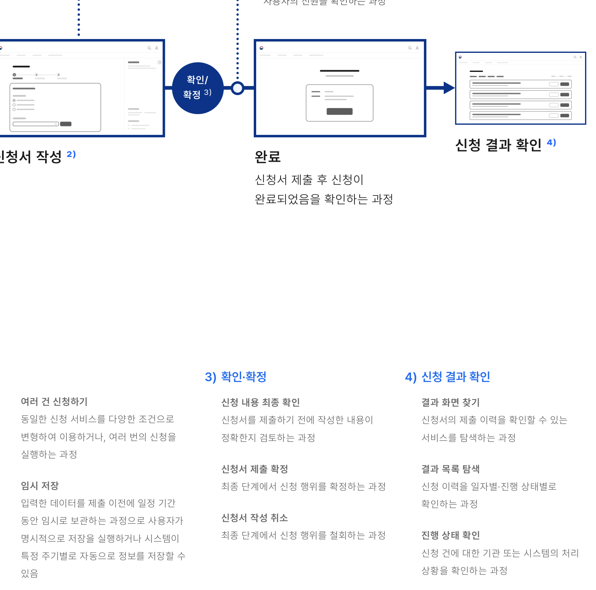

신청은 사용자가 서비스 제공 기관에 요구 사항을 알리기 위해 서식을 작성하는 과업으로 관련 법률에 명시된 종류의 민원 외에 사용자가 특정한 내용을 요청하는 모든 행동을 포함한다.

## 유형

| 구분 | 설명 |
|---|---|
| 제출 | 정해진 서식에 따라 신청서를 작성하여 제출함 예) 복지 급여 신청, 전입신고, 귀국신고 |
| 조회 | 자격, 문서 효력, 처분 결과 등을 확인함 예) 문서 진위 확인, 세액 조회 |
| 발급 | 증명 서류, 자격 번호 등을 발급함 예) 주민등록 등·초본 발급, 개인통관번호 발급, 자동차 등록증 발급 |
| 예약 | 일정 기간 동안의 재화 또는 서비스에 대한 이용을 신청함 예) 도서 예약, 좌석 예약, 관람 예약/예매 |
### 이용 상황별 플로 (Flow)

로그인

신청하기

신청 대상 탐색 ¹⁾

유의 사항·자격 확인

신청서 작성과 제출 과정에서 유의해야 하는 사항에 대한 안내를 확인하고 신청 주체가 될 수 있는지의 여부를 확인하는 과정

### 외부/연계 서비스로 이동

서비스 정보 확인

### 1) 신청 대상 탐색

서비스 목록 탐색 디지털 서비스에서 제공 중인 신청 서비스 목록에서 필요한 신청 서비스를 발견하는 과정

대상 선택하기 한 번에 여러 건의 서비스를 신청할 수 있어 필요한 서비스를 선택하고 일시적으로 저장하는 과정

신청하기 선택한 서비스에 대한 신청을 시도하는 과정

### 2) 신청서 작성

단계의 진행과 탐색 신청서 작성과 제출, 여러 단계로 구성된 신청의 경우에는 여러 개의 신청 서식의 작성을 완료하고 이전 단계로 돌아가 작성 내용을 확인하는 과정

신청 정보 입력 서식에서 작성을 요구하는 항목에 데이터를 입력하는 과정

신청 정보 자동 입력 인증 과정에서 확인된 정보 또는 기존에 입력한 데이터를 활용하여 서식을 직접 작성하지 않고 정보를 입력하는 과정

작성 도움말 확인 서식 작성에 대한 도움말을 확인하는 과정

신청서 작성 매뉴얼 확인 간단한 작성 도움말 외에 특정 서식 작성만을 위해 만들어진 매뉴얼을 참고하는 과정

서류 제출 신청에 필요한 증빙 서류(증명 사진, 주민등록등·초본 등)를 첨부하는 과정
신청서 작성 중 스스로 문제를 해결하지 못하여, 관리자와 커뮤니케이션한 후 신청서 작성을 완료한 경우

커뮤니케이션

인증

신청 완료 이전에 최종적으로 사용자의 신원을 확인하는 과정

도식 라벨: 확인/
도식 라벨: 확정 ³⁾



**ASCII 흐름 보완**

```text
서비스 정보 확인 -> 신청서 작성 -> 확인/확정 -> 신청 결과 확인 -> 완료
```
### 3) 확인·확정

신청 내용 최종 확인 신청서를 제출하기 전에 작성한 내용이 정확한지 검토하는 과정

### 4) 신청 결과 확인

결과 화면 찾기 신청서의 제출 이력을 확인할 수 있는 서비스를 탐색하는 과정

신청서 제출 확정 최종 단계에서 신청 행위를 확정하는 과정

신청서 작성 취소 최종 단계에서 신청 행위를 철회하는 과정

결과 목록 탐색 신청 이력을 일자별·진행 상태별로 확인하는 과정

진행 상태 확인 신청 건에 대한 기관 또는 시스템의 처리 상황을 확인하는 과정
