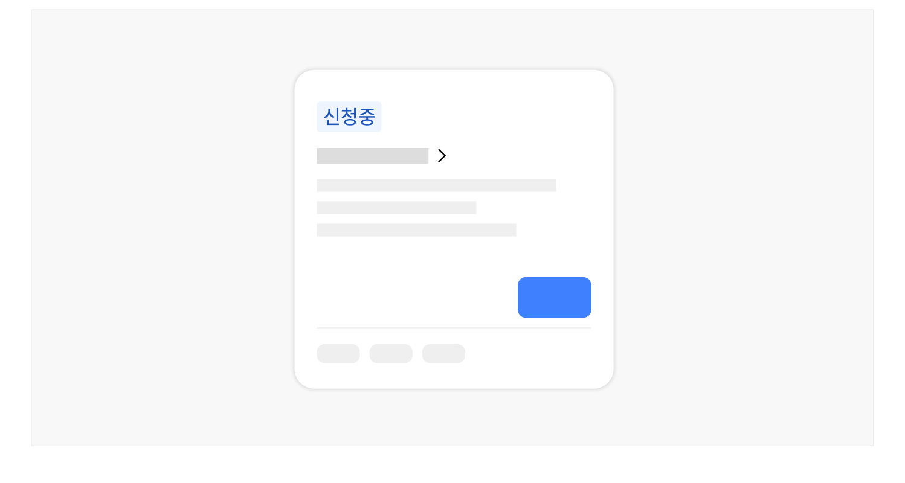
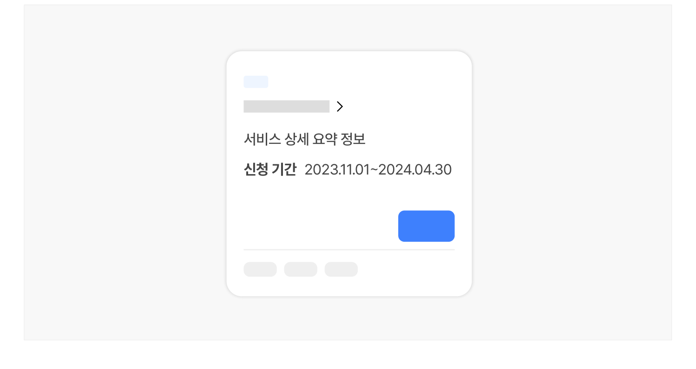
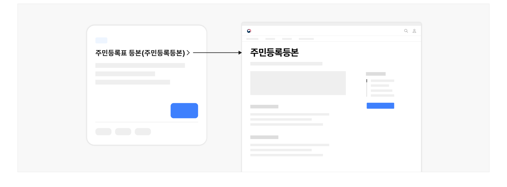

## 구조

- 1 필터링·정렬 컨트롤: 신청 서비스 목록을 필터링·정렬하는 데 사용되는 컨트롤
- 2 페이지네이션: 신청 서비스 목록을 탐색하는 데 사용되는 컨트롤
- 3 항목: 정보를 식별하기 위한 콘텐츠 집합으로 개별 항목에 대해 실행할 기능 관련 버튼, 상세 정보를 확인할 수 있는 탐색 링크가 포함될 수 있음

- a. 제목: 서비스명을 보여주는 텍스트. 상세 화면으로 이동하기 위한 링크로 사용됨
- b. 꺾쇠/화살표: 제목이 링크로 작동함을 안내하는 시각적 단서
- c. 미리보기/요약: 서비스에 대한 기본적인 정보를 요약하여 보여주는 텍스트
- d. 배지: 서비스의 이용 가능 상태에 대한 메타 데이터를 표시하여 다음 중 하나의 상태를 가질 수 있음

- 예정됨
- 접수 중
- 마감됨

- e. 메타 데이터: 신청 서비스에 부여된 여러 데이터 속성(예 - 분야, 연령, 소득 등)을 표시하는 텍스트
- f. 저장 컨트롤: 관심 있는 신청 정보를 모아보기 위해 개인화된 기록을 저장하는 데 사용되는 컨트롤
- g. 액션 버튼: 신청하기 버튼 등 항목에 대해 수행할 수 있는 기능 사용을 유도하기 위한 컨트롤을 제공함
도식 라벨: d. 1 2 1 3-d 3-f 3-g 3-e 3-a 3-b 3-c

### d


## 사용성 가이드라인

- 01 신청 서비스의 특성에 따른 적절한 서비스 목록 정렬 방식을 사용한다.
- 02 목록을 적절한 방식으로 군집화하여 메타 데이터를 부여한다.
- 03 신청 상태 정보를 명확하게 인지할 수 있도록 표현한다.
- 04 미리보기/요약에 신청 가능 기한 정보를 제공한다.
- 05 제목에 공식적인 서비스 명칭을 사용한다.
- 06 제목에 말줄임표를 사용하지 않는다.
- 07 미리보기/요약 텍스트는 간결하게 작성한다.
- 08 상세 화면을 거치지 않고 신청 과정에 바로 접근할 수 있는 액션 버튼을 제공한다.
- 09 외부 서비스로 이동하거나 새 창을 실행하는 액션 버튼에 명확한 시각적 단서를 제공한다.
### 01. 신청 서비스의 특성에 따른 적절한 서비스 목록 정렬 방식을 사용한다.

- 모든 서비스를 상시 신청할 수 있는 경우: 가나다순으로 정렬
- 한시적으로 운영되거나 신청 인원에 따라 마감되는 신청인 경우: 현재 신청 가능한 서비스를 우선적으로

배치
### 02. 목록을 적절한 방식으로 군집화하여 메타 데이터를 부여한다.

사용자가 목록에서 원하는 서비스를 빠르게 탐색할 수 있도록 서비스의 특성과 사용자의 요구에 따라 메타 데이터를 설계하고 부여해야 한다.
### 03. 신청 상태 정보를 명확하게 인지할 수 있도록 표현한다.

한시적으로 운영되거나 신청 인원에 따라 마감되는 서비스인 경우, 신청 상태 정보 표현을 위한 배지를 반드시 제공하여 사용자가 목록과 서비스 정보를 효과적으로 탐색할 수 있게 해야 한다.

[모범 사례]



**사례 텍스트 보완**

```text
신청중
```
### 04. 미리보기/요약에 신청 가능 기한 정보를 제공한다.

한시적으로 운영되는 서비스인 경우 미리보기/요약에 기한 정보를 추가하여 상세 정보 화면으로 이동하지 않고도 서비스에 대해 빠르게 파악할 수 있게 만든다.

[모범 사례]



**사례 텍스트 보완**

```text
서비스 상세 요약 정보
신청 기간 2023.11.012024.04.30
```
### 05. 제목에 공식적인 서비스 명칭을 사용한다.

제목은 사용자가 신청 서비스 목록을 탐색하기 위해 활용하는 가장 기본적인 정보로 임의의 축약어를 사용하거나 공식 명칭과는 부분적으로 다른 단어를 사용하였을 때 사용자에게 혼동을 줄 수 있다. 만약 공식 명칭 대신 일반적으로 사용자에게 통용되는 용어가 있다면 괄호 내부에 보조적인 설명을 제공하거나 목록의 텍스트 필터(부분 검색)에서 해당 용어로 검색했을 때 결과로 제공되도록 하는 것이 바람직하다.

[모범 사례]



**사례 텍스트 보완**

```text
주민등록표 등본(주민등록등본)
주민등록표 등본
```
[피해야 할 사례]


**사례 텍스트 보완**

```text
주민등록표 등본(주민등록등본)
주민등록등본
```
### 06. 제목에 말줄임표를 사용하지 않는다.

사용자가 정확한 신청 서비스 명칭을 확인할 수 있도록 제목 텍스트에 말줌임표를 사용하여 자르지 않아야 한다. 일반적인 신청 서비스 명칭의 텍스트 길이를 확인하여 목록의 높이를 지정하고 제목이 여러 줄로 떨어지는 경우에는 카드 열 개수의 조정, 리스트형으로의 레이아웃 변경 등을 고려해야 한다.
### 07. 미리보기/요약 텍스트는 간결하게 작성한다.

상세 정보 확인 전에 사용자가 탐색 과정에서 도움을 받을 수 있는 정보만 간결하게 표시되도록 한다.
### 08. 상세 화면을 거치지 않고 신청 과정에 바로 접근할 수 있는 액션 버튼을 제공한다.

'신청하기' 링크를 클릭하면 또 다른 대상 선택 화면 대신 유의 사항 및 자격 확인 또는 신청서 작성 양식으로 연결되어 사용자가 의도한 행동을 수행할 수 있게 설계해야 한다.
### 09. 외부 서비스로 이동하거나 새 창을 실행하는 액션 버튼에 명확한 시각적 단서를 제공한다.

새 창 열림 아이콘을 표시하여 사용자가 원하지 않는 상황에서 현재의 이용 맥락을 벗어나지 않도록 한다.


## 접근성 가이드라인

### 01. 공유/저장 컨트롤과 액션 버튼에 명확한 접근 가능한 이름을 제공한다.

스크린 리더 사용자가 컨트롤 요소를 단위로 탐색을 시도하는 경우, 목록에 동일한 레이블을 가진 컨트롤 요소가 다수 제공되었을 때 각 컨트롤 요소를 통해 기능을 실행하는 대상 정보를 명확하게 파악하기 어려울 수 있다. 각 컨트롤 요소에 title 속성 또는 aria-describedby 속성을 활용하여 접근 가능한 이름이 변별될 수 있도록 해야 한다.

- KWCAG 2.2 적절한 링크 텍스트
- WCAG 2.1 Headings and Labels (AA)
- WCAG 2.1 Label in Name (A)
- WCAG 2.1 Name, Role, Value (A)


### 관련 구성 요소

### 컴포넌트

구조화 목록 링크 페이지네이션

### 기본 패턴

목록 탐색 필터링·정렬
