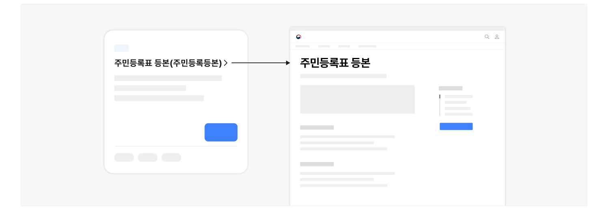
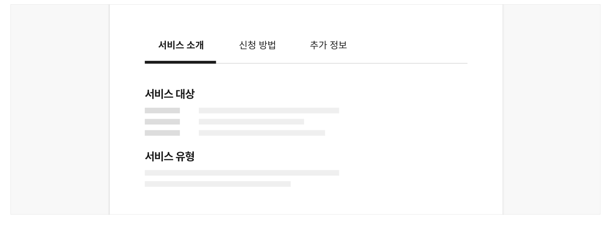
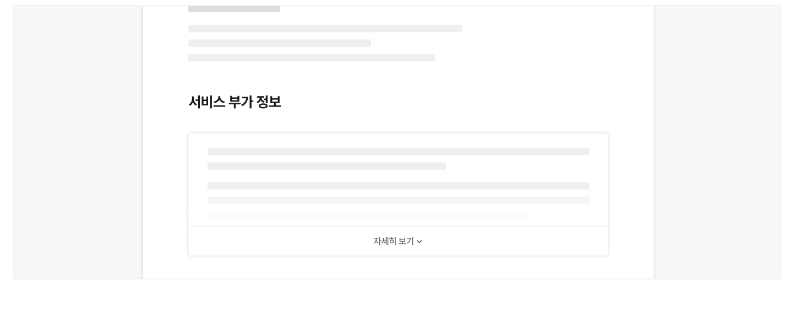
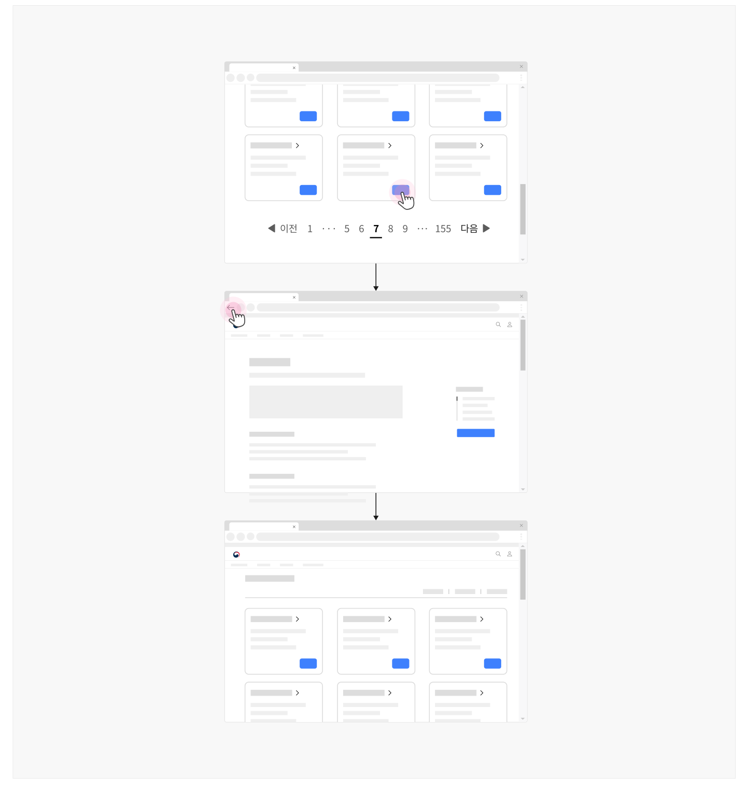

## 구조

- 1 제목: 본문 제목으로 신청 서비스명이 텍스트로 제공됨
- 2 요약 정보: 신청 서비스의 특징이나 목적을 요약하여 설명하는 2~3줄의 텍스트
- 3 개요 정보: 신청 서비스의 핵심 정보에 대한 개요 목록
- 4 상세 정보: 신청 서비스 상세 정보를 전달하기 위한 콘텐츠 섹션
- 5 부가 정보: 서비스나 신청 과정 진입 전에 반드시 확인해야 할 정보는 아니지만 서비스에 대한 이해를 돕기 위해 제공되는 콘텐츠 섹션
- 6 콘텐츠 변경 이력: 정보의 업로드일, 변경일, 변경된 내용에 대한 로그 기록
- 7 콘텐츠 내 탐색: 본문의 콘텐츠 섹션의 구조를 파악하고 원하는 섹션으로 이동할 수 있도록 도와주는 탐색 수단
- 8 액션 버튼: 신청 단계로 이동하거나 신청할 수 있는 외부 서비스 채널로 이동할 수 있는 링크


## 사용성 가이드라인

- 01 본문 콘텐츠의 제목을 신청 서비스명으로 제공한다.
- 02 상세 정보 콘텐츠는 간결하며 이해하기 쉽게 작성한다.
- 03 상세 정보는 정확하고 최신화된 상태로 제공한다.
- 04 서비스를 신청할 수 있는 모든 채널과 제약 사항에 대한 정보를 제공한다.
- 05 온라인으로 신청할 수 없는 상황에 대해 명확하게 인지 가능하도록 표현한다.
- 06 사용자가 신청 과업을 완료하는 데 필요한 모든 서식과 서류에 대해 안내하고 빠르게 접근할 수 있는 수단을 제공한다.
- 07 신청 과정과 처리 절차에 대한 정보를 제공한다.
- 08 일반적으로 신청 과정에 소요되는 기간 정보를 절차별로 안내한다.
- 09 사용자에게 도움을 줄 수 있는 다양한 부가 정보를 제공한다.
- 10 기본 정보는 한 화면에 확인 가능하도록 제공한다.
- 11 기본 정보는 첫 번째 탭에서 확인 가능하도록 제공한다.
- 12 부가 정보는 사용자가 필요에 따라 상세 내용을 확인할 수 있게 제공하는 방안을 고려한다.
- 13 모든 링크는 실행하였을 때, 링크 레이블에 명시된 적절한 화면으로 이동해야 한다.
- 14 목록 이동 버튼을 누르거나 사용자 에이전트에서 뒤로가기 동작을 실행하였을 때 사용자의 탐색 맥락이 유지되어야 한다.
### 01. 본문 콘텐츠의 제목을 신청 서비스명으로 제공한다.

정확히 어떤 항목에 대한 상세 정보인지 사용자가 명확하게 파악할 수 있도록 신청 서비스명을 본문 콘텐츠의 제목으로 제공하고 본문에서 가장 강조된 형태로 표현해야 한다.

[모범 사례]



**사례 텍스트 보완**

```text
주민등록표 등본(주민등록등본)
주민등록표 등본
```
### 02. 상세 정보 콘텐츠는 간결하며 이해하기 쉽게 작성한다.

가능한 한 모든 사용자가 이해하기 쉬운 단어를 사용하고 문장의 구조를 단순화하여 정보를 제공해야 한다. 신청 서비스의 특성으로 인해 불가피하게 전문 용어, 외국어 등이 사용되어야 한다면 도움 관련 컴포넌트를 활용하여 설명을 제공해야 한다.
### 03. 상세 정보는 정확하고 최신화된 상태로 제공한다.

모든 상세 정보 텍스트에는 오탈자가 없도록 하고 공식적인 용어와 명칭을 사용해야 한다. 또한 정보에 변경이 필요한 경우 다른 채널보다 우선적으로 내용을 최신화하여 서비스에 대한 신뢰를 확보해야 한다.

정보의 정확도와 최신화에 각별히 유의해야 하는 정보의 유형은 다음 목록과 같다. 이 중 신청 기간, 상태, 지원 금액, 문의처와 관련된 정보는 신청 과업 자체의 목표 완수에 필수적이며 잘못 제공되었을 때 치명적인 결과로 이어질 수 있음을 유념해야 한다.

- 신청 서비스에 대한 상세 정보
- 문의처
- 신청 서식
- 관련 정책, 법령
- 관련 서비스 채널 정보
### 04. 서비스를 신청할 수 있는 모든 채널과 제약 사항에 대한 정보를 제공한다.

방문/대면, 전화, 우편, 온라인 등 서비스를 신청할 수 있는 모든 채널에 대한 정보를 제공해야 한다.
### 05. 온라인으로 신청할 수 없는 상황에 대해 명확하게 인지 가능하도록 표현한다.

만약 이용기기, 사용자의 상황, 신청 서비스의 특성에 따라 신청 과정에 제약이 발생할 수 있거나 일부 기능만을 사용할 수 있다면 사용자가 신청을 시도하기 전에 명확하게 인지할 수 있도록 표현해야 한다.
### 06. 사용자가 신청 과업을 완료하는 데 필요한 모든 서식과 서류에 대해 안내하고 빠르게 접근할 수 있는 수단을 제공한다.

각종 증빙서류, 전자 문서로 대체할 수 없는 서류 등 사용자가 신청 과정에서 제출해야 하는 모든 서류를 사전에 안내하여 신청 과정에 진입한 이후 사용자의 과업이 중단되지 않도록 한다. 사용자가 추가적으로 정보를 탐색하지 않도록 문서 양식은 직접 다운로드할 수 있게 제공하고, 증빙서류는 서류 종류에 따라 세부 정보를 확인할 수 있는 외부 서비스 또는 온라인 신청을 지원하는 서비스 링크를 통해 빠르게 접근할 수 있도록 한다.
### 07. 신청 과정과 처리 절차에 대한 정보를 제공한다.

신청 업무에 대한 사용자의 이해를 돕고 상세 정보에 기반하여 신청에 필요한 정보를 준비하고 계획할 수 있도록 신청 과정에 처리 절차에 대한 정보를 제공해야 한다.
### 08. 일반적으로 신청 과정에 소요되는 기간 정보를 절차별로 안내한다.

각 신청 과정에 소요되는 기간 정보를 제공하여, 신청을 시도하고자 하는 사용자는 사전에 정보를 예측할 수 있도록 하고 신청을 완료한 사용자는 진행 단계와 상태에 대해 가늠할 수 있도록 한다.
### 09. 사용자에게 도움을 줄 수 있는 다양한 부가 정보를 제공한다.

상세 정보에서 이해가 가지 않는 부분, 부족한 내용에 대해 사용자가 직접 문제를 해결할 수 있는 방안을 제시한다.

- 서비스에 대한 문의처: 전화, 이메일, 상담 챗봇 등
- 관련된 서비스 링크 목록
- 다른 사용자가 함께 이용한 서비스 링크 목록
- 자주 하는 질문 및 답변 등
### 10. 기본 정보는 한 화면에 확인 가능하도록 제공한다.

기본 정보 섹션을 탭이나 아코디언으로 제공하지 않아야 한다. 탭과 아코디언은 각 패널 내부 정보를 확인하는 데 부가적인 행동이 필요하며 중요한 정보를 놓치게 되는 사용자의 실수를 유발할 수 있다.

[모범 사례]



**사례 텍스트 보완**

```text
서비스 대상
서비스 유형
신청 방법
추가 정보
```
[피해야 할 사례]


**사례 텍스트 보완**

```text
서비스 소개
신청 방법
추가 정보
서비스 대상
서비스 유형
```
### 11. 기본 정보는 첫 번째 탭에서 확인 가능하도록 제공한다.

단일 화면에서 콘텐츠를 소구하기에 콘텐츠 내용이 지나치게 복잡하거나 콘텐츠 섹션 간 성격이 달라 탭 레이아웃을 사용하는 경우, 모든 신청 서비스에 대한 기본 정보는 첫 번째 탭에 제공되어야 한다.
### 12. 부가 정보는 사용자가 필요에 따라 상세 내용을 확인할 수 있게 제공하는 방안을 고려한다.

모든 부가 정보를 노출시지키 않고 각 항목의 콘텐츠를 일부만 표시하고 숨긴 다음 해당 정보가 필요한 사용자가 영역을 확장하여 내용을 확인할 수 있게 제공할 수 있다.

[모범 사례]



**사례 텍스트 보완**

```text
서비스 부가 정보
자세히 보기
```
### 13. 모든 링크는 실행하였을 때, 링크 레이블에 명시된 적절한 화면으로 이동해야 한다.

링크의 목적지를 부적절하게 설정하면 사용자는 예측하지 않은 화면으로 이동하여 당황할 수 있고 도착한 화면이나 웹사이트에서 원하는 정보를 찾기 위해 추가적인 정보 탐색을 시도해야 한다.

'신청하기' 링크를 클릭하면 또 다른 대상 선택 화면 대신 유의 사항 및 자격 확인 또는 신청서 작성 양식으로 연결되어 사용자가 의도한 행동을 수행할 수 있게 설계해야 한다.
### 14. 목록 이동 버튼을 누르거나 사용자 에이전트에서 뒤로가기 동작을 실행하였을 때 사용자의 탐색 맥락이 유지되어야 한다.

예를 들어, 사용자가 3번째 목록에 있는 항목을 눌러 서비스 정보 확인 화면으로 진입했다면 돌아가기 동작을 수행하여 시스템이 응답하기 직전의 맥락이 유지되어야 사용자는 추가적인 정보를 계속 탐색할 수 있다. 사용자가 적용한 필터링·정렬 옵션도 그대로 유지되어야 하는데, 만약 이러한 맥락이 변경된다면 사용자는 상세 정보를 확인할 때마다 탐색 중인 목록의 페이지 번호, 항목의 위치, 적용한 필터링·정렬 옵션을 기억했다 다시 적용하고 목록을 탐색해야 한다.
사용성 가이드라인


[피해야 할 사례]



**사례 텍스트 보완**

```text
원본 PDF의 UI 배치·상태·다이어그램을 보존한 시각 자료입니다.
```


### 관련 구성 요소

### 기본 패턴

상세 정보 확인 첨부파일
