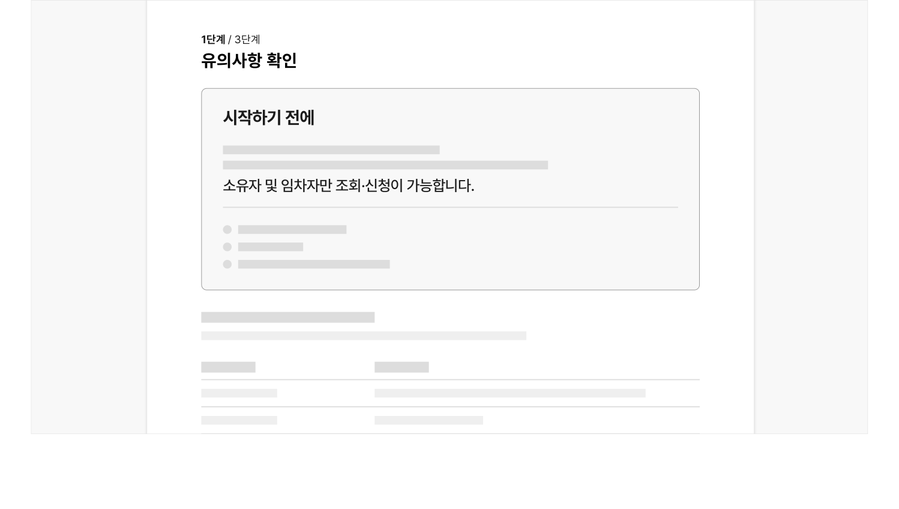
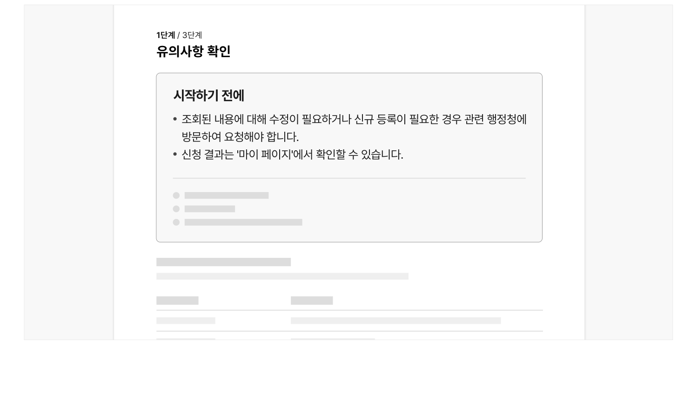

## 유형

### 구분

### 안내 섹션

신청서 입력폼 상단에 직접 제공되는 형태로 안내하고자 하는 정보의 중요도에 따라 디스클로저 컴포넌트와 함께 사용할 수 있다.

### 단일 화면

신청의 첫 단계로 '유의 사항 및 자격 확인'을 진행한다. 실제 신청 서식의 입력과는 상관 없이 사용자가 서비스를 신청하기에 적합한 조건을 확인하기 위한 입력폼 또는 유의 사항에 대한 안내를 제공한다.
### 유형 선택 방법

| 구분 | 안내 섹션 | 단일 화면 |
|---|---|---|
| 신청 취소/철회 | 해당 없거나 가능함 | 어렵거나 불가능함 |
| 제출된 신청 서식의 수정 | 해당 없거나 가능함 | 어렵거나 불가능함 |
| 신청 자격의 제한 | 제한 없음 | 신청 조건에 따라 신청 가능 여부가 결정됨 |
| 신청서 작성의 단계와 속도 | 단계가 적고 신청 서식이 간단함 | 단계가 많고 각 단계를 완료하는 데 많은 노력과 오랜 시간을 투입해야 함 |
## 구조

- 1 배지: 신청 서비스의 주요 메타 데이터를 요약하여 제공함
- 2 안내 정보: 신청서 작성 전 유의해야 할 사항, 제출해야 할 서류 등의 정보를 안내함

a. 취소/수정 가능 여부 b. 전자서명/본인인증 절차의 포함 여부 c. 제출할 증빙서류 d. 기타 안내사항

- 3 디스클로저: 부가적으로 참고 가능한 정보를 제공하는 확장 가능한 영역
- 4 액션 버튼: 다음 단계로 이동하기 위한 액션 버튼


## 사용성 가이드라인

- 01 유의 사항 및 자격 확인은 신청서 작성 과업의 가장 첫 단계로 제공한다.
- 02 신청서 작성 중간이나 최종 단계에서 작성을 중단해야 하는 상황에 대해 사용자에게 명확하게 안내한다.
- 03 중요도와 계층 구조에 따라 정보를 직관적으로 인지할 수 있도록 표현한다.
- 04 신청서 작성의 단계 중에 필요한 정보, 신청 완료 이후 필요한 정보는 포함하지 않는다.

### 유의 사항 및 자격 확인은 신청서 작성 과업의 가장 첫 단계로 제공한다.

신청의 특성상 자격 판별을 위해 많은 정보를 입력해야 하는 상황을 제외하고 사용자가 신청서 작성 과정에서 유의 사항 및 자격 확인을 가장 먼저 거치도록 설계해야 한다.

특히 단계가 많거나 복잡한 신청서를 작성해야 하는 서비스에서 사용자가 이미 많은 정보를 입력한 중간 단계나 최종 제출 버튼을 누른 상태에서 제한 사항을 검증하게 되면 사용자는 쓸모없는 작업을 수행하게 된다. 제출 후 수정이나 취소가 불가능한 경우에는 사용자에게 더 심각한 결과를 가져올 수 있다.

### 신청서 작성 중간이나 최종 단계에서 작성을 중단해야 하는 상황에 대해 사용자에게 명확하게 안내한다.

신청의 특성상 자격 판별을 위해 많은 정보를 입력해야 한다면 신청서 작성 중간이나 최종 단계에서 진행 과정을 중단해야 하는 상황이 발생할 수 있음을 분명하게 인지할 수 있는 방식으로 전달해야 한다.

[모범 사례]



**사례 텍스트 보완**

```text
1단계 / 3단계
유의사항 확인
시작하기 전에
소유자 및 임차자만 조회·신청이 가능합니다.
```

### 중요도와 계층 구조에 따라 정보를 직관적으로 인지할 수 있도록 표현한다.

사용자가 반드시 확인해야 할 정보가 다른 정보와 변별되도록 표현해야 한다. 만약 온라인으로 신청을 진행할 수 없거나 신청 자체가 불가능한 조건이 복합적이라면 목록, 표 등 다양한 방식을 활용하여 가능한 한 직관적으로 인지할 수 있는 정보 표현 방식을 사용해야 한다.

### 신청서 작성의 단계 중에 필요한 정보, 신청 완료 이후 필요한 정보는 포함하지 않는다.

'유의 사항 및 자격 확인'의 과업 플로(Flow)의 맥락에 적합한 정보만을 제공해야 한다.

[피해야 할 사례]



**사례 텍스트 보완**

```text
1단계 / 3단계
유의사항 확인
시작하기 전에
조회된 내용에 대해 수정이 필요하거나 신규 등록이 필요한 경우 관련 행정청에 방문하여 요청해야 합니다.
신청 결과는 '마이 페이지'에서 확인할 수 있습니다.
```


### 관련 구성 요소

### 기본 패턴

도움 동의 입력폼
