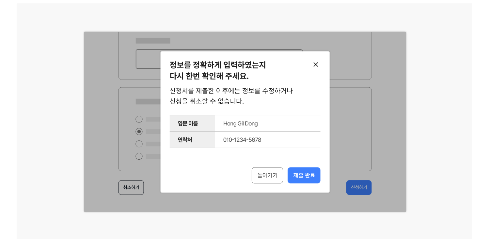

## 유형

### 모달

확인 절차를 모달에서 진행하는 형태로 사용자에게 안내해야 할 핵심 정보의 양이 적어 모달에서 스크롤 없이 표현할 수 있는 경우에 사용하기 적합하다.

### 단일 화면

확인 절차를 별도의 화면에서 진행하는 형태로 사용자에게 안내해야 할 핵심 정보의 양이 많아 모달에서 스크롤 없이 표현할 수 없고 정보의 구조화가 필요한 경우에 사용하기 적합하다.
## 구조

1 제목: 요청하는 행동에 대한 간단한 요약 정보를 제공함 2 설명(선택): 제목에 부가적인 정보를 제공하기 위한 텍스트 3 확인 정보: 사용자에게 확인을 요청하고자 하는 정보 목록 4 액션 컨트롤: 신청서의 제출을 확정하거나 중단하고 신청서 작성 단계로 돌아가는 액션을 위한 버튼

그룹

## 사용성 가이드라인

- 01 신청 취소/철회, 제출된 신청 서식 수정이 불가능한 경우 확인·확정 단계를 포함해야 한다.
- 02 작성한 내용 중 핵심 정보를 요약하여 제공한다.
- 03 취소/수정 불가한 사항에 대해 사용자에게 명확하게 안내해야 한다.
- 04 행동을 확정, 취소할 수 있는 버튼을 모두 제공한다.
### 01. 신청 취소/철회, 제출된 신청 서식 수정이 불가능한 경우 확인·확정 단계를 포함해야 한다.

사용자가 신청서의 제출 자체를 되돌릴 수 없거나 중요 정보를 수정할 수 없는 신청이라면 제출 완료 이전에 확인·확정 단계를 반드시 포함시켜 사용자가 실수하지 않도록 해야 한다. 만약 신청의 결과를 되돌릴 수 없더라도 동일한 신청을 여러 번 수행할 수 있는 발급형 신청에는 확인·확정 단계를 포함하지 않을 수 있다.
### 02. 작성한 내용 중 핵심 정보를 요약하여 제공한다.

사용자가 신청서에 작성한 정보를 최종적으로 확인하고 잘못 작성한 경우 수정할 수 있는 기회를 제공해야 한다. 이때, 사용자가 신청 과정에서 입력한 모든 데이터를 보여주는 것이 아니라 핵심 내용만 선별하여 제공하는 것이 바람직하다. 핵심 정보로 제공할 수 있는 내용은 다음과 같다.

- 답변 받을 연락처 정보
- 신청 항목 중 취소/수정할 수 없는 정보 (예 - '여권 발급' 신청 중 영문 이름)
- 심사 및 신청 결과에 영향을 미칠 수 있는 정보 (예 - 소득 기준)

[모범 사례]



**사례 텍스트 보완**

```text
정보를 정확하게 입력하였는지
다시 한번 확인해 주세요.
신청서를 제출한 이후에는 정보를 수정하거나
신청을 취소할 수 없습니다.
영문 이름
Hong Gil Dong
연락처
01012345678
돌아가기
제출 완료
돌 완
제출 완
```
### 03. 취소/수정 불가한 사항에 대해 사용자에게 명확하게 안내해야 한다.

모달의 헤더 내 제목, 본문 콘텐츠의 제목 또는 설명에 취소나 수정할 수 없음을 안내하는 텍스트를 반드시 포함시켜 사용자가 현재의 상황을 인지하고 이후 과정에서의 결과를 예측할 수 있도록 해야 한다.
관련 구성 요소


### 04. 행동을 확정, 취소할 수 있는 버튼을 모두 제공한다.

행동을 확정하는 버튼과 함께 행동을 취소하고 이전으로 돌아갈 수 있는 버튼을 제공하여 사용자가 실수로 신청서를 제출하는 오류를 방지해야 한다.

### 관련 구성 요소

### 컴포넌트

모달
