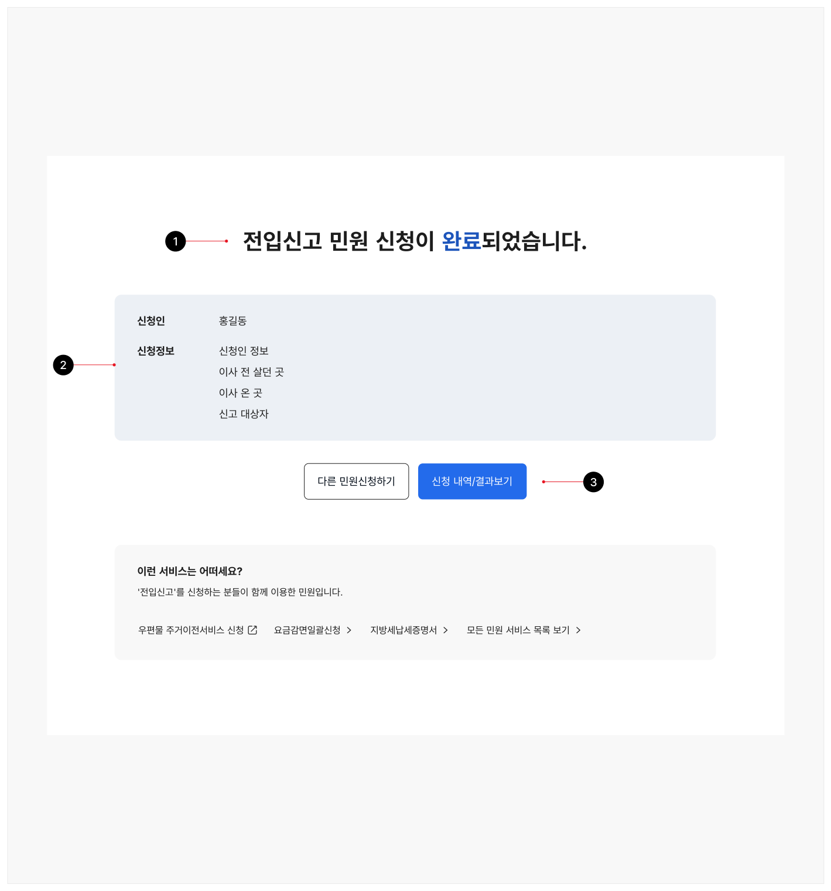
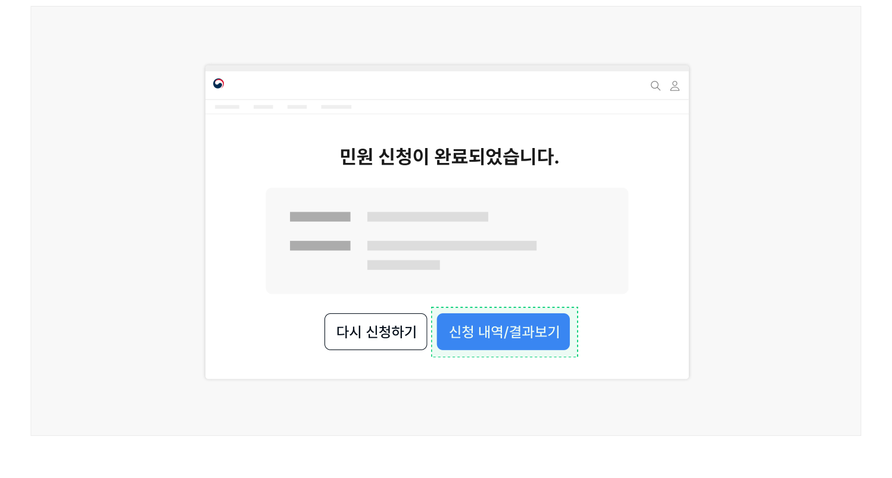
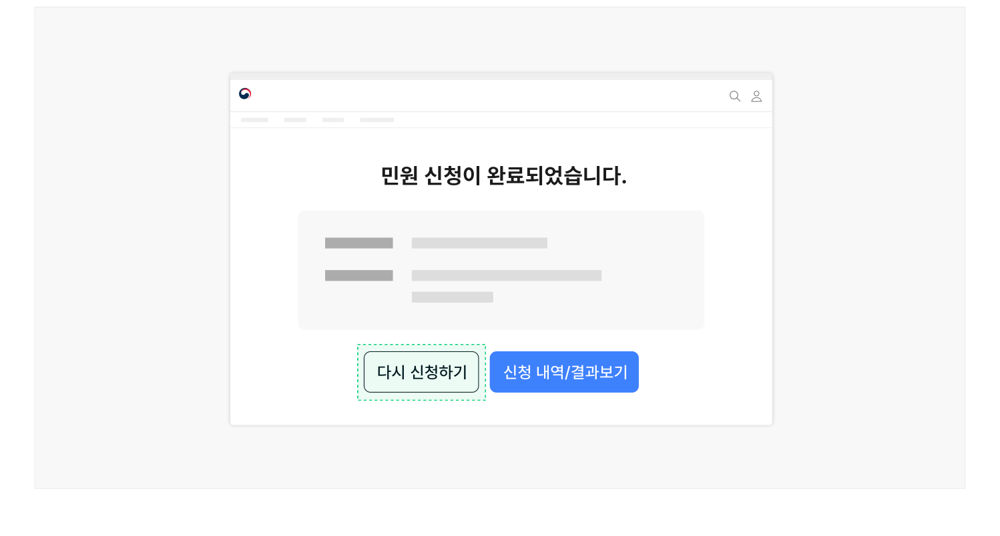
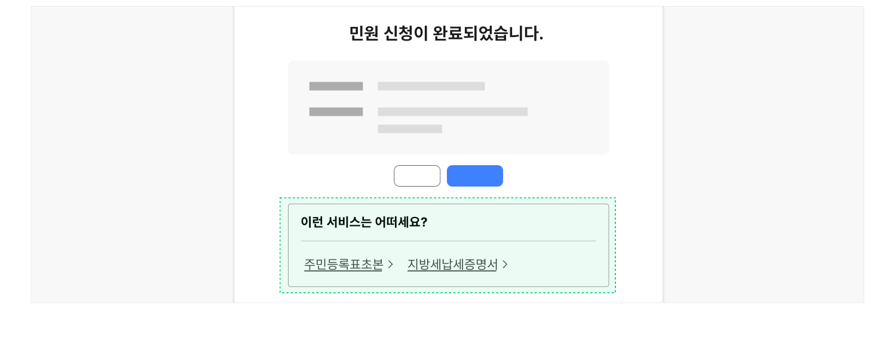

## 구조

1 제목: 완료 화면의 제목 텍스트 2 확인 정보: 제출 완료된 신청 서식 내용 중 사용자에게 중요한 입력 정보를 요약하여 제공하는

텍스트 목록 3 액션 컨트롤: 신청 내역 화면 링크, 관련 서비스 링크, 다시 신청하기 버튼 등 신청 완료 이후 사용자의 행동을 유도하기 위한 수단이 제공됨



## 사용성 가이드라인

- 01 모든 신청 과업에는 완료 단계를 제공한다.
- 02 작성한 내용 중 핵심 정보를 요약하여 제공한다.
- 03 신청 결과를 확인할 수 있는 화면으로 연결된 링크를 제공한다.
- 04 사용자가 빈번하게 동일한 신청 서비스를 연속적으로 이용하는 경우, 같은 작업을 다시 수행할 수 있는 버튼을 제공한다.
- 05 관련된 신청 서비스 정보를 확인하거나 신청할 수 있는 링크를 제공한다.

### 모든 신청 과업에는 완료 단계를 제공한다.

신청서 제출이 완료된 이후에는 반드시 완료 화면으로 이동하여 사용자가 신청서가 정상적으로 제출되었음을 확인하고 신뢰할 수 있도록 해야 한다. 제출 후 '완료'에 대한 피드백 없이 메인 화면이나 신청 내역 화면으로 이동하게 되면 사용자는 당황할 수 있다.

### 작성한 내용 중 핵심 정보를 요약하여 제공한다.

사용자가 신청서에 작성한 정보를 최종적으로 확인할 수 있는 기회를 제공해야 한다. 이때, 사용자가 신청 과정에서 입력한 모든 데이터를 보여주는 것이 아니라 핵심 내용만 선별하여 제공하는 것이 바람직하다. 단, '확인·확정' 단계가 포함된 신청이라면 핵심 정보 요약은 생략한다.

핵심 정보로 제공할 수 있는 내용은 다음과 같다.

- 답변 받을 연락처 정보
- 결과 확인 과정에서 필요한 정보
- 심사 및 신청 결과에 영향을 미칠 수 있는 정보 (예 - 소득 기준)

### 신청 결과를 확인할 수 있는 화면으로 연결된 링크를 제공한다.

사용자가 신청 내역, 결과, 진행 현황 등을 확인하고 신청 과업을 마무리할 수 있도록 신청 결과 확인 단계로 진입할 수 있는 수단을 제공해야 한다.

[모범 사례]



**사례 텍스트 보완**

```text
민원 신청이 완료되었습니다.
다시 신청하기
신청 내역/결과보기
```

### 사용자가 빈번하게 동일한 신청 서비스를 연속적으로 이용하는 경우, 같은 작업을 다시 수행할 수 있는 버튼을 제공한다.

사용자가 신청을 위해 이미 거쳐온 단계를 반복하지 않고 가장 간단한 절차로 작업을 수행할 수 있다.

[모범 사례]



**사례 텍스트 보완**

```text
민원 신청이 완료되었습니다.
다시 신청하기
신청 내역/결과보기
```

### 관련된 신청 서비스 정보를 확인하거나 신청할 수 있는 링크를 제공한다.

사용자가 1회의 세션 동안 여러 신청을 동시에 이용하는 경우, 완료 화면에 이를 관련 서비스 링크로 제공하면 사용자가 서비스 방문 목적을 보다 효과적으로 달성할 수 있다.

[모범 사례]



**사례 텍스트 보완**

```text
민원 신청이 완료되었습니다.
이런 서비스는 어떠세요?
주민등록표초본
지방세납세증명서
```
