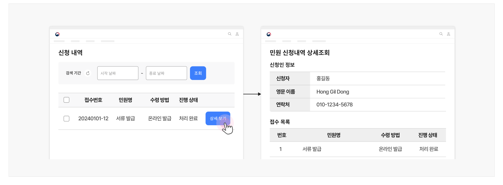
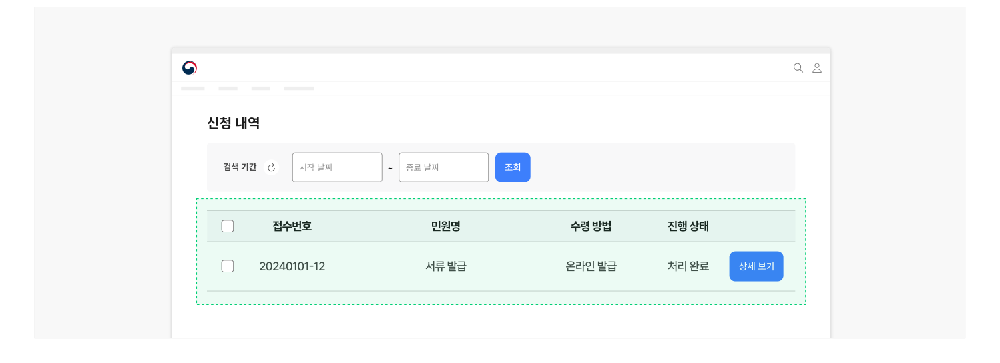
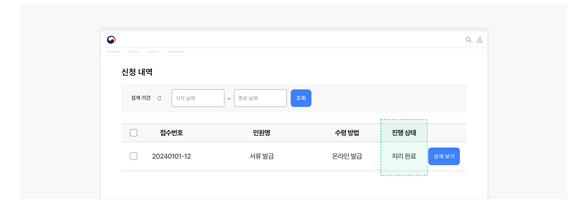
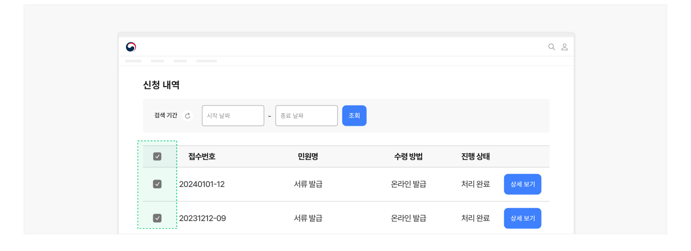

## 구조

- 1 필터링·정렬 컨트롤: 신청 내역 목록을 필터링·정렬하는 데 사용되는 컨트롤
- 2 페이지네이션: 신청 내역 목록을 탐색하는 데 사용되는 컨트롤
- 3 제목: 신청 서비스명을 보여주는 텍스트. 상세 화면으로 이동하기 위한 링크 또는 신청 이력 화면으로 이동하기 위한 링크로 사용됨
- 4 메타 데이터: 신청 서비스에 부여된 여러 데이터 속성을 표시하는 텍스트로 다음 내용이 제공될 수 있음

a. 신청일/취소일 b. 신청 처리 절차/현재 진행 상태

- 5 액션 버튼: 각 신청 내역 항목에 대해 수행할 수 있는 기능 사용을 유도하기 위한 컨트롤을 제공함

- a. 인쇄/저장
- b. 신청 취소


## 사용성 가이드라인

- 01 신청 결과 확인 화면으로 이동하는 링크 레이블에 직관적인 명칭을 사용한다.
- 02 신청 내역을 제공한다.
- 03 신청 이력을 제공한다.
- 04 신청 이력을 알기 쉽게 구조화한다.
- 05 정렬 기능을 제공한다.
- 06 신청 처리 절차 및 현재 진행 상태에 대한 정보를 제공한다.
- 07 일괄 선택 기능을 제공한다.
- 08 신청 취소 버튼을 명확하게 표현한다.

### 신청 결과 확인 화면으로 이동하는 링크 레이블에 직관적인 명칭을 사용한다.

신청 결과 확인 화면으로 이동하는 링크 레이블은 사용자에게 익숙하며 단어를 통해 목적지에 대해 유추할 수 있는 '신청 현황', '신청 내역'으로 제공한다.

디지털 서비스의 브랜드나 서비스 특징을 고려한 이름을 제공하고자 하는 경우, 인라인 텍스트 설명이나 툴팁으로 부가적인 정보를 제공하는 것이 바람직하다.

### 신청 내역을 제공한다.

각 신청 건에 대해 신청서 작성 양식의 모든 항목과 각 항목에 사용자가 입력한 정보를 확인할 수 있는 내역 정보를 제공하여 사용자가 신청 현황과 조건을 확인할 수 있도록 해야 한다.

신청서에 작성한 내용을 기반으로 문서가 발급되는 경우 내역 정보는 문서로 대체할 수 있으나 문서에 포함되지 않은 정보에 대해서는 별도로 정보를 제공해야 한다.

[모범 사례]



**사례 텍스트 보완**

```text
신청 내역
민원 신청내역 상세조회
신청인 정보
검색 기간
~
조회
시작 날짜
종료 날짜
신청자
홍길동
영문 이름
Hong Gil Dong
접수번호
민원명
수령 방법
진행 상태
연락처
01012345678
…
```

### 신청 이력을 제공한다.

사용자가 이용한 신청 서비스의 이력 목록을 제공하여 사용자가 과거의 신청 사항을 조회할 수 있도록 해야 한다. 신청 이력의 제공 기간은 서비스 특성이나 사용자 인증 방식에 적합한 수준으로 제공하면 된다.

[모범 사례]



**사례 텍스트 보완**

```text
신청 내역
검색 기간
~
조회
시작 날짜
종료 날짜
접수번호
민원명
수령 방법
진행 상태
상세 보기
2024010112
서류 발급
온라인 발급
처리 완료
```

### 신청 이력을 알기 쉽게 구조화한다.

여러 건의 신청 내역이 있을 경우, 표나 목록으로 구조화하여 알기 쉽게 표현한다.

### 정렬 기능을 제공한다.

내역을 신청 일자, 중요도, 마감 기한 등의 기준으로 정렬하여 중요한 내용을 먼저 확인할 수 있게 만든다.

### 신청 처리 절차 및 현재 진행 상태에 대한 정보를 제공한다.

처리 단계 전체를 명시하고 현재의 진행 단계가 어디에 속하는지를 표시하여 사용자가 신청 서비스의 처리 현황과 다음 단계를 예측할 수 있어야 한다. 처리 절차와 단계 정보가 제공되지 않으면 사용자는 서비스를 신뢰하기 어렵고 불안을 느낄 수 있다.

[모범 사례]



**사례 텍스트 보완**

```text
신청 내역
검색 기간
~
조회
시작 날짜
종료 날짜
접수번호
민원명
수령 방법
진행 상태
상세 보기
2024010112
서류 발급
온라인 발급
처리 완료
```

### 일괄 선택 기능을 제공한다.

일괄 선택 기능은 사용자가 여러 건의 신청 내역에 같은 동작을 여러 번 반복하지 않고 필요한 작업을 빠르게 수행하도록 돕는다.

[모범 사례]



**사례 텍스트 보완**

```text
신청 내역
검색 기간
~
조회
시작 날짜
종료 날짜
접수번호
민원명
수령 방법
진행 상태
상세 보기
2024010112
서류 발급
온라인 발급
처리 완료
2023121209
```

### 신청 취소 버튼을 명확하게 표현한다.

신청 상태를 변경하고자 하는 사용자가 원하는 목표를 빠르게 달성할 수 있도록, 신청 취소 버튼을 인지하기 쉽게 만든다.


## 접근성 가이드라인

### 신청 내역 선택에 사용되는 체크박스에 적절한 레이블을 제공한다.

신청 내역 선택에 사용되는 여러 개의 체크박스가 동일한 레이블을 갖거나 레이블 내용을 적절하지 않게 제공하면, 보조 기술 사용자는 어떤 신청 건을 선택하는지 알 수 없으므로 예약명, 예약번호 등의 명확한 신청 정보를 레이블로 제공해야 한다.

- KWCAG 2.2 레이블 제공
- WCAG 2.1 Labels or Instructions (A)
- WCAG 2.1 Headings and Labels (AA)


### 관련 구성 요소

### 컴포넌트

구조화 목록 배지

### 기본 패턴

목록 탐색 필터링·정렬
