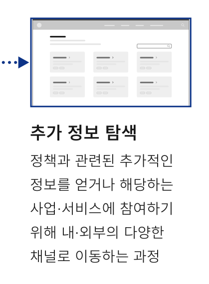

## 개요

정책 정보 확인은 디지털 서비스에 개제된 정부/기관의 행동 방침, 계획, 법률에 관한 정보를 사용자가 확인하는 과업이다.

## 유형

| 구분 | 설명 |
|---|---|
| 정책 정보 | 정부가 공공문제를 해결하거나 정치적·행정적 목표를 실현하기 위해 마련한 법률·정책·사업·사업계획·정부방침·정책지침·결의 사항 등에 대한 정보 예) 주요 정책 소개 |
| 관련 자료 | 주요 정책을 이해하고 참여하는데 필요한 각종 자료 예) 보고서, 매뉴얼, 법령 자료, 정책 홍보자료, 연구 자료, 국정 과제 등 |
### 이용 상황별 플로(Flow)

도식 라벨: 정책 탐색 정책 목록에서 원하는 정보를 발견하는 과정

정

정책 상세 정보 확인 ¹⁾

정 발

정책 자료 참고 ²⁾

### 1) 정책 상세 정보 확인

상세 콘텐츠를 확인하여 찾고자 한 내용에 부합하는지, 어떤 내용이 포함되어 있는지 등을 이해하고 비교 및 검토를 수행하는 과정

### 2) 정책 자료 참고

정책과 관련된 각종 자료를 통해 궁금증을 해결하거나 사업·서비스의 참여에 도움이 되는 내용을 확인하는 과정


**ASCII 흐름 보완**

```text
정책 탐색 -> 정보 확인 -> 정책 자료 참고 -> 추가 정보 탐색
```
### 추가 정보 탐색

정책과 관련된 추가적인 정보를 얻거나 해당하는 사업·서비스에 참여하기 위해 내·외부의 다양한 채널로 이동하는 과정
