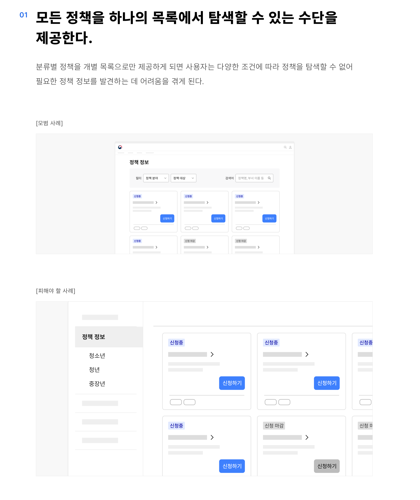
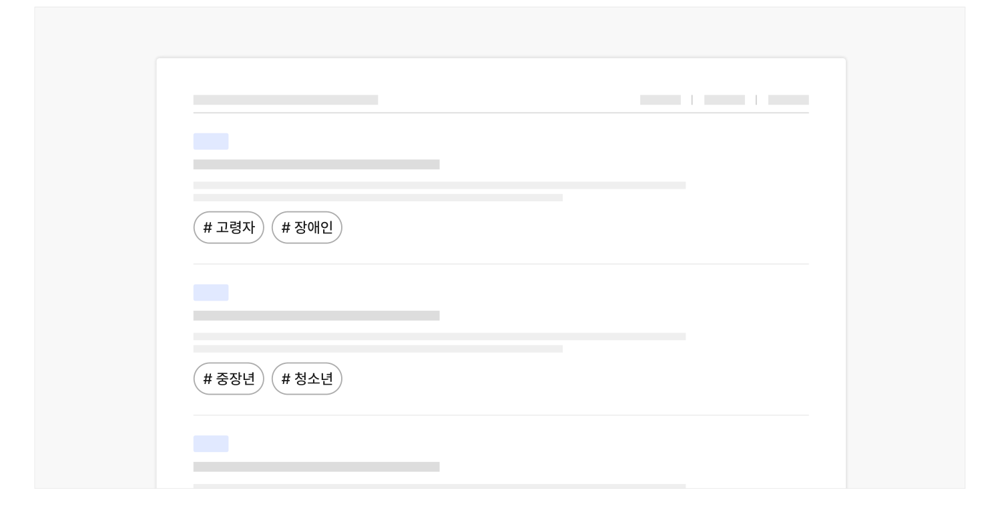
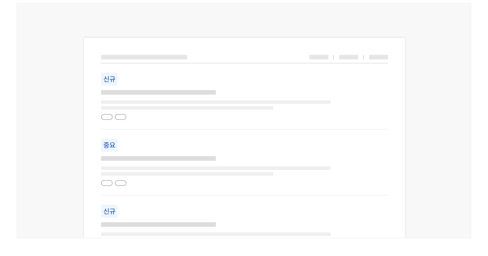

### 정책 탐색

## 구조

- 1 필터링·정렬 컨트롤: 정책 목록을 필터링·정렬하는 데 사용되는 컨트롤
- 2 페이지네이션: 정책 목록을 탐색하는 데 사용되는 컨트롤
- 3 항목: 정보를 식별하기 위한 콘텐츠 집합으로 개별 항목에 대해 실행할 기능 관련 버튼, 상세 정보를 확인할 수 있는 탐색 링크가 포함될 수 있음

- a. 제목: 정책명을 보여주는 텍스트. 상세 화면으로 이동하기 위한 링크로 사용됨
- b. 미리보기/요약: 정책에 대한 기본적인 정보를 요약하여 보여주는 텍스트
- c. 꺾쇠/화살표: 제목이 링크로 작동함을 안내하는 시각적 단서
- d. 배지: 정책의 주요 분류 체계를 나타내는 메타 데이터
- e. 메타 데이터: 배지 외에 정책 항목에 부여된 여러 데이터 속성을 표시하는 텍스트
- f. 저장 컨트롤: 관심 있는 정책 정보를 모아보기 위해 개인화된 기록을 저장하는 데 사용되는 컨트롤
도식 라벨: 1 1 2 3-a 3-b 3-d 3-f 3-c 3-e


## 사용성 가이드라인

- 01 모든 정책을 하나의 목록에서 탐색할 수 있는 수단을 제공한다.
- 02 필터링 또는 검색 기능을 제공한다.
- 03 정책의 대상/분야 등의 분류 체계를 표시한다.
- 04 새로운 정책 및 자료를 명확하게 구분한다.

### 모든 정책을 하나의 목록에서 탐색할 수 있는 수단을 제공한다.

분류별 정책을 개별 목록으로만 제공하게 되면 사용자는 다양한 조건에 따라 정책을 탐색할 수 없어 필요한 정책 정보를 발견하는 데 어려움을 겪게 된다.

[모범 사례]

[피해야 할 사례]

### 필터링 또는 검색 기능을 제공한다.

목록에 필터링 또는 검색 기능을 제공하여 사용자가 여러 분류 체계에 해당하는 정책을 조회하는 과정을 통해 빠르게 원하는 정책을 찾을 수 있도록 한다.

### 정책의 대상/분야 등의 분류 체계를 표시한다.

제공 유형, 지원 주기 등 정책의 분류 체계를 배지와 기타 메타 데이터로 제공하여 사용자가 참고할 수 있도록 해야 한다.

[모범 사례]



**사례 텍스트 보완**

```text
고령자
장애인
중장년
청소년
```

### 새로운 정책 및 자료를 명확하게 구분한다.

새로 시행되는 정책이나 중요 정책에 '신규', '중요'와 같은 메타 데이터를 배지로 제공함으로써 사용자가 시의성 있는 정책 정보를 탐색할 수 있도록 도와야 한다.

[모범 사례]



**사례 텍스트 보완**

```text
신규
중요
```


## 접근성 가이드라인

### 공유/저장 컨트롤과 액션 버튼에 명확한 접근 가능한 이름을 제공한다.

스크린 리더 사용자가 컨트롤 요소를 단위로 탐색을 시도하는 경우, 목록에 동일한 레이블을 가진 컨트롤 요소가 다수 제공되었을 때 각 컨트롤 요소를 통해 기능을 실행하는 대상 정보를 명확하게 파악하기 어려울 수 있다. 각 컨트롤 요소에 title 속성 또는 aria-describedby 속성을 활용하여 접근 가능한 이름이 변별될 수 있도록 해야 한다.

- KWCAG 2.2 적절한 링크 텍스트
- WCAG 2.1 Headings and Labels (AA)
- WCAG 2.1 Label in Name (A)
- WCAG 2.1 Name, Role, Value (A)


### 관련 구성 요소

### 컴포넌트

구조화 목록 페이지네이션

### 기본 패턴

목록 탐색 필터링·정렬
