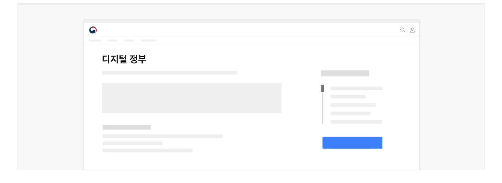
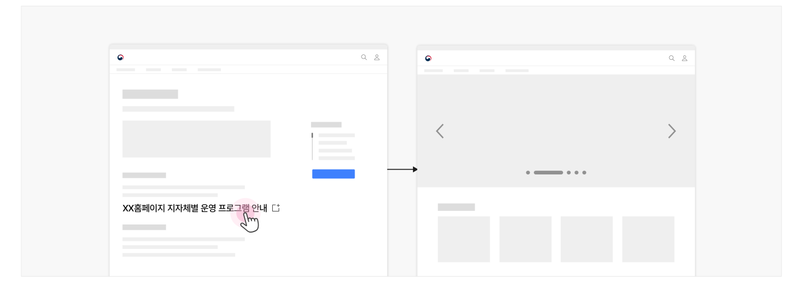

사용성 가이드라인


### 정보 확인

## 사용성 가이드라인

- 01 화면 제목을 정책명으로 제공한다.
- 02 상세 정보 콘텐츠는 간결하며 이해하기 쉽게 작성한다.
- 03 상세 정보는 정확하고 최신화된 상태로 제공한다.
- 04 내용이 없는 콘텐츠 섹션과 섹션 제목은 표시되지 않도록 한다.
- 05 인포그래픽, 사진, 동영상 등의 콘텐츠를 적절하게 활용한다.
- 06 사용자에게 도움을 줄 수 있는 다양한 부가 정보를 제공한다.
- 07 부가 정보는 사용자가 필요에 따라 상세 내용을 확인할 수 있게 제공하는 방안을 고려한다.
- 08 모든 링크는 실행하였을 때, 링크 레이블에 명시된 적절한 화면으로 이동해야 한다.

### 화면 제목을 정책명으로 제공한다.

정확히 어떤 항목에 대한 상세 정보인지 사용자가 명확하게 파악할 수 있도록 정책명을 제목으로 제공하고 본문에서 가장 강조된 형태로 표현해야 한다.

[모범 사례]



**사례 텍스트 보완**

```text
디지털 정부
```

### 상세 정보 콘텐츠는 간결하며 이해하기 쉽게 작성한다.

가능한 한 모든 사용자가 이해하기 쉬운 단어를 사용하고 문장의 구조를 단순화하여 정보를 제공해야 한다. 정책의 특성으로 인해 불가피하게 전문 용어, 외국어 등이 사용되어야 한다면 도움 관련 컴포넌트를 활용하여 설명을 제공해야 한다.

### 상세 정보는 정확하고 최신화된 상태로 제공한다.

모든 상세 정보 텍스트에는 오탈자가 없도록 하고 공식적인 용어와 명칭을 사용해야 한다. 또한 정보에 변경이 필요한 경우 다른 채널보다 우선적으로 내용을 최신화하여 디지털 정부서비스에 대한 신뢰를 확보해야 한다.

### 내용이 없는 콘텐츠 섹션과 섹션 제목은 표시되지 않도록 한다.

상세 내용에서 세부 제목은 제공되고 있으나 하위에 아무런 정보가 제공되지 않은 채로 비어 있는 영역이 노출되면 사용자는 정보가 제대로 작성되지 않은 것으로 오인할 수 있다.

### 인포그래픽, 사진, 동영상 등의 콘텐츠를 적절하게 활용한다.

시각적 정보를 활용하면 텍스트에만 의존하는 것보다 말하고자 하는 바를 효과적으로 전달할 수 있으며 사용자의 흥미를 유발한다.

### 사용자에게 도움을 줄 수 있는 다양한 부가 정보를 제공한다.

정책과 관련하여 사용자가 참고할 수 있는 유용한 부가 정보를 충분히 제공하여 사용자가 별도의 메뉴 탐색, 검색을 시도하지 않도록 해야 한다. 정책과 관련하여 제공할 수 있는 부가 정보의 예시는 다음과 같다.

- 정책에 대한 문의처: 담당자 이름과 전화번호 또는 이메일 주소
- 관련 정책 링크 목록, 관련 자료 다운로드 링크, 관련 자료 게시판
- 관련 웹사이트 링크, 정책 관련 신청 링크

### 부가 정보는 사용자가 필요에 따라 상세 내용을 확인할 수 있게 제공하는 방안을 고려한다.

모든 부가 정보를 노출시지키 않고 각 항목의 콘텐츠를 일부만 표시하고 숨긴 다음 해당 정보가 필요한 사용자가 영역을 확장하여 내용을 확인할 수 있게 제공할 수 있다.

### 모든 링크는 실행하였을 때, 링크 레이블에 명시된 적절한 화면으로 이동해야 한다.

링크의 목적지를 부적절하게 설정하면 사용자는 예측하지 않은 화면으로 이동하여 당황할 수 있고 도착한 화면/사이트에서 원하는 정보를 찾기 위해 추가적인 정보 탐색을 시도해야 한다.

정책에 대해 보다 구체적인 정보를 확인할 수 있는 링크를 클릭하면 게시판 목록이나 외부 서비스의 메인 화면이 아닌 관련 상세 화면으로 연결되어 사용자가 의도한 행동을 수행할 수 있게 설계한다.

[모범 사례]



**사례 텍스트 보완**

```text
XX홈페이지 지자체별 운영 프로그램 안내
```
[피해야 할 사례]


**사례 텍스트 보완**

```text
XX홈페이지 지자체별 운영 프로그램 안내
```


### 관련 구성 요소

### 기본 패턴

상세 정보 확인 첨부파일
