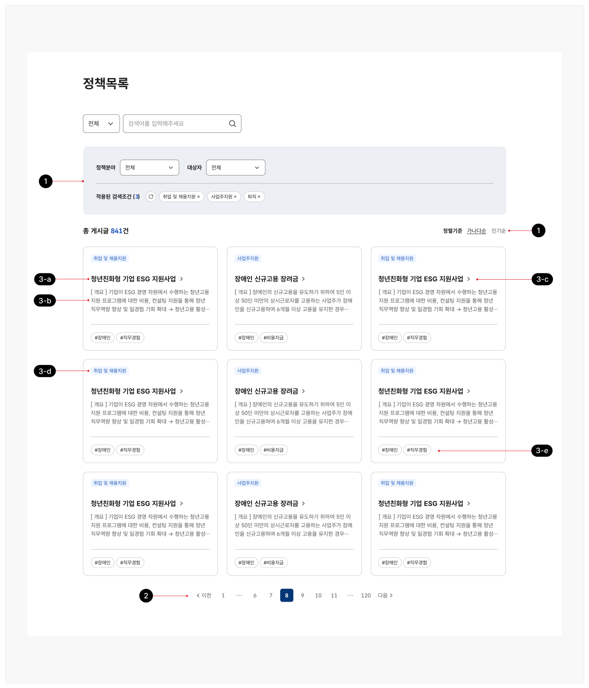
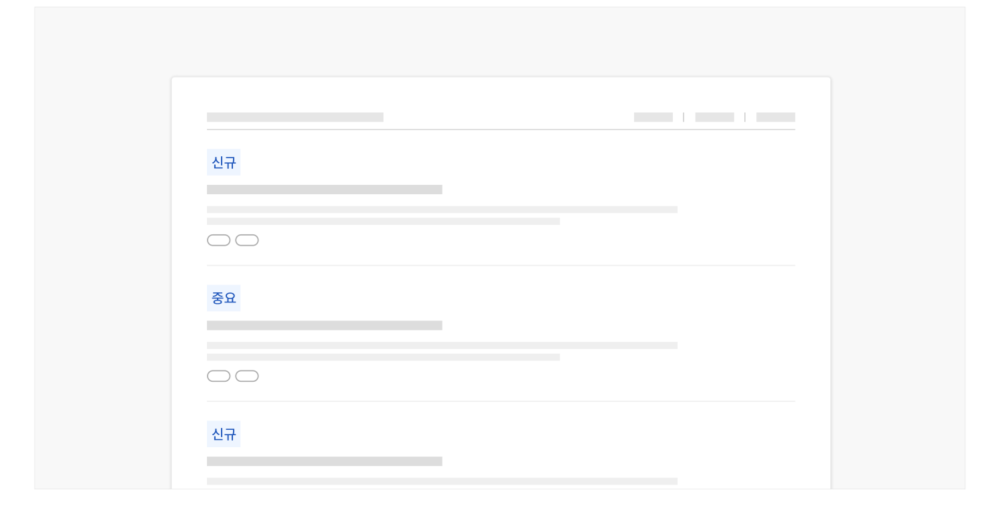
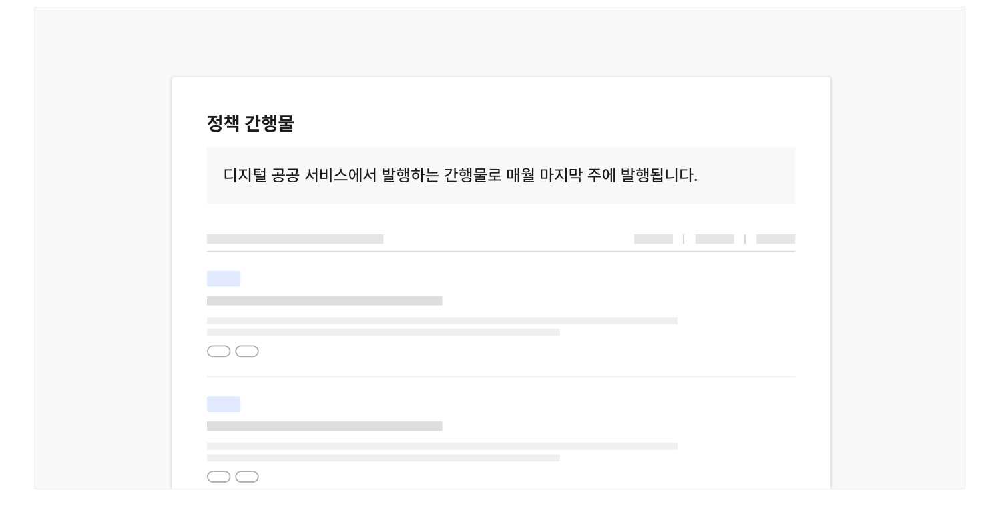

## 구조

1 필터링·정렬 컨트롤: 정책 자료 목록을 필터링·정렬하는 데 사용되는 컨트롤 2 페이지네이션: 정책 자료 목록을 탐색하는 데 사용되는 컨트롤 3 항목: 정보를 식별하기 위한 콘텐츠 집합으로 개별 항목에 대해 실행할 기능 관련 버튼, 상세 정보를

확인할 수 있는 탐색 링크가 포함될 수 있음

- a. 제목: 자료명을 보여주는 텍스트. 상세 화면으로 이동하기 위한 링크로 사용됨
- b. 미리보기/요약: 자료에 기본적인 정보를 요약하여 보여주는 텍스트
- c. 꺾쇠/화살표: 헤딩이 링크로 작동함을 안내하는 시각적 단서
- d. 배지: 자료의 주요 분류 체계를 나타내는 메타 데이터
- e. 메타 데이터: 배지 외에 항목에 부여된 여러 데이터 속성을 표시하는 텍스트


**시각 자료 텍스트 보완**

```text
3-a
3-c
3-b
3-d
3-e
```


## 사용성 가이드라인

- 01 필터링 또는 검색 기능을 제공한다.
- 02 새로운 자료, 변경이 있는 자료를 명확하게 구분한다.
- 03 정책 관련 간행물의 발행 주기에 대한 정보를 제공한다.

### 필터링 또는 검색 기능을 제공한다.

사용자가 주로 찾는 자료의 특성을 고려하여 목록에 필터링, 정렬 방식, 상세 검색(기간, 자료 유형 등) 기능을 제공하여 사용자가 여러 분류 체계에 해당하는 정보를 효과적으로 조회할 수 있도록 만든다.

### 새로운 자료, 변경이 있는 자료를 명확하게 구분한다.

새로 등록된 정책 자료나 중요 자료에 '신규', '중요'와 같은 메타 데이터를 배지로 제공함으로써 사용자가 시의성 있는 정책 정보 자료를 탐색할 수 있도록 도와야 한다.

[모범 사례]



**사례 텍스트 보완**

```text
신규
중요
```

### 정책 관련 간행물의 발행 주기에 대한 정보를 제공한다.

정기적으로 정책 동향을 확인하고자 하는 사용자를 고려하여 간행물 자료의 발행 주기 정보를 본문의 부제목이나 별도 안내 영역에 제공해야 한다. 발행 주기가 일시적으로 변경되거나 발행이 일시적·영구적으로 중단되었다면 이러한 상황에 대한 정보도 반드시 제공되어야 한다.

[모범 사례]



**사례 텍스트 보완**

```text
정책 간행물
디지털 공공 서비스에서 발행하는 간행물로 매월 마지막 주에 발행됩니다.
```


### 관련 구성 요소

### 컴포넌트

배지

### 기본 패턴

목록 탐색 첨부파일 필터링·정렬
